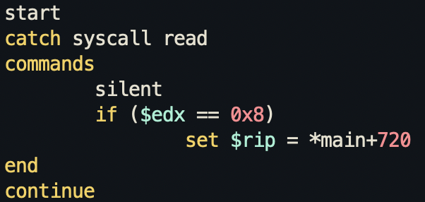

According to [wiki](https://en.wikipedia.org/wiki/X86_calling_conventions#x86-64_calling_conventions), the arguments for the `read` syscall is stored in `rdi`, `rsi`, and `rdx` respectively. So the `mov edx,0x8` means setting the bytes to read to 8.

I tried setting that to 0 and continue reading but didn't work since it still required me to input. So I just tried to set the `rip` register to the `win` call instruction.

Not entirely sure why we can't just set the `rip` registers directly and have to go through a conditional. Without the conditional line, the script will work, it will jump to the `win` call (still prints out the "You win" line), but it doesn't give us the flag for some reason. But with the comparison, it gives us the flag. Logically speaking, they're pretty much the same because `edx` is always set to 8 before the `read` syscall, but I guess the creator of this challenge wanted us to use conditionals for this.