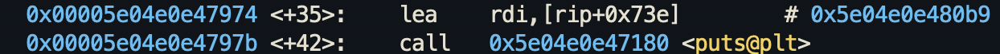

This one is pretty simple. The `win` function can be called but it's not gonna work. It's gonna terminate due to segfault. Inspecting the function, we see that it stops at a `mov` instruction.



The first `puts` function accesses that address and to print things out to the screen. Accessing that address gives us this string:

![[debugging-level-8-string.png]]

So it seems the instructions starting from `win+35` will print out the flag onto the screen. We can try to execute this by setting the `rip` register to the `win+35` location and see if it executes the rest of the instructions or not.

```
set $rip = *win+35
```

This works.