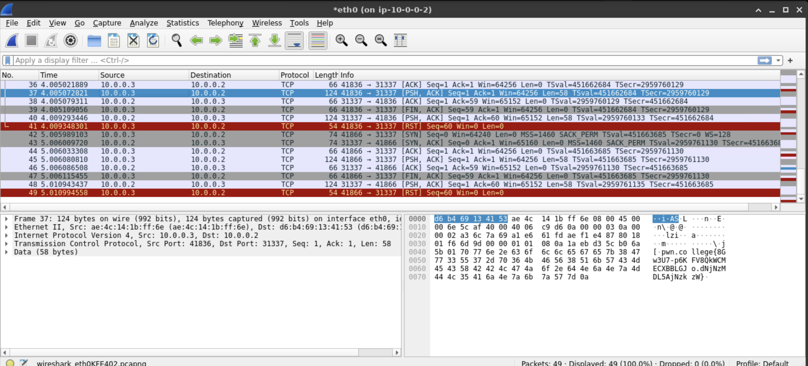

This level requires us to monitor the traffic from a remote host that's communicating with us via port `31337`. For this level, it seems that the remote host is connected to our `eth0` network interface on port `31337`. To monitor traffic, we can use `wireshark`.

```bash
wireshark
```

We'll monitor on `eth0` since it's the only interface getting some traffic.



We can see that the remote host `10.0.0.3` is sending us some information via TCP. If we try to use the "Follow TCP stream" option, we can see exactly they are sending over to us.


They're basically sending over the flag, and we're sending back the flag with a TCP PSH flag when they send the FIN flag, then the connection resets. So by reading from 1 of these packages, we can get the flag that the remote host sent over to us.