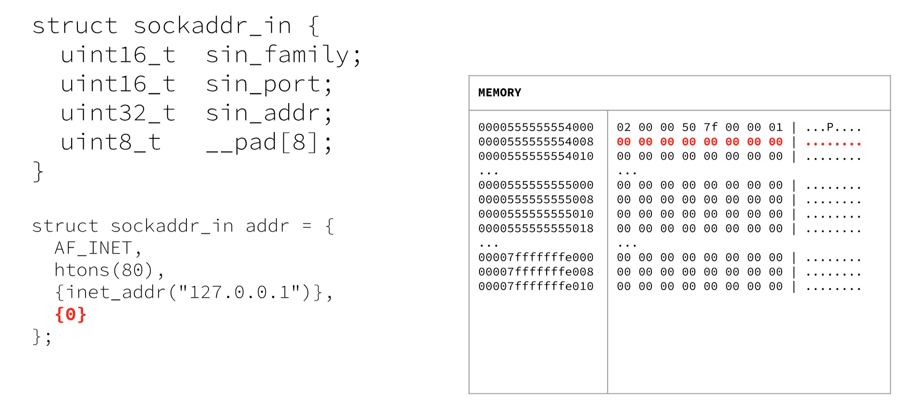

This level requires us to bind the socket. Binding means specifying the IP address that clients can access through, and the port the machine will listen on. Setting the IP to `0.0.0.0` means the socket will listen on all available network interface of the machine, not just 1 particular specified IP of an interface.

The [bind syscall](https://man7.org/linux/man-pages/man2/bind.2.html) takes 3 arguments: socket file descriptor, socket address structure, address length. The socket file descriptor is from the socket function, address length is 16 for our case. The socket address structure is structured like this:

```c
struct sockaddr_in {
	sa_family_t sin_family;
	in_port_t sin_port;
	struct in_addr sin_addr;
}
```

Here's what each properties will be for this case:
- `sin_family` will be set to `AF_INET` for IPv4
- `sin_port` will be set to port 80 (Standard HTTP port)
- `sin_addr` will be set to `0.0.0.0` (Enable listening on all network interface)

Following this struct will be 8 null bytes since our structure is 16 bytes long.



So we can initialize our struct in the `.data` section of the code. Of course, we will need to make sure the data aligns with the above example.

```asm
.section .data
sockaddr:
    .word 2
    .word 0x5000        # because htons makes it big endian cuz network stuff
    .double 0x00000000  # big endian cuz networking likes that
    .byte 0,0,0,0,0,0,0,0
```

> Note: This is stored in little endian.

Now with this struct, we can reference this when calling the `bind` syscall. Since we already saved the socket file descriptor in `r8`, we can use it here.

```asm
mov rdi, r8         # socket fd
lea rsi, sockaddr   # sockaddr struct
mov dl, 16          # sockaddr length
mov rax, 49         # sys_bind
syscall
```