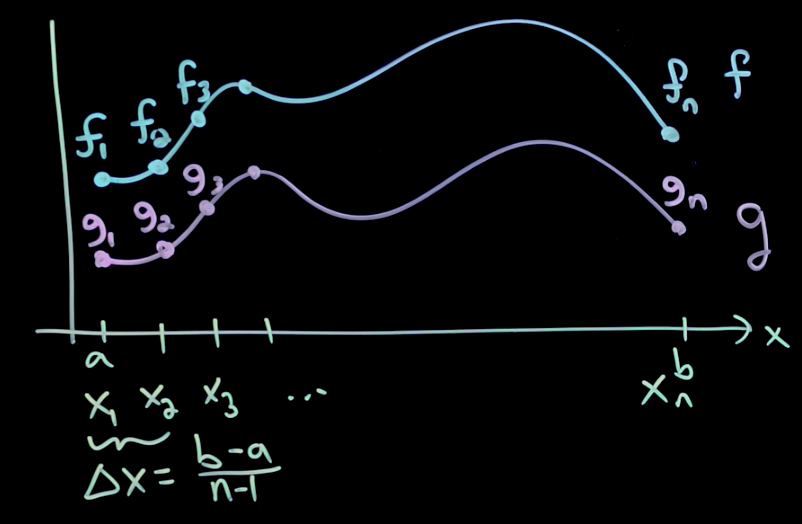

# Fourier and Wavelet transforms

The Fourier transformation is a coordinate transformation that's useful for representing data. The Fourier transformation can transform operators into eigenvalues and eigenfunctions (which are made up of sines and cosines of different frequencies).

The SVD can be thought of as a data-driven version of the Fast Fourier Transform (FFT).

The Fourier transformation can allow us to approximate a function as a sum of sines and cosines of various frequencies. Just like how in a vector space, we have our X and our Y axes for our coordinates which form a basis for 2D vectors. The function space has sine and cosine for its coordinates which form a basis for functions.

# Fourier series

The Fourier series is a way of approximating arbitrary function $f(x)$ (assuming $f(x)$ is periodic and piecewise smooth) as an infinite sum of sines and cosines of increasing frequencies.

$$
f(x) = \frac{a_0}{2} + \sum_{k=1}^\infty(a_k \cos(kx) + b_k \sin(kx))
$$

We have an infinite sum of sines and cosines of increasing frequencies and the Fourier coefficients $a_k$ and $b_k$, which tells us how much of these sines and cosines to add up to approximate our function $f(x)$. Assuming $f(x)$ is $2\pi$ periodic (a period lasts from $-\pi$ to $\pi$), we can calculate the coefficients like this:

$$
\begin{aligned}
&a_k = \frac{1}{\pi} \int_{-\pi}^\pi f(x) \cos(kx) dx
\\
&b_k = \frac{1}{\pi} \int_{-\pi}^\pi f(x) \sin(kx) dx
\end{aligned}
$$

We can rewrite this coefficients calculation in terms of inner products:

$$
\begin{aligned}
&a_k = \frac{1}{||\cos(kx)||^2} \langle f(x), \cos(kx) \rangle
\\
&b_k = \frac{1}{||\sin(kx)||^2} \langle  f(x), \sin(kx) \rangle
\end{aligned}
$$

With $||\cos(kx)||^2 = ||\sin(kx)||^2 = \pi$. So the coefficients can be thought of as the function $f(x)$ projected on to the sine and cosine of $k$. For an intuition into these equations, watch [this](https://youtu.be/MB6XGQWLV04?si=Ke1rxS6glX4zv-g9&t=404). Sines and cosines are orthogonal basis functions and we can project $f(x)$ onto those basis functions, which gives us the coefficient.

In real life, we can't take infinite sums, so we can only approximate functions with the Fourier series.

Let's redefine the function $f(x)$ from 0 to $L$. These functions will be periodic on $L$ domain.

$$
f(x) = \frac{a_0}{2} + \sum_{k=1}^\infty(a_k \cos(\frac{2\pi kx}{L}) + b_k \sin(\frac{2\pi kx}{L}))
$$

With the coefficients given by this.

$$
\begin{aligned}
&a_k = \frac{2}{L} \int_{0}^L f(x) \cos(\frac{2\pi kx}{L}) dx
\\
&b_k = \frac{2}{L} \int_{0}^L f(x) \sin(\frac{2\pi kx}{L}) dx
\end{aligned}
$$

# Inner products in Hilbert space

The inner products of functions and the inner products of vectors are pretty consistent to each other. The inner product of functions, similar to the inner products of vectors, can tell us how similar the functions are.

If we discretize the function into $f_n$ and $g_n$ discrete points and we sample these points on discrete intervals $x_n$, we can take the inner products of those discrete points as vectors. As the $\Delta x$ becomes smaller and smaller, approaching 0 and recovering the function, we get the full inner product of the 2 functions.

$$
f = \begin{bmatrix} f_1 \\ f_2 \\ \vdots \\ f_n \end{bmatrix}, \; g = \begin{bmatrix} g_1 \\ g_2 \\ \vdots \\ g_n \end{bmatrix}
$$

Taking the inner product of these 2 vectors will give us the inner product of the 2 functions as $n$ goes to infinity or $\Delta x$ goes to 0.

$$
\langle f, g \rangle = \sum^n_{k=1} f_k g_k
$$

We also normalize this inner product of this function with $\Delta x$ so that even if our approximation domain is larger, our inner product won't get larger because it's the same functions.

$$
\langle f, g \rangle \Delta x = \sum^n_{k=1} f(x_k) g(x_k) \Delta x
$$

This basically gives us the Riemann approximation of our function inner product.

# Complex Fourier series

We can also write the Fourier series with complex numbers:

$$
f(x) = \sum^\infty_{k=-\infty} c_k e^{ikx}
$$

With the Euler's expansion of the $e$ term being:

$$
e^{ikx} = \cos(kx) + i \sin(kx)
$$

So we can expand this complex Fourier series further:

$$
f(x) = \sum^\infty_{k=-\infty} c_k e^{ikx} = \sum^\infty_{k=-\infty} (\alpha_k + i \beta_k) (\cos(kx) + i \sin(kx))
$$

If $f(x)$ is real then $c_k = \overline{c_{-k}}$.

This complex Fourier series is a more compact version of the Fourier series and it also expresses complex functions. Each of the $e^{ikx}$ is an orthogonal basis in the function space that allows us to construct this Fourier series that can approximate $f(x)$.

Assuming $\psi_k = e^{ikx}$, and we're evaluating a $2\pi$ periodic function:

$$
\langle \psi_j, \psi_k \rangle = \int_{-\pi}^\pi e^{ijx} \overline{e^{ikx}} dx = \int_{-\pi}^\pi e^{ijx} e^{-ikx} dx = \int_{-\pi}^\pi e^{i(j - k) x} dx
$$

Integrating this will give us this:

$$
\langle \psi_j, \psi_k \rangle = \frac{1}{i(j-k)} \biggr[e^{i(j-k)x}\biggl]^\pi_{-\pi}
$$

Say for example $j-k$ evaluates to 2. If we plug that into the equation above, we get that $e^{i2\pi} = e^{i2 (-\pi)}$, meaning the inner product will be 0. So the inner product is 0 if $j\ne k$, and $2\pi$ if $j = k$. This shows that $\psi_j$ and $\psi_k$ are orthogonal to each other. This tells us the the $e^{ikx}$ gives us orthogonal bases for our function space.

The $c_k$ term is the inner product of the function with this orthogonal basis term. With $\langle f(x), \psi_k \rangle$ being $c_k$ and $\psi_k$ being $e^{ikx}$ and $\frac{1}{2\pi}$ being the normalization term.

$$
f(x) = \frac{1}{2\pi} \sum^\infty_{k=-\infty} \langle f(x), \psi_k \rangle \psi_k
$$

If necessary to expand a function $f(x)$ of period $2L$ we can use the following expressions ([reference](https://math24.net/complex-form-fourier-series.html)):

$$
\begin{aligned}
&f(x) = \sum^\infty_{n=-\infty} c_n e^{\frac{in\pi x}{L}}
\\
&c_n = \frac{1}{2\pi} \langle f(x), \psi_n \rangle = \frac{1}{2L} \int_{-L}^{L} f(x) e^{\frac{-i n \pi x}{L}} dx
\\
&\omega_n = k \frac{\pi}{L} = k \Delta \omega
\end{aligned}
$$

# Fourier transform

The Fourier transform is a non-periodic Fourier series. It generalizes the Fourier series to an infinite size domain. It's a Fourier series as we take $L \rightarrow \infty$. Because the function is non-periodic and $L \rightarrow \infty$, the change in frequency ($\Delta \omega$) will go to 0.

$$
f(x) = \lim_{\Delta \omega \rightarrow 0} \sum_{k=-\infty}^\infty \frac{\Delta \omega}{2\pi} \int_{-\pi / \Delta \omega}^{\pi / \Delta \omega} f(\xi) e^{-ik \Delta \omega \xi} d\xi \; e^{ik\Delta \omega x}
$$

All we're doing here is placing in the $c_k$ term in the Fourier series with the $e$ term in the Fourier series together and taking the limit of the change in frequency going to 0 or $L$ goes to infinity.

Analyzing this expression will give us this:

$$
f(x) = \int_{-\infty}^{\infty} \frac{1}{2\pi} \int_{-\infty}^{\infty} f(\xi) e^{-i\omega \xi} d\xi \; e^{i\omega x} d\omega
$$

Now we can define the Fourier transform:

$$
\hat{f}(\omega) = \mathfrak{F}(f(x)) = \int_{-\infty}^{\infty} f(x) e^{-i\omega x} dx
$$

Instead of having a discrete set of $c_k$ like in the Fourier series, now we have a continuum of Fourier coefficients in the $\hat{f}(\omega)$.

Now we can also define the inverse Fourier transform too:

$$
f(x) = \mathfrak{F}^{-1}(\hat{f}(\omega)) = \frac{1}{2\pi} \int_{-\infty}^{\infty} \hat{f}(\omega) \; e^{i\omega x} d\omega
$$

That's the Fourier transform pair. If we have a function $f(x)$ defined from $-\infty$ to $\infty$, we can use the Fourier transform to get a continuous function of Fourier coefficients (which is a function of frequencies) $\hat{f}(\omega)$, so the frequencies are continuously varying. With those Fourier coefficients, we can work in both the function space and the frequency space. Once we're finished working in the frequency space, we can inverse Fourier transform the coefficients to recover the original $f(x)$ function.

$$
\begin{aligned}
&\hat{f}(\omega) = \mathfrak{F}(f(x)) = \int_{-\infty}^{\infty} f(x) e^{-i\omega x} dx
\\
&f(x) = \mathfrak{F}^{-1}(\hat{f}(\omega)) = \frac{1}{2\pi} \int_{-\infty}^{\infty} \hat{f}(\omega) \; e^{i\omega x} d\omega
\end{aligned}
$$

There's a lot of nice properties about the $\mathfrak{F}$ operator. It's easy to compute the derivatives of functions in the Fourier transform domain, making it very useful for solving differential equations. It's also a unitary operator in the function space.

# Solving derivative with Fourier transform

Say we have a derivative of a function $f(x)$ and we want to take the Fourier transform of that derivative:

$$
\mathfrak{F}(\frac{d}{dx} f(x)) = \int_{-\infty}^{\infty} \frac{df}{dx} e^{-i\omega x} dx
$$

Integrating by parts we have $\int udv = uv - \int vdu$. So assuming $\frac{df}{dx} = dv$ and $e^{i\omega x} = u$, we get $uv = f(x) e^{-i\omega x}$ and $\int vdu = \int_{-\infty}^{\infty} f(x) (-i \omega e^{-i \omega x}) dx$. 

$$
\begin{aligned}
\mathfrak{F}(\frac{d}{dx} f(x)) &= \int_{-\infty}^{\infty} \frac{df}{dx} e^{-i\omega x} dx 
\\
&= [f(x) e^{-i\omega x}]^{\infty}_{-\infty} - \int_{-\infty}^{\infty} f(x) (-i \omega e^{-i \omega x}) dx
\end{aligned}
$$

$e^{-i\omega x}$ is going to give us a real value. It will have at most a length of 1 and it's gonna be on a circle with an angle given by $-\omega x$.

> Note: The Fourier transform only make sense if $f(x)$ decays to 0 at $_-^+\infty$.

The $f(x)$ evaluated at the bounds of the function $^+_-\infty$ has to be equal to 0. So the $uv$ term will be evaluated to 0. This is nice because the entire integral term is just the Fourier transform of $f(x)$: $\mathfrak{F}(f(x))$.

$$
\begin{aligned}
\mathfrak{F}(\frac{d}{dx} f(x)) &= \int_{-\infty}^{\infty} \frac{df}{dx} e^{-i\omega x} dx 
\\
&= [f(x) e^{-i\omega x}]^{\infty}_{-\infty} - \int_{-\infty}^{\infty} f(x) (-i \omega e^{-i \omega x}) dx
\\
&= i \omega \int_{-\infty}^{\infty} f(x) (e^{-i \omega x}) dx
\\
&= i\omega \mathfrak{F}(f(x))
\end{aligned}
$$

Sometimes we can approximate the derivative of $f(x)$ more accurately by taking the Fourier transform of it then taking the inverse Fourier transform. This is called the *spectral derivative*.

We can also transform partial differential equations into ordinary differential equations with the Fourier transform. Say we have a PDE $u_{tt} = c u_{xx}$ with $t$ being time and $x$ being space, if we take the Fourier transform in space then we get $\hat{u}_{tt} = -\omega^2 \hat{u}$ (because we took the 2 $x$ derivative of the Fourier transform, which gave us $i^2 \omega^2 \mathfrak{F}(u) = -1 \omega^2 \mathfrak{F}(u)$). Now we have an ODE. To be more explicit, $u(x, t)$ is a function of $x$ and $t$, and $\hat{u}(\omega, t)$ is a function of $\omega$ and $t$. We basically swap out space $x$ with a spatial frequency number $\omega$.

# Linearity of the Fourier transform

The Fourier transform is a linear operator:

$$
\begin{aligned}
&\mathfrak{F}(\alpha f(x) + \beta g(x)) = \alpha \mathfrak{F}(f) + \beta \mathfrak{F}(g)
\\
&\mathfrak{F}^{-1}(\alpha \hat{f}(\omega) + \beta \hat{g}(\omega)) = \alpha \mathfrak{F}^{-1}(\hat{f}) + \beta \mathfrak{F}^{-1}(\hat{g})
\end{aligned}
$$

# Parseval's theorem

The Fourier transform preserves the $L_2$-norm up to a constant. This is closely related to unitarity, so that two functions will retain the same inner product before and after the Fourier transform. This property is useful for approximation and truncation, providing the ability to bound error at a given truncation.

$$
\int_{-\infty}^{\infty} |\hat{f}(\omega)|^2 d\omega = 2\pi \int_{-\infty}^{\infty} |f(x)|^2 dx
$$

# Convolution integrals with Fourier transform

Convolution integral allows us to add 2 functions to form a 3rd function. What the $x$ mean is that as $\xi$ goes from $-\infty$ to $\infty$, we're sliding $g$ across $f$ or vice versa and we're adding up their product as we're sliding, meaning it expresses the amount of overlap one function has as it is shifted over the other function.

$$
(f * g) = \int_{-\infty}^{\infty} f(x - \xi) g(\xi) d\xi
$$

We can simplify a convolution integral in a spatial variable by Fourier transforming the functions $f$ and $g$. The Fourier transform of the convolution integral becomes just a product of the Fourier transform domain.

$$
\mathfrak{F}(f * g) = \mathfrak{F}(f)\mathfrak{F}(g) = \hat{f}\hat{g}
$$

Below is the proof that multiplying functions in the Fourier transform's frequency domain is the same as convolving functions in the spatial domain.

$$
\begin{aligned}
\mathfrak{F}^{-1} (\hat{f}\hat{g}) (x) &= \frac{1}{2\pi} \int_{-\infty}^{\infty} \hat{f}(\omega) \hat{g}(\omega) e^{i\omega x} d\omega
\\
&= \int_{-\infty}^{\infty} \hat{f}(\omega) e^{i\omega x} \biggr(\frac{1}{2\pi} \int_{-\infty}^{\infty} g(y) e^{-i\omega y} dy \biggl) d\omega
\\
&= \frac{1}{2\pi} \int_{-\infty}^{\infty} \int_{-\infty}^{\infty} g(y) \hat{f}(\omega) e^{i\omega (x-y)} d\omega dy
\\
&= \int_{-\infty}^{\infty} g(y) \biggr(\frac{1}{2\pi} \int_{-\infty}^{\infty} \hat{f}(\omega) e^{i\omega (x-y)} d\omega \biggl) dy
\\
&= \int_{-\infty}^{\infty} g(y) f(x - y) dy
\\
&= g * f = f * g
\end{aligned}
$$
