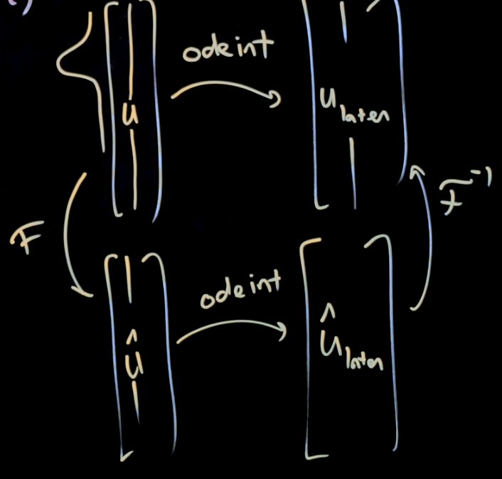
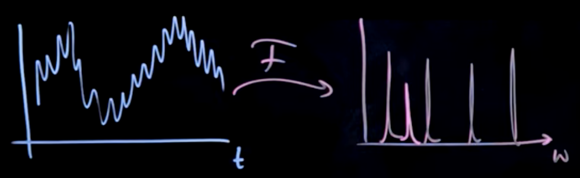
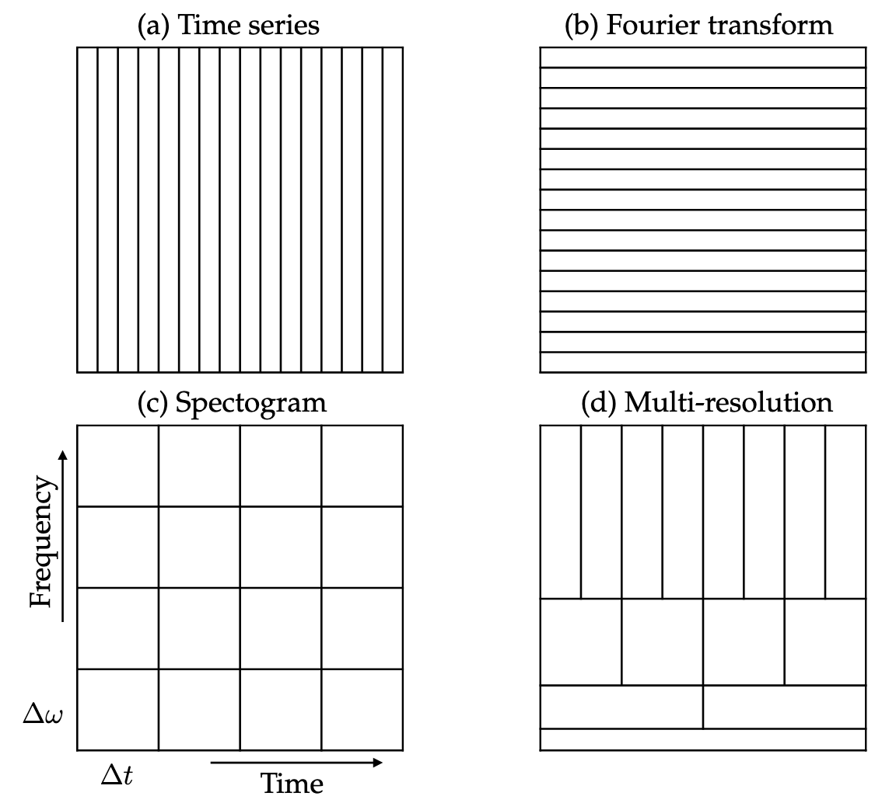

# Fourier and Wavelet transforms

The Fourier transformation is a coordinate transformation that's useful for representing data. The Fourier transformation can transform operators into eigenvalues and eigenfunctions (which are made up of sines and cosines of different frequencies).

The SVD can be thought of as a data-driven version of the Fast Fourier Transform (FFT).

The Fourier transformation can allow us to approximate a function as a sum of sines and cosines of various frequencies. Just like how in a vector space, we have our X and our Y axes for our coordinates which form a basis for 2D vectors. The function space has sine and cosine for its coordinates which form a basis for functions.

# Fourier series

The Fourier series is a way of approximating arbitrary function $f(x)$ (assuming $f(x)$ is periodic and piecewise smooth) as an infinite sum of sines and cosines of increasing frequencies.

$$
f(x) = \frac{a_0}{2} + \sum_{k=1}^\infty(a_k \cos(kx) + b_k \sin(kx))
$$

We have an infinite sum of sines and cosines of increasing frequencies and the Fourier coefficients $a_k$ and $b_k$, which tells us how much of these sines and cosines to add up to approximate our function $f(x)$. Assuming $f(x)$ is $2\pi$ periodic (a period lasts from $-\pi$ to $\pi$), we can calculate the coefficients like this:

$$
\begin{aligned}
&a_k = \frac{1}{\pi} \int_{-\pi}^\pi f(x) \cos(kx) dx
\\
&b_k = \frac{1}{\pi} \int_{-\pi}^\pi f(x) \sin(kx) dx
\end{aligned}
$$

We can rewrite this coefficients calculation in terms of inner products:

$$
\begin{aligned}
&a_k = \frac{1}{||\cos(kx)||^2} \langle f(x), \cos(kx) \rangle
\\
&b_k = \frac{1}{||\sin(kx)||^2} \langle  f(x), \sin(kx) \rangle
\end{aligned}
$$

With $||\cos(kx)||^2 = ||\sin(kx)||^2 = \pi$. So the coefficients can be thought of as the function $f(x)$ projected on to the sine and cosine of $k$. For an intuition into these equations, watch [this](https://youtu.be/MB6XGQWLV04?si=Ke1rxS6glX4zv-g9&t=404). Sines and cosines are orthogonal basis functions and we can project $f(x)$ onto those basis functions, which gives us the coefficient.

In real life, we can't take infinite sums, so we can only approximate functions with the Fourier series.

Let's redefine the function $f(x)$ from 0 to $L$. These functions will be periodic on $L$ domain.

$$
f(x) = \frac{a_0}{2} + \sum_{k=1}^\infty(a_k \cos(\frac{2\pi kx}{L}) + b_k \sin(\frac{2\pi kx}{L}))
$$

With the coefficients given by this.

$$
\begin{aligned}
&a_k = \frac{2}{L} \int_{0}^L f(x) \cos(\frac{2\pi kx}{L}) dx
\\
&b_k = \frac{2}{L} \int_{0}^L f(x) \sin(\frac{2\pi kx}{L}) dx
\end{aligned}
$$

# Inner products in Hilbert space

The inner products of functions and the inner products of vectors are pretty consistent to each other. The inner product of functions, similar to the inner products of vectors, can tell us how similar the functions are.

If we discretize the function into $f_n$ and $g_n$ discrete points and we sample these points on discrete intervals $x_n$, we can take the inner products of those discrete points as vectors. As the $\Delta x$ becomes smaller and smaller, approaching 0 and recovering the function, we get the full inner product of the 2 functions.

$$
f = \begin{bmatrix} f_1 \\ f_2 \\ \vdots \\ f_n \end{bmatrix}, \; g = \begin{bmatrix} g_1 \\ g_2 \\ \vdots \\ g_n \end{bmatrix}
$$

Taking the inner product of these 2 vectors will give us the inner product of the 2 functions as $n$ goes to infinity or $\Delta x$ goes to 0.

$$
\langle f, g \rangle = \sum^n_{k=1} f_k g_k
$$

We also normalize this inner product of this function with $\Delta x$ so that even if our approximation domain is larger, our inner product won't get larger because it's the same functions.

$$
\langle f, g \rangle \Delta x = \sum^n_{k=1} f(x_k) g(x_k) \Delta x
$$

This basically gives us the Riemann approximation of our function inner product.

# Complex Fourier series

We can also write the Fourier series with complex numbers:

$$
f(x) = \sum^\infty_{k=-\infty} c_k e^{ikx}
$$

With the Euler's expansion of the $e$ term being:

$$
e^{ikx} = \cos(kx) + i \sin(kx)
$$

So we can expand this complex Fourier series further:

$$
f(x) = \sum^\infty_{k=-\infty} c_k e^{ikx} = \sum^\infty_{k=-\infty} (\alpha_k + i \beta_k) (\cos(kx) + i \sin(kx))
$$

If $f(x)$ is real then $c_k = \overline{c_{-k}}$.

This complex Fourier series is a more compact version of the Fourier series and it also expresses complex functions. Each of the $e^{ikx}$ is an orthogonal basis in the function space that allows us to construct this Fourier series that can approximate $f(x)$.

Assuming $\psi_k = e^{ikx}$, and we're evaluating a $2\pi$ periodic function:

$$
\langle \psi_j, \psi_k \rangle = \int_{-\pi}^\pi e^{ijx} \overline{e^{ikx}} dx = \int_{-\pi}^\pi e^{ijx} e^{-ikx} dx = \int_{-\pi}^\pi e^{i(j - k) x} dx
$$

Integrating this will give us this:

$$
\langle \psi_j, \psi_k \rangle = \frac{1}{i(j-k)} \biggr[e^{i(j-k)x}\biggl]^\pi_{-\pi}
$$

Say for example $j-k$ evaluates to 2. If we plug that into the equation above, we get that $e^{i2\pi} = e^{i2 (-\pi)}$, meaning the inner product will be 0. So the inner product is 0 if $j\ne k$, and $2\pi$ if $j = k$. This shows that $\psi_j$ and $\psi_k$ are orthogonal to each other. This tells us the the $e^{ikx}$ gives us orthogonal bases for our function space.

The $c_k$ term is the inner product of the function with this orthogonal basis term. With $\langle f(x), \psi_k \rangle$ being $c_k$ and $\psi_k$ being $e^{ikx}$ and $\frac{1}{2\pi}$ being the normalization term.

$$
f(x) = \frac{1}{2\pi} \sum^\infty_{k=-\infty} \langle f(x), \psi_k \rangle \psi_k
$$

If necessary to expand a function $f(x)$ of period $2L$ we can use the following expressions ([reference](https://math24.net/complex-form-fourier-series.html)):

$$
\begin{aligned}
&f(x) = \sum^\infty_{n=-\infty} c_n e^{\frac{in\pi x}{L}}
\\
&c_n = \frac{1}{2\pi} \langle f(x), \psi_n \rangle = \frac{1}{2L} \int_{-L}^{L} f(x) e^{\frac{-i n \pi x}{L}} dx
\\
&\omega_n = k \frac{\pi}{L} = k \Delta \omega
\end{aligned}
$$

# Fourier transform

The Fourier transform is a non-periodic Fourier series. It generalizes the Fourier series to an infinite size domain. It's a Fourier series as we take $L \rightarrow \infty$. Because the function is non-periodic and $L \rightarrow \infty$, the change in frequency ($\Delta \omega$) will go to 0.

$$
f(x) = \lim_{\Delta \omega \rightarrow 0} \sum_{k=-\infty}^\infty \frac{\Delta \omega}{2\pi} \int_{-\pi / \Delta \omega}^{\pi / \Delta \omega} f(\xi) e^{-ik \Delta \omega \xi} d\xi \; e^{ik\Delta \omega x}
$$

All we're doing here is placing in the $c_k$ term in the Fourier series with the $e$ term in the Fourier series together and taking the limit of the change in frequency going to 0 or $L$ goes to infinity.

Analyzing this expression will give us this:

$$
f(x) = \int_{-\infty}^{\infty} \frac{1}{2\pi} \int_{-\infty}^{\infty} f(\xi) e^{-i\omega \xi} d\xi \; e^{i\omega x} d\omega
$$

Now we can define the Fourier transform:

$$
\hat{f}(\omega) = \mathfrak{F}(f(x)) = \int_{-\infty}^{\infty} f(x) e^{-i\omega x} dx
$$

Instead of having a discrete set of $c_k$ like in the Fourier series, now we have a continuum of Fourier coefficients in the $\hat{f}(\omega)$.

Now we can also define the inverse Fourier transform too:

$$
f(x) = \mathfrak{F}^{-1}(\hat{f}(\omega)) = \frac{1}{2\pi} \int_{-\infty}^{\infty} \hat{f}(\omega) \; e^{i\omega x} d\omega
$$

That's the Fourier transform pair. If we have a function $f(x)$ defined from $-\infty$ to $\infty$, we can use the Fourier transform to get a continuous function of Fourier coefficients (which is a function of frequencies) $\hat{f}(\omega)$, so the frequencies are continuously varying. With those Fourier coefficients, we can work in both the function space and the frequency space. Once we're finished working in the frequency space, we can inverse Fourier transform the coefficients to recover the original $f(x)$ function.

$$
\begin{aligned}
&\hat{f}(\omega) = \mathfrak{F}(f(x)) = \int_{-\infty}^{\infty} f(x) e^{-i\omega x} dx
\\
&f(x) = \mathfrak{F}^{-1}(\hat{f}(\omega)) = \frac{1}{2\pi} \int_{-\infty}^{\infty} \hat{f}(\omega) \; e^{i\omega x} d\omega
\end{aligned}
$$

There's a lot of nice properties about the $\mathfrak{F}$ operator. It's easy to compute the derivatives of functions in the Fourier transform domain, making it very useful for solving differential equations. It's also a unitary operator in the function space.

# Solving derivative with Fourier transform

Say we have a derivative of a function $f(x)$ and we want to take the Fourier transform of that derivative:

$$
\mathfrak{F}(\frac{d}{dx} f(x)) = \int_{-\infty}^{\infty} \frac{df}{dx} e^{-i\omega x} dx
$$

Integrating by parts we have $\int udv = uv - \int vdu$. So assuming $\frac{df}{dx} = dv$ and $e^{i\omega x} = u$, we get $uv = f(x) e^{-i\omega x}$ and $\int vdu = \int_{-\infty}^{\infty} f(x) (-i \omega e^{-i \omega x}) dx$. 

$$
\begin{aligned}
\mathfrak{F}(\frac{d}{dx} f(x)) &= \int_{-\infty}^{\infty} \frac{df}{dx} e^{-i\omega x} dx 
\\
&= [f(x) e^{-i\omega x}]^{\infty}_{-\infty} - \int_{-\infty}^{\infty} f(x) (-i \omega e^{-i \omega x}) dx
\end{aligned}
$$

$e^{-i\omega x}$ is going to give us a real value. It will have at most a length of 1 and it's gonna be on a circle with an angle given by $-\omega x$.

> Note: The Fourier transform only make sense if $f(x)$ decays to 0 at $_-^+\infty$.

The $f(x)$ evaluated at the bounds of the function $^+_-\infty$ has to be equal to 0. So the $uv$ term will be evaluated to 0. This is nice because the entire integral term is just the Fourier transform of $f(x)$: $\mathfrak{F}(f(x))$.

$$
\begin{aligned}
\mathfrak{F}(\frac{d}{dx} f(x)) &= \int_{-\infty}^{\infty} \frac{df}{dx} e^{-i\omega x} dx 
\\
&= [f(x) e^{-i\omega x}]^{\infty}_{-\infty} - \int_{-\infty}^{\infty} f(x) (-i \omega e^{-i \omega x}) dx
\\
&= i \omega \int_{-\infty}^{\infty} f(x) (e^{-i \omega x}) dx
\\
&= i\omega \mathfrak{F}(f(x))
\end{aligned}
$$

Sometimes we can approximate the derivative of $f(x)$ more accurately by taking the Fourier transform of it then taking the inverse Fourier transform. This is called the *spectral derivative*.

We can also transform partial differential equations into ordinary differential equations with the Fourier transform. Say we have a PDE $u_{tt} = c u_{xx}$ with $t$ being time and $x$ being space, if we take the Fourier transform in space then we get $\hat{u}_{tt} = -\omega^2 \hat{u}$ (because we took the 2 $x$ derivative of the Fourier transform, which gave us $i^2 \omega^2 \mathfrak{F}(u) = -1 \omega^2 \mathfrak{F}(u)$). Now we have an ODE. To be more explicit, $u(x, t)$ is a function of $x$ and $t$, and $\hat{u}(\omega, t)$ is a function of $\omega$ and $t$. We basically swap out space $x$ with a spatial frequency number $\omega$.

# Linearity of the Fourier transform

The Fourier transform is a linear operator:

$$
\begin{aligned}
&\mathfrak{F}(\alpha f(x) + \beta g(x)) = \alpha \mathfrak{F}(f) + \beta \mathfrak{F}(g)
\\
&\mathfrak{F}^{-1}(\alpha \hat{f}(\omega) + \beta \hat{g}(\omega)) = \alpha \mathfrak{F}^{-1}(\hat{f}) + \beta \mathfrak{F}^{-1}(\hat{g})
\end{aligned}
$$

# Parseval's theorem

The Fourier transform preserves the $L_2$-norm up to a constant. This is closely related to unitarity, so that two functions will retain the same inner product before and after the Fourier transform. This property is useful for approximation and truncation, providing the ability to bound error at a given truncation.

$$
\int_{-\infty}^{\infty} |\hat{f}(\omega)|^2 d\omega = 2\pi \int_{-\infty}^{\infty} |f(x)|^2 dx
$$

The norm represents how much energy there is under the curve of $f$ and under the curve of the Fourier transform. These 2 integrals are equal up to a constant $2\pi$.

If there's some really small Fourier coefficients, we just ignore them and zero them out. The question is if we zero them out, how big of an impact would that have on $f$. What this theorem says is that if there's Fourier coefficients that are negligibly small and we set them to 0 (truncating them), because the left-hand side integral doesn't change much, we're still going to be able to capture most of the energy of $f$.

# Convolution integrals with Fourier transform

Convolution integral allows us to add 2 functions to form a 3rd function. What the $x$ mean is that as $\xi$ goes from $-\infty$ to $\infty$, we're sliding $g$ across $f$ or vice versa and we're adding up their product as we're sliding, meaning it expresses the amount of overlap one function has as it is shifted over the other function.

$$
(f * g) = \int_{-\infty}^{\infty} f(x - \xi) g(\xi) d\xi
$$

We can simplify a convolution integral in a spatial variable by Fourier transforming the functions $f$ and $g$. The Fourier transform of the convolution integral becomes just a product of the Fourier transform domain.

$$
\mathfrak{F}(f * g) = \mathfrak{F}(f)\mathfrak{F}(g) = \hat{f}\hat{g}
$$

Below is the proof that multiplying functions in the Fourier transform's frequency domain is the same as convolving functions in the spatial domain.

$$
\begin{aligned}
\mathfrak{F}^{-1} (\hat{f}\hat{g}) (x) &= \frac{1}{2\pi} \int_{-\infty}^{\infty} \hat{f}(\omega) \hat{g}(\omega) e^{i\omega x} d\omega
\\
&= \int_{-\infty}^{\infty} \hat{f}(\omega) e^{i\omega x} \biggr(\frac{1}{2\pi} \int_{-\infty}^{\infty} g(y) e^{-i\omega y} dy \biggl) d\omega
\\
&= \frac{1}{2\pi} \int_{-\infty}^{\infty} \int_{-\infty}^{\infty} g(y) \hat{f}(\omega) e^{i\omega (x-y)} d\omega dy
\\
&= \int_{-\infty}^{\infty} g(y) \biggr(\frac{1}{2\pi} \int_{-\infty}^{\infty} \hat{f}(\omega) e^{i\omega (x-y)} d\omega \biggl) dy
\\
&= \int_{-\infty}^{\infty} g(y) f(x - y) dy
\\
&= g * f = f * g
\end{aligned}
$$

# Heat equation example

> Fun fact: Fourier devised the Fourier transform to solve the heat equation

1D heat equation:

$$
u_t = \alpha^2 u_{xx}
$$

The way we can think about this is we have a 1D piece of metal with some initial heat distribution at time 0 for all of space: $u(x, 0)$, so $u$ is a function of $x$ and $t$: $u(x, t)$. As $x \rightarrow ^+_-\infty$, the heat distribution will decay to 0 otherwise this would have infinite heat energy, which is impossible.

When we Fourier transform this PDE, we'll get an ODE that's easier to solve. We can take the Fourier transform of $u(x, t)$, we can choose $x$ or $t$, space or time. We'll Fourier transform with respect to space because space is our coordinate that goes from $-\infty$ to $\infty$ (usually we think of time as going from 0 to $\infty$).

$$
\mathfrak{F}(u(x, t)) = \hat{u}(\omega, t)
$$

If we take the Fourier transform of $u_x$ and Fourier transform of $u_{xx}$, we can use the derivative property of the Fourier transform (remember that $\hat{u}$ is still a function of $\omega$ and $t$, our time variable didn't change):

$$
\begin{aligned}
\mathfrak{F}(\frac{d}{dx} u_{xx}) = \mathfrak{F}(u_x) = i\omega \hat{u}
\\
\mathfrak{F}(u_{xx}) = i^2\omega^2 \hat{u} = -w^2 \hat{u}
\end{aligned}
$$

Now we Fourier transform the PDE with respect to space. This will give us an ODE with a time derivative for each fixed $\omega$, meaning we get a family of ODEs for every $\omega$.

$$
\mathfrak{F}(u_t) = \frac{d}{dt}\hat{u} = -\omega^2 \alpha^2 \hat{u}
$$

Now we can solve this ODE:

$$
\begin{aligned}
&\hat{u}(\omega, t) = e^{-\omega^2 \alpha^2 t} \hat{u}(\omega, 0)
\end{aligned}
$$

The $e^{-\omega^2 \alpha^2 t} \hat{u}$ is a Gaussian kernel. $t$ is the product of 2 functions of $\omega$. It's kinda like the $e^{-\omega^2 \alpha^2 t} \hat{u}$ term is $\hat{f}$ and the $\hat{u}(\omega, 0)$ term is $\hat{g}$. If we inverse Fourier transform $\hat{f}\hat{g}$, we get the convolution integral of $f$ and $g$.

Now we'll need to transform this back from the Fourier coefficients into the physical coordinates to get the final time's heat distribution.

$$
u(x, t) = \mathfrak{F}^{-1}(\hat{u}(\omega, t)) = \mathfrak{F}^{-1}(e^{-\omega^2 \alpha^2 t}) * \mathfrak{F}^{-1}(\hat{u}(\omega, 0))
$$

The $\hat{u}(\omega, 0)$ is just the Fourier transform of heat distribution at the initial time 0:

$$
u(x, t) = \mathfrak{F}^{-1}(e^{-\omega^2 \alpha^2 t}) * u(x, 0)
$$

The inverse Fourier transform of a Gaussian kernel is a Gaussian kernel.

$$
\begin{aligned}
u(x, t) &= \text{Gaussian}(x, t) * u(x, 0)
\\
&= \frac{1}{2\alpha \sqrt{\pi t}} e^{-\frac{x^2}{4\alpha^2 t}} * u(x, 0)
\end{aligned}
$$

What this mean is as time gets bigger, the Gaussian kernel will get more spread out and more diffused. This is called a *diffusion kernel*.

So we're taking the diffusion kernel, slide it across $u(x, 0)$, which is the initial heat distribution, and take the dot product. The longer times goes on, the smoother and more spread out this diffusion kernel gets, the more it smoothes out the initial condition of our heat distribution, meaning the heat will eventually cool off.

So this is essentially what the heat equation does, it takes the initial conditions and it convolves that with a gaussian kernel that gets more spread out in time.

# Discrete Fourier Transform (DFT)

DFT is actually just approximating Fourier series on a finite interval. DFT is essentially just a Fourier series on data points instead of a function. The DFT is really important as it leads to the Fast Fourier Transform (FFT).

The DFT is a mathematical transformation that can be written in terms of matrix multiplication. The FFT is a computationally efficient way of computing the DFT that scales to large datasets. So the FFT is how we compute the DFT.

Say we have a discrete vector of data $\vec{x}$ full of discrete points $x_n$ with values $f_n$, and maybe we believe there's an underlying function for this data vector.

$$
\vec{x} = \begin{bmatrix} f_0 \\ f_1 \\ \vdots \\ f_{n-1} \end{bmatrix}
$$

Now we want to compute the discrete Fourier series of that data vector. We also want to break this data up into a sum of sines and cosines. This can be very useful. If we have, say audio data, we can figure out what kind of tones add up to create that data. It's also nice for approximating derivatives using the Fourier transform derivative properties.

Below is the DFT pairs (The transform and its inverse):

$$
\begin{aligned}
&\hat{f}_k = \sum_{j=0}^{n-1} f_j e^{-i2\pi jk / n}
\\
&f_k = \frac{1}{n} \sum_{j=0}^{n-1} \hat{f}_j e^{i2\pi jk / n}
\end{aligned}
$$

The DFT is a linear operator (i.e., a matrix) that maps the data points in $f$ to the frequency domain $\hat{f}$. $\hat{f}_n$ will tell us how much of the $nth$ frequency is in the data.

$$
\{f_0, f_1, ..., f_{n-1}\} \xrightarrow{DFT} \{\hat{f}_0, \hat{f}_1, ..., \hat{f}_{n-1}\}
$$

The $\hat{f}_n$ tell us how much of each frequencies of sines and cosines along with their phase to add up to recover $f$.

The exponential $e^{-i2\pi / n}$ is defined as $\omega_n$, which is some fundamental frequency that's related to what kinds of sines and cosines we can approximate with $n$ discrete values in a domain $x$.

$$
\omega_n = e^{-i2\pi / n}
$$

We can use $\omega_n$ to compute a matrix to multiply $f_n$ and give us our Fourier transform.

$$
\begin{bmatrix} \hat{f}_0 \\ \hat{f}_1 \\ \vdots \\ \hat{f}_{n-1} \end{bmatrix} = \begin{bmatrix} 1 & 1 & 1 & ... & 1 \\ 1 & \omega_n & \omega_n^2 & ... & \omega_n^{n-1} \\ 1 & \omega_n^2 & \omega_n^4 & ... & \omega_n^{2(n-1)} \\
\vdots & \vdots & \vdots & \ddots & \vdots \\ 1 & w_n^{n-1} & w_n^{2(n-1)} & ... & w_n^{(n-1)^2} \end{bmatrix} \begin{bmatrix} f_0 \\ f_1 \\ \vdots \\ f_{n-1} \end{bmatrix}
$$

The matrix is called the *DFT matrix*. It's pretty expensive to compute this matrix and multiply it with the vector. We're always going to be using the FFT to compute the DFT. The matrix has some unique properties: It's a Vandermonde matrix, it's a unitary matrix.

Because $w_n$ is complex, $\hat{f}_n$ is also complex. It not only tells us how much of the $nth$ mode of sines and cosines there are but it also tells us the phase between the sines and cosines of the $nth$ mode.

# Fast Fourier Transform (FFT)

The DFT using 2 for loops has a time complexity of $O(n^2)$. It's very expensive. The FFT achieve the same thing but with a time complexity of $O(n \log(n))$. The FFT is how we compute the DFT efficiently. FFT can be used to solve PDEs, de-noise data, analyze data, and compression.

Let's say $n = 2^{10} = 1024$. The DFT may be implemented much more efficiently if the number of data points $n$ is a power of 2. With $F_n$ being the DFT matrix, we have:

$$
\hat{f} = F_{1024} f 
$$

What we can do is reorder the $f$ vector to have the even indices $f_n$ values on top and the odd indices $f_n$ values on the bottom. $I_{n/2}$ being an identity matrix, $D_{n/2}$ being a diagonal matrix

$$
\hat{f} = \begin{bmatrix} I_{512} & D_{512} \\ I_{512} & -D_{512} \end{bmatrix} \begin{bmatrix} F_{512} & 0 \\ 0 & F_{512} \end{bmatrix} \begin{bmatrix} f_{\text{even}} \\ f_{\text{odd}} \end{bmatrix}
$$

With $D_{n/2}$ being the diagonal matrix of the DFT matrix:

$$
D_{512} = \begin{bmatrix} 1 & 0 & 0 & ... & 0 \\ 0 & \omega & 0 & ... & 0 \\ 0 & 0 & \omega^2 & ... & 0 \\ \vdots & \vdots & \vdots & \ddots & \vdots \\ 0 & 0 & 0 & ... & w^{511} \end{bmatrix}
$$

The $\begin{bmatrix} I_{512} & D_{512} \\ I_{512} & -D_{512} \end{bmatrix}$ matrix is diagonal. And $\begin{bmatrix} F_{512} & 0 \\ 0 & F_{512} \end{bmatrix}$ is half the cost of the DFT matrix. So essentially, if we rearrange the $f$ matrix, we can turn the DFT matrix into a product of 2 matrices that is much easier to compute.

With the $F_{n/2}$, we can recursively do decompose those the same way as well, pulling out the even and odd indices of the $f_\text{even}$ and the even and odd indices of $f_\text{odd}$ (Say we have $f_\text{even} = \{ 0, 2, 4, 6\}$ and $f_\text{odd} = \{ 1, 3, 5, 7\}$, we can split it too 4 lists: $f_\text{even-even} = \{ 0, 4\}$, $f_\text{even-odd} = \{ 2, 6\}$, $f_\text{odd-even} = \{ 1, 5\}$, $f_\text{odd-odd} = \{ 3, 7\}$).

This is why $n$ being a power of 2 is so useful, we can recursively break the $F_n$ matrix down.

$$
F_{1024} \rightarrow F_{512} \rightarrow ... \rightarrow F_4 \rightarrow F_2
$$

The FFT is based on the fact that the DFT matrix has so much symmetry that if we just organize the $f$ data vector, we can recursively decompose the DFT matrix into smaller matrices.

**IMPORTANT**: Even if our data is not a power of 2, it would still be cheaper to add a bunch of 0 paddings to the data until $n$ is a power of 2 than to calculate the DFT matrix directly.

# Spectral derivative 

For the FFT spectral derivative, we need to take the FFT of the derivative of $f$. And the FFT of a derivative will result in $i$ times the frequency times the FFT of $f$:

$$
\mathfrak{F}(\frac{df}{dx}) = i \kappa \mathfrak{F}(f) = i \kappa \hat{f}
$$

$\hat{f}$ is a vector of Fourier coefficients and $\kappa$ is a vector of frequencies. So multiplying the 2 vectors will give us the frequency-weighted Fourier coefficients. If we inverse Fourier transform that vector, we would recover the derivative of the function for those discrete sample points.

$$
\mathfrak{F}(\frac{df}{dx}) = i \begin{bmatrix} \kappa_1 \hat{f}_1 \\ \kappa_2 \hat{f}_2 \\ \vdots \\ \kappa_n \hat{f}_n \end{bmatrix}
$$

$\kappa$ is constructed similar to $\omega$ with the fundamental frequency $\frac{2 \pi}{L}$ and the vector $\vec{k}$ from $-n/2$ to $n/2$, so a vector of frequencies from $-n/2$ to $n/2$ with those fundamental units (this is called *harmonics*). We also need to be careful when organizing the frequencies in $\kappa$.

$$
\kappa = \frac{2\pi}{L} k
$$

> Note: $\kappa$ for spatial frequencies, used when transforming in space (wave numbers), $\omega$ for temporal frequencies, used when transforming in time. They play the same role, just with different names.

# Solving PDEs with the FFT

We can solve the PDEs with FFT as a big system of ODEs, numerically speaking. We can take $u$, the state of our system, then discretize it on a spatial grid. Then we advance $u$ using an ODE integrator like Runge-Kutta. We can approximate the derivatives in the PDE accurately and efficiently using the FFT.

We can also use the FFT to transform the initial conditions of the PDE, then simulate the system evolution in time in the Fourier frequency domain. After we're done simulating, we transform the evolution back into the spatial domain using the inverse FFT for plotting or other purposes. At least in the case of a linear PDE, we can do this.

TL;DR: We can approximate the derivatives using the FFT then advance the system through time.

# Gabor transform and the spectrogram

Say we have some time series data, like an audio recording. If we Fourier transform that signal, it will translate that signal into the frequency domain with units of $Hz$. The spikes in the frequency domain (also called the power spectrum) corresponds to individual tones in the audio recording.

With the time series data, we have very precise information about where in time we are but we don't know what the frequency is at that instance in time. Similarly, in the Fourier transform domain, we have precise information about frequencies is present in the data, but we don't know when the frequency is used.

The Gabor transform allows us to compute the spectrogram. The spectrogram is a time-frequency plot of what frequencies are active in specific instances in time. We can pull out both the temporal information and the frequency content of the data.

The Fourier transform is really good for signals that are periodic. Audio signals is not like that, it's non-periodic. 

With the Gabor transform, instead of performing the Fourier transform on the entire temporal domain, we take a fixed-width Gaussian window and we convolve the Fourier transform with the Gaussian window sliding across the signal. This gives us a spectrogram, which is kinda like a hybrid between the 2 graphs above. We can't have as much frequency resolution as the time series graph or as much time resolution as the Fourier frequency graph.

The Gabor transform is built on the Fourier transform. Say we have a function $f$. The Gabor transform is given by this:

$$
G(f) = \hat{f}_g(t, \omega) = \int_{-\infty}^{\infty} f(\tau) e^{-i\omega\tau} g(t - \tau) d\tau
$$

The Gabor transform of $f$ is basically the Fourier transform of $f$, $\int_{-\infty}^{\infty} f(\tau) e^{-i\omega\tau}$, but weighted by the Gaussian window, $g(t - \tau)$, sliding across (Short Time Fourier Transform - STFT). This will give us some resolution of what frequencies are active and some resolution of when those frequencies are active in time.

> Fun fact: This is how Shazam and Google Assistant classifies music. They try to find the peaks in the power spectrum and they try to match that sparse template of peaks in time to a library of known songs.

We can also take the spectrogram and take the SVD of it to get the "eigen-sounds".

# Uncertainty principles

In time-frequency analysis, there is a fundamental uncertainty principle that limits the ability to simultaneously attain high resolution in both the time and frequency domains. The spectrogram resolves both time and frequency information, but with lower resolution in each domain.

$$
\biggr( \int_{-\infty}^{\infty} x^2 |f(x)|^2 dx \biggl) \biggr( \int_{-\infty}^{\infty} \omega^2 |\hat{f}(\omega)|^2 d\omega \biggl) \ge \frac{1}{16\pi^2}
$$

If we try to localize where we are in space or time (think of $f(x)$ as a Gaussian kernel that we're trying to make tighter and tighter), this would give us a lot of resolution and allow us to know exactly where we are in space or time. However, this would mean that the frequency space would be more spread out since $\hat{f}(\omega)$ is also a Gaussian, and vice versa.

The spectrogram is the balance of the 2, giving us both information on the space/time and the frequency, but at a lower resolution.

# Wavelets and multi-resolution analysis

Wavelets is kinda like a supercharged Fourier transform. Wavelets is used a lot for image and audio compression.

The wavelets transform (also called multi-resolution analysis) gives us multiple scales in time and frequency. It's kinda like an enhanced spectrogram.

We have this hierarchical gridding of time information and frequency information. Low frequencies tend to last for a long time and don't change much over time. The lowest grid in the graph shows the lowest frequencies. The next 2 grid above shows more resolution in time with less frequency resolution. Next level shows more resolution in time and less resolution in frequency, etc.

The main idea for the wavelets decomposition is for lower frequencies, we don't need as much temporal accuracy, for higher frequencies, we get more temporal accuracy, but also more uncertainty in exactly what frequency is turning on or off at that range in time.

The wavelets decomposition is similar to the Fourier decomposition and the Gabor transform, we take some time series or temporal data and project it onto an orthogonal basis. However, in the wavelets transform, the orthogonal basis is not going to be just sines and cosines, it's going to be a hierarchy of orthogonal functions that will get smaller in time or space.

We start with a mother wavelet $\psi(t)$. From the mother wavelet, we can derive the smaller wavelets:

$$
\psi_{a, b} (t) = \frac{1}{\sqrt{a}}\psi \biggr(\frac{t-b}{a}\biggl)
$$

The parameters $a$ and $b$ are responsible for scaling and translating the function $\psi$, respectively. So we can imagine if $\psi$ was a Gaussian, $b$ will slide the Gaussian left or right in time, pick which window in time to be in, $a$ will scale the wavelet to be bigger or smaller, making us going up a level in the hierarchy (because the higher up in the hierarchy, the smaller the window) and making the window smaller.

Below is the description of the wavelets transform with respect to the mother wavelet $\psi$.

$$
\mathfrak{W}_{\psi}(f)(a,b) = \langle f(t), \psi_{a, b} (t) \rangle = \int_{-\infty}^{\infty} f(t) \overline{\psi}_{a, b}(t) dt
$$

Example: The Haar wavelet

The mother wavelet of the Haar wavelet is just a function that starts at 1 and then it goes down to negative 1 over the whole interval. So the mother wavelet is $\psi_{1, 0}$, scaled by 1 (unchanging), shifted by 0 (no shifting). From this mother wavelet, we can build smaller wavelets, say 2 wavelets, 1 going from 1 to -1 only on the left half of the interval $\psi_{1/2, 0}$, and 1 going from 1 to -1 only on the right half of the interval $\psi_{1/2, 1/2}$.

All of these functions, the mother wavelet function and the children wavelet functions, are all orthogonal. If we take the inner product between any 2 arbitrary function in this function space, we would get 0. This is because we're taking the shape of the mother wavelet and shrinking it down in halves. If the mother wavelet's shape sums up to 0 then we get this orthogonal decomposition.

The mother wavelet will pull out big structures of a signal, the smaller wavelets will pull out smaller structures in different portions of the signal.

> Note: There are a lot of different mother wavelets to choose from: Haar, Daubechies, Mexican hat, Coiflet, etc.

# Image compression with the FFT

The FFT that we use here is a 2D FFT for 2D images.

A 2D FFT is very simple: We take the FFT of every row, then take the FFT of that output. If we take the FFT of the column first then we do the row second. That's how we take a 2D FFT.

The 2D FFT of an image will usually show an plus sign in the middle, then some stuff everywhere else. We can think of the Fourier coefficients in the final output to be a particular wave numbers that corresponds to some $\cos(kx) \sin(jy)$ with $k$ being the width coordinate and $j$ being the height coordinate. Every single point in the output matrix has an $x$ frequency and a $y$ frequency.

When we have our image, say a 1 megapixel image, we'll first run the 2D FFT on it and get an output of Fourier coefficients matrix with 1 million coefficients. For almost all natural images, when we Fourier transform them, most of the Fourier coefficients are very small. We can truncate them so this large number of Fourier coefficients is reduced. We do this by thresholding and keeping around $1\%$ or $2\%$ of the largest coefficients. When we inverse 2D FFT this truncated Fourier coefficients matrix, we'll get the original image with not a lot of details lost.

The truncated coefficients will be just a list of a bunch of these Fourier coefficients at $j$ and $k$:

$$
\begin{bmatrix}
j, k, \hat{f}
\\
j, k, \hat{f}
\\
\vdots
\end{bmatrix}
$$