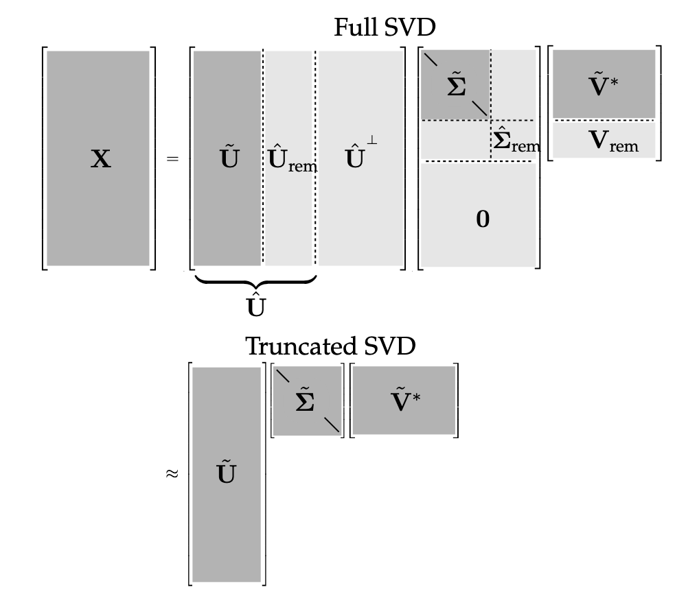

# Applications

SVD provides a numerically stable matrix decomposition. SVD makes up the foundation of Principal Component Analysis (PCA).

It generalizes the concept of Fast Fourier Transform (FFT). FFT works in idealized settings, and SVD is a more generic data-driven technique.

High dimensionality is a common challenge in processing data from complex systems. Data exhibit dominant patterns, which may be characterized by a low-dimensional attractor or manifold.

Consider images, which typically contains a large number of measurements (pixels), and therefore elements of high-dimensional vector space. Most images are highly compressible, meaning relevant information may be represented in a much lower-dimensional subspace.

SVD provides a systematic way to determine a low-dimensional approximation to high-dimensional data in terms of dominant patterns. The patterns are discovered from data, without the addition of intuition.

SVD is numerically stable and provides a hierarchical representation of the data in terms of a new coordinate system defined by dominant correlations within the data.

SVD is *guaranteed* to exist for any matrix, unlike eigendecomposition.

SVD is also used to compute the pseudo-inverse of non-square matrices, providing solutions to under-determined or over-determined matrix equations $Ax = b$. SVD can also de-noise datasets. It's also important to characterize the input and output geometry of a linear map between vector spaces.

# Definition of SVD

We're interested in analyzing a large dataset $X \in C^{n\times m}$.

$$
X = \begin{bmatrix} | & | & & | \\ x_1 & x_2 & ... & x_m \\ | & | & & | \end{bmatrix}
$$

The columns $x_k \in C^n$ maybe the measurements from simulations or experiments, like images that's been reshaped into column vectors with as many elements as pixels in the image. The column vectors could also represent the state of a physical system evolving in time.

$k$ is a label indicating the $kth$ distinct set of measurements. Often, the state dimension $n$ is very large, on the order of millions or billions of degrees of freedom.

The columns are often called *snapshots*, $m$ is the number of snapshots in $X$. For many system, $n$ is much larger than $m$ ($n \gg m$), resulting in a tall and skinny matrix, as oppose to a short and fat one.

SVD is a unique matrix decomposition that exist for every complex-valued $X \in C^{n \times m}$. We can take the matrix $X$ and decompose it as the product of 3 matrices:

$$
X = U \Sigma V^*
$$

Where:
- $U \in C^{n \times n}$ and $V \in C^{m \times m}$ are *unitary* matrices ($U U^* = U^* U = I$) with orthonormal columns.
- $\Sigma \in R^{n \times m}$ is a matrix with real, non-negative entries on the diagonal and zeros off the diagonal. The values are also hierarchically ordered, so $\sigma_{n-1} \ge \sigma_n$.

Columns of $U$ have the same dimension as the columns of $X$. $U$ is hierarchically arranged so $U_{n-1}$ is somehow more important than $U_n$ in terms of their ability to describe the variance in the columns of $X$. For example, columns of $X$ are face images then columns of $U$ are "eigen-faces". They give a basis to represent each columns of $X$.

$*$ denotes complex conjugate transpose (For real-valued matrices, it's the same as regular transpose $V^* = V^T$).

Example: Air flow field.

If our data is an air flow field evolving in time, the $U$ matrix would represent the "eigen-flow". The amount of energy that each of the column vectors captures of the flow would be given by the corresponding $\sigma_n$. $V_n$ would be a time series for how $U_1$ evolves. So each snapshots following $U_1$ has a certain amount of $U_1$ in it, that amount of how that $U_1$ varies in time is given by $V_1$.

So when $V$ gets transposed, the first column would of the transposed matrix would tell us the exact mixture of all the $U$ vectors that would add up to $X_1$.

Essentially, $U$ contains information about the column of $X$, $V^T$ contains information about the rows of $X$, $\Sigma$ is a diagonal matrix that tells you how important the columns in $U$ and $V^T$ are.

When $n \le m$, $\Sigma$ has at most $m$ non-zero elements on the diagonal:

$$
\Sigma = \begin{bmatrix} \hat{\Sigma} \\ 0 \end{bmatrix}
$$

Expanding the multiplication will give us the below equation. Each column of the matrix will get multiplied with its associated column and row. The expansion will only have $m$ terms since the $X$ matrix only contains $m$ samples, so all the $U$ values after $U_m$ is 0 because they'll get multiplied by a 0:

$$
\sigma_{m-1} U_{m-1}V_{m-1}^T + \sigma_{m} U_{m}V_{m}^T
$$

This $m$-bounded version of SVD (reduced SVD) is called *economy SVD*:

$$
X = U\Sigma V^* = \begin{bmatrix} \hat{U} & \hat{U}^{\perp}\end{bmatrix} \begin{bmatrix} \hat{\Sigma} \\ 0 \end{bmatrix} V^* = \hat{U} \hat{\Sigma} V^*
$$


The diagonal elements of $\hat{\Sigma}$ are called *singular values* as they are ordered from largest to smallest. The rank of X is equal to the number of non-zero singular values.

SVD can also be used to obtain an optimal rank-$r$ approximation of $X$ for $r \lt m$.

# Computation

Numerically, SVD may be computed by first reducing the matrix $X$ to a bidiagonal matrix and then using an iterative algorithm to compute the SVD of the bidiagonal matrix.

For matrices with high aspect ratio (meaning $n \gg m$), this may be achieved by first computing a QR factorization to reduce $X$ to an upper triangular matrix, then followed by Householder reflections to reduce this upper triangular matrix into a bidiagonal form (may be performed using a modified QR algorithm developed by Golub & Kahan).

[Details about QR factorization](https://www.math.ucla.edu/~yanovsky/Teaching/Math151B/handouts/GramSchmidt.pdf)

```python
import numpy as np
X = np.random.randn(5, 3) # random data matrix
U, S, VT = np.linalg.svd(X, full_matrices=True) # full SVD
U_hat, S_hat, VT_hat = np.linalg.svd(X, full_matrices=False) # economy SVD
```

# Matrix approximation

Perhaps the most useful and defining property of SVD is that it provides an optimal low-rank approximation to a matrix $X$. It provides a hierarchy of low-rank approximations, since a rank-$r$ approximation is obtained by keeping the leading $r$ singular values and vectors, and discarding the rest.

Because $\Sigma$ is diagonal, it is possible to express the matrix $X = U\Sigma V^*$ as a
sum of rank-one matrices (this is called the *dyadic summation*):

$$
X = \sum^m_{k=1} \sigma_k u_k v_k^* = \sigma_1 u_1 v_1^* + ... + \sigma_m u_m v_m^*
$$

The economy SVD's $U$ column vectors and $V^*$ row vectors are linearly independent with a rank of 1 (because each of them have exactly 1 linearly independent column or row). So $U \times V^*$ creates a new linearly dependent matrix and is a rank 1 matrix (because it depends on the linear combination of $u_k$ and $v_k$.

So if $X$ is a rank 1 matrix (1 dimensional), the best approximation for it is gonna be a rank 1 matrix $\sigma_1 U_1 V_1^T$. Then a rank 2 matrix (2 dimensional), the best approximation for it is gonna be a rank 2 matrix $\sigma_1 U_1 V_1^T + \sigma_2 U_2 V_2^T$. And so on.

With $\sigma_k$ being the $kth$ diagonal entry in $\Sigma$, and $u_k$ and $v_k$ are the $kth$ column of $U$ and $V$ respectively. The singular values are arranged in order ($\sigma_1 \ge \sigma_2 \ge ... \ge \sigma_m \ge 0$) so each subsequent values of $\sigma_k u_k v_k^*$ is less important than the previous in capturing the information in $X$.

> Each row of $u_k$ will be multiplied with the entirety of $v_k^*$, which is a row matrix, giving us a new matrix with the number of columns taken from $v_k^*$ and number of rows taken from $u_k$ (this is the same for the economy SVD).

For many systems, the singular values $\sigma_k$ decrease rapidly, and it's possible to  obtain a good approximation of $X$ by truncating at some rank $r$:

$$
\tilde{X} \approx X = \sum^r_{k=1} \sigma_k u_k v_k^* = \sigma_1 u_1 v_1^* + ... + \sigma_r u_r v_r^*
$$

Truncated SVD: $\tilde{X} = \tilde{U} \tilde{\Sigma} \tilde{V}^*$, where $\tilde{U}$ and $\tilde{V}^*$ contains the first $r$ columns of $U$ and $V$, and $\tilde{\Sigma}$ contains the first $r\times r$ sub-block of $\Sigma$.



If $X$ doesn't have full rank, some of the singular values in $\hat{\Sigma}$ may be zero, and the truncated SVD may still be exact. However, for truncation values $r$ that are smaller than the number of non-zero singular values (meaning the rank of X), truncated SVD only approximates $X$.

For a given rank $r$, there's no better approximation of $X$ than the truncated SVD approximation $\tilde{X}$. There are numerous choices for the truncation rank $r$. Thus, high-dimensional data may be well described by a few dominant patterns given by the columns of $\tilde{U}$ and $\tilde{V}$.

This is important. There are numerous examples of data sets that contain high-dimensional measurements, resulting in a large data matrix $X$. However, there are often dominant low-dimensional patterns in the data, and the truncated SVD basis $\tilde{U}$ provides a coordinate transformation from the high-dimensional measurement space into a low-dimensional pattern space. This has the benefit of reducing the size and dimension of large datasets, yielding a tractable basis for visualization and analysis.

It's important to note that $\tilde{U}^T\tilde{U}$ still have orthogonal columns, which produces an identity matrix. But $\tilde{U}\tilde{U}^T$ produces an $n \times n$ matrix with rank $r$.

$$
\begin{aligned}
&\tilde{U}^T\tilde{U} = I^{r\times r}
\\
&\tilde{U}\tilde{U}^T \ne I
\end{aligned}
$$

# Side note: Economy SVD vs Truncated SVD

Economy SVD is for approximating the matrix. Approximating the exact rank representation of the matrix and focuses on representing the full structure of the matrix $X$. It uses all the non-zero singular values in $\hat{\Sigma}$.

Truncated SVD focuses on low-rank approximation of the matrix. Approximates a few dominant patterns of the matrix $X$, reducing the complexity or noise in the dataset while preserving most of its structure. It only uses the top $k$ singular values in $\hat{\Sigma}$.

# Optimal approximations and error bounds

According to the [Eckart-Young Theorem](https://en.wikipedia.org/wiki/Low-rank_approximation#Proof_of_Eckart%E2%80%93Young%E2%80%93Mirsky_theorem_(for_Frobenius_norm)), the truncated SVD guarantees the best matrix approximation of a given rank in the Frobenius norm.

We can also quantify the error of the rank-$r$ SVD approximation:

$$
|| X - \tilde{X} ||^2_F = \sum^m_{k=r+1} \sigma_k^2
$$

Because the error scales with the size and magnitude of X, it is often more useful to consider the relative error:

$$
\frac{|| X - \tilde{X} ||^2_F}{|| X ||^2_F}
$$

Example: If the columns of $X$ are velocity fields, for example from a discretized fluid flow simulation, then this error is related to the fraction of the kinetic energy that is missing in the approximation $\tilde{X}$.

The squared Frobenius norm error of mean-subtracted data has the interpretation of the amount of missing variance in the approximation $\tilde{X}$.

The error expression can also be written as this:

$$
X - \tilde{X} = \sum^m_{k=r+1}\sigma_k u_k v_k^*
$$

# Dominant correlations

SVD is closely related to an eigenvalue problem involving the correlation matrices $XX^*$ and $X^*X$.

$$
\begin{aligned}
&X X^* = U \begin{bmatrix} \hat{\Sigma} \\ 0 \end{bmatrix} V^* V \begin{bmatrix} \hat{\Sigma} & 0 \end{bmatrix} U^* = U \begin{bmatrix} \hat{\Sigma}^2 & 0 \\ 0 & 0 \end{bmatrix} U^*
\\
&X^* X = V \begin{bmatrix} \hat{\Sigma} & 0 \end{bmatrix} U^* U \begin{bmatrix} \hat{\Sigma} \\ 0 \end{bmatrix} V^* = V \hat{\Sigma}^2 V^*
\end{aligned}
$$


Both correlation matrices are symmetric.

$U$ and $V$ are unitary. So $U$, $\Sigma$, and $V$ are solutions to the following eigenvalue problems:

$$
\begin{aligned}
&X X^* U = U \begin{bmatrix} \hat{\Sigma}^2 & 0 \\ 0 & 0 \end{bmatrix}
\\
&X^* X V = V \hat{\Sigma}^2
\end{aligned}
$$

Each non-zero singular value of $X$ is a positive square root of an eigenvalue of $X^*X$ and of $XX^*$, which have the same non-zero eigenvalues.

If $X = X^*$ (self-adjoint), the singular values of $X$ are equal to the absolute value of the eigenvalues of $X$.

SVD interpretation: The columns of $U$ are eigenvectors of the correlation matrix $XX^*$, and the columns of $V$ are eigenvectors of $X^*X$.

# Methods of snapshots

