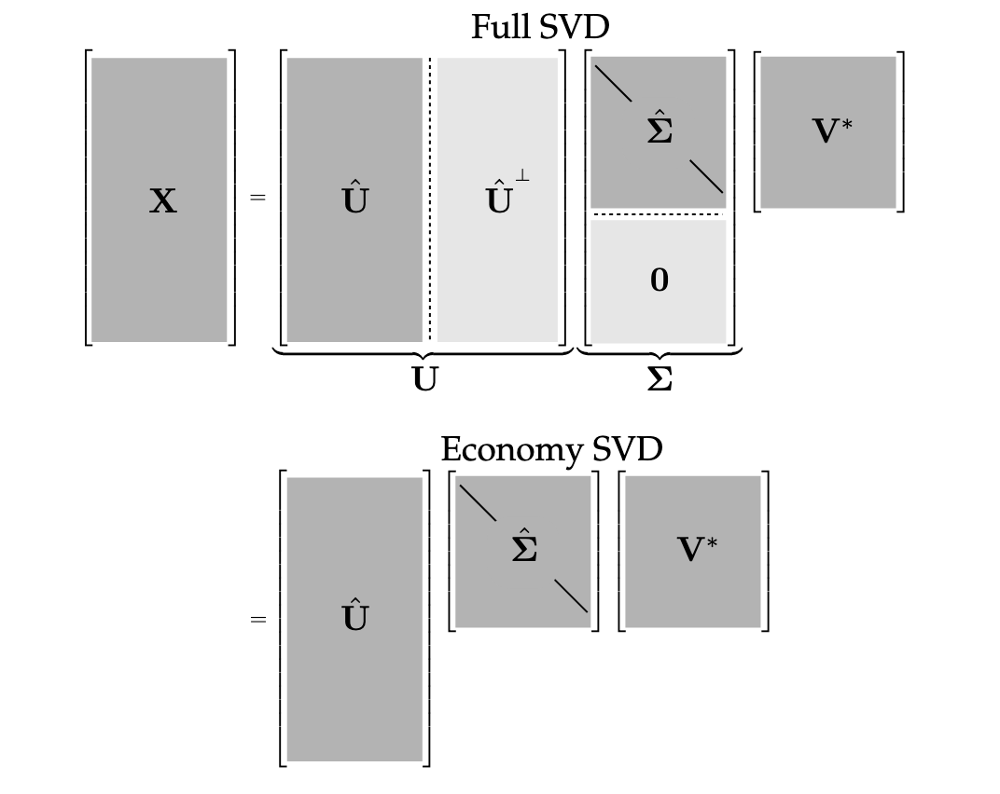

# Applications

SVD provides a numerically stable matrix decomposition. SVD makes up the foundation of Principal Component Analysis (PCA).

It generalizes the concept of Fast Fourier Transform (FFT). FFT works in idealized settings, and SVD is a more generic data-driven technique.

High dimensionality is a common challenge in processing data from complex systems. Data exhibit dominant patterns, which may be characterized by a low-dimensional attractor or manifold.

Consider images, which typically contains a large number of measurements (pixels), and therefore elements of high-dimensional vector space. Most images are highly compressible, meaning relevant information may be represented in a much lower-dimensional subspace.

SVD provides a systematic way to determine a low-dimensional approximation to high-dimensional data in terms of dominant patterns. The patterns are discovered from data, without the addition of intuition.

SVD is numerically stable and provides a hierarchical representation of the data in terms of a new coordinate system defined by dominant correlations within the data.

SVD is *guaranteed* to exist for any matrix, unlike eigendecomposition.

SVD is also used to compute the pseudo-inverse of non-square matrices, providing solutions to under-determined or over-determined matrix equations $Ax = b$. SVD can also de-noise datasets. It's also important to characterize the input and output geometry of a linear map between vector spaces.

# Definition of SVD

We're interested in analyzing a large dataset $X \in C^{n\times m}$.

$$
X = \begin{bmatrix} | & | & & | \\ x_1 & x_2 & ... & x_m \\ | & | & & | \end{bmatrix}
$$

The columns $x_k \in C^n$ maybe the measurements from simulations or experiments, like images that's been reshaped into column vectors with as many elements as pixels in the image. The column vectors could also represent the state of a physical system evolving in time.

$k$ is a label indicating the $kth$ distinct set of measurements. Often, the state dimension $n$ is very large, on the order of millions or billions of degrees of freedom.

The columns are often called *snapshots*, $m$ is the number of snapshots in $X$. For many system, $n$ is much larger than $m$ ($n \gg m$), resulting in a tall and skinny matrix, as oppose to a short and fat one.

SVD is a unique matrix decomposition that exist for every complex-valued $X \in C^{n \times m}$. We can take the matrix $X$ and decompose it as the product of 3 matrices:

$$
X = U \Sigma V^*
$$

Where:
- $U \in C^{n \times n}$ and $V \in C^{m \times m}$ are *unitary* matrices ($U U^* = U^* U = I$) with orthonormal columns.
- $\Sigma \in R^{n \times m}$ is a matrix with real, non-negative entries on the diagonal and zeros off the diagonal. The values are also hierarchically ordered, so $\Sigma_{n-1} \ge \Sigma_n$.

Columns of $U$ have the same dimension as the columns of $X$. $U$ is hierarchically arranged so $U_{n-1}$ is somehow more important than $U_n$ in terms of their ability to describe the variance in the columns of $X$. For example, columns of $X$ are face images then columns of $U$ are "eigen-faces". They give a basis to represent each columns of $X$.

$*$ denotes complex conjugate transpose (For real-valued matrices, it's the same as regular transpose $V^* = V^T$).

Example: Air flow field.

If our data is an air flow field evolving in time, the $U$ matrix would represent the "eigen-flow". The amount of energy that each of the column vectors captures of the flow would be given by the corresponding $\Sigma_n$. $V_n$ would be a time series for how $U_1$ evolves. So each snapshots following $U_1$ has a certain amount of $U_1$ in it, that amount of how that $U_1$ varies in time is given by $V_1$.

So when $V$ gets transposed, the first column would of the transposed matrix would tell us the exact mixture of all the $U$ vectors that would add up to $X_1$.

Essentially, $U$ contains information about the column of $X$, $V^T$ contains information about the rows of $X$, $\Sigma$ is a diagonal matrix that tells you how important the columns in $U$ and $V^T$ are.

When $n \le m$, $\Sigma$ has at most $m$ non-zero elements on the diagonal:

$$
\Sigma = \begin{bmatrix} \hat{\Sigma} \\ 0 \end{bmatrix}
$$

Expanding the multiplication will give us the below equation. Each column of the matrix will get multiplied with its associated column and row. The expansion will only have $m$ terms since the $X$ matrix only contains $m$ samples, so all the $U$ values after $U_m$ is 0 because they'll get multiplied by a 0:

$$
\Sigma_{m-1} U_{m-1}V_{m-1}^T + \Sigma_{m} U_{m}V_{m}^T
$$

This $m$-bounded version of SVD (reduced SVD) is called *economy SVD*:

$$
X = U\Sigma V^* = \begin{bmatrix} \hat{U} & \hat{U}^{\perp}\end{bmatrix} \begin{bmatrix} \hat{\Sigma} \\ 0 \end{bmatrix} V^* = \hat{U} \hat{\Sigma} V^*
$$

The diagonal elements of $\hat{\Sigma}$ are called *singular values* as they are ordered from largest to smallest. The rank of X is equal to the number of non-zero singular values.

SVD can also be used to obtain an optimal rank-$r$ approximation of $X$ for $r \lt m$.