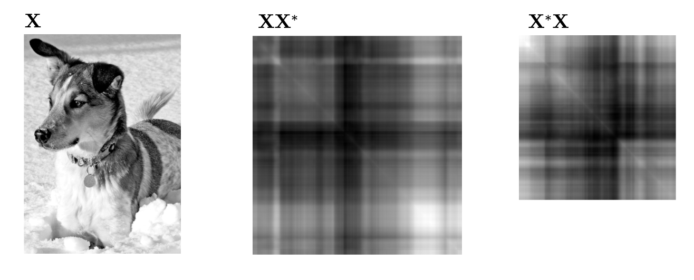

[A nice visual explanation of SVD](https://www.youtube.com/watch?v=CpD9XlTu3ys)

# Applications

SVD provides a numerically stable matrix decomposition. SVD makes up the foundation of Principal Component Analysis (PCA).

It generalizes the concept of Fast Fourier Transform (FFT). FFT works in idealized settings, and SVD is a more generic data-driven technique.

High dimensionality is a common challenge in processing data from complex systems. Data exhibit dominant patterns, which may be characterized by a low-dimensional attractor or manifold.

Consider images, which typically contains a large number of measurements (pixels), and therefore elements of high-dimensional vector space. Most images are highly compressible, meaning relevant information may be represented in a much lower-dimensional subspace.

SVD provides a systematic way to determine a low-dimensional approximation to high-dimensional data in terms of dominant patterns. The patterns are discovered from data, without the addition of intuition.

SVD is numerically stable and provides a hierarchical representation of the data in terms of a new coordinate system defined by dominant correlations within the data.

SVD is *guaranteed* to exist for any matrix, unlike eigendecomposition.

SVD is also used to compute the pseudo-inverse of non-square matrices, providing solutions to under-determined or over-determined matrix equations $Ax = b$. SVD can also de-noise datasets. It's also important to characterize the input and output geometry of a linear map between vector spaces.

# Definition of SVD

We're interested in analyzing a large dataset $X \in C^{n\times m}$.

$$
X = \begin{bmatrix} | & | & & | \\ x_1 & x_2 & ... & x_m \\ | & | & & | \end{bmatrix}
$$

The columns $x_k \in C^n$ maybe the measurements from simulations or experiments, like images that's been reshaped into column vectors with as many elements as pixels in the image. The column vectors could also represent the state of a physical system evolving in time.

$k$ is a label indicating the $kth$ distinct set of measurements. Often, the state dimension $n$ is very large, on the order of millions or billions of degrees of freedom.

The columns are often called *snapshots*, $m$ is the number of snapshots in $X$. For many system, $n$ is much larger than $m$ ($n \gg m$), resulting in a tall and skinny matrix, as oppose to a short and fat one.

SVD is a unique matrix decomposition that exist for every complex-valued $X \in C^{n \times m}$. We can take the matrix $X$ and decompose it as the product of 3 matrices:

$$
X = U \Sigma V^*
$$

Where:
- $U \in C^{n \times n}$ and $V \in C^{m \times m}$ are *unitary* matrices ($U U^* = U^* U = I$) with orthonormal columns.
- $\Sigma \in R^{n \times m}$ is a matrix with real, non-negative entries on the diagonal and zeros off the diagonal. The values are also hierarchically ordered, so $\sigma_{n-1} \ge \sigma_n$.

Columns of $U$ have the same dimension as the columns of $X$. $U$ is hierarchically arranged so $U_{n-1}$ is somehow more important than $U_n$ in terms of their ability to describe the variance in the columns of $X$. For example, columns of $X$ are face images then columns of $U$ are "eigen-faces". They give a basis to represent each columns of $X$.

$*$ denotes complex conjugate transpose (For real-valued matrices, it's the same as regular transpose $V^* = V^T$. For complex-valued matrices, it's a little different).

Example: Air flow field.

If our data is an air flow field evolving in time, the $U$ matrix would represent the "eigen-flow". The amount of energy that each of the column vectors captures of the flow would be given by the corresponding $\sigma_n$. $V_n$ would be a time series for how $U_1$ evolves. So each snapshots following $U_1$ has a certain amount of $U_1$ in it, that amount of how that $U_1$ varies in time is given by $V_1$.

So when $V$ gets transposed, the first column would of the transposed matrix would tell us the exact mixture of all the $U$ vectors that would add up to $X_1$.

Essentially, $U$ contains information about the column of $X$, $V^T$ contains information about the rows of $X$, $\Sigma$ is a diagonal matrix that tells you how important the columns in $U$ and $V^T$ are.

When $n \le m$, $\Sigma$ has at most $m$ non-zero elements on the diagonal:

$$
\Sigma = \begin{bmatrix} \hat{\Sigma} \\ 0 \end{bmatrix}
$$

Expanding the multiplication will give us the below equation. Each column of the matrix will get multiplied with its associated column and row. The expansion will only have $m$ terms since the $X$ matrix only contains $m$ samples, so all the $U$ values after $U_m$ is 0 because they'll get multiplied by a 0:

$$
\sigma_{m-1} U_{m-1}V_{m-1}^T + \sigma_{m} U_{m}V_{m}^T
$$

This $m$-bounded version of SVD (reduced SVD) is called *economy SVD*:

$$
X = U\Sigma V^* = \begin{bmatrix} \hat{U} & \hat{U}^{\perp}\end{bmatrix} \begin{bmatrix} \hat{\Sigma} \\ 0 \end{bmatrix} V^* = \hat{U} \hat{\Sigma} V^*
$$


The diagonal elements of $\hat{\Sigma}$ are called *singular values* as they are ordered from largest to smallest. The rank of X is equal to the number of non-zero singular values.

SVD can also be used to obtain an optimal rank-$r$ approximation of $X$ for $r \lt m$.

# Computation

Numerically, SVD may be computed by first reducing the matrix $X$ to a bidiagonal matrix and then using an iterative algorithm to compute the SVD of the bidiagonal matrix.

For matrices with high aspect ratio (meaning $n \gg m$), this may be achieved by first computing a QR factorization to reduce $X$ to an upper triangular matrix, then followed by Householder reflections to reduce this upper triangular matrix into a bidiagonal form (may be performed using a modified QR algorithm developed by Golub & Kahan).

[Details about QR factorization](https://www.math.ucla.edu/~yanovsky/Teaching/Math151B/handouts/GramSchmidt.pdf)

```python
import numpy as np
X = np.random.randn(5, 3) # random data matrix
U, S, VT = np.linalg.svd(X, full_matrices=True) # full SVD
U_hat, S_hat, VT_hat = np.linalg.svd(X, full_matrices=False) # economy SVD
```

# Matrix approximation

Perhaps the most useful and defining property of SVD is that it provides an optimal low-rank approximation to a matrix $X$. It provides a hierarchy of low-rank approximations, since a rank-$r$ approximation is obtained by keeping the leading $r$ singular values and vectors, and discarding the rest.

Because $\Sigma$ is diagonal, it is possible to express the matrix $X = U\Sigma V^*$ as a
sum of rank-one matrices (this is called the *dyadic summation*):

$$
X = \sum^m_{k=1} \sigma_k u_k v_k^* = \sigma_1 u_1 v_1^* + ... + \sigma_m u_m v_m^*
$$

The economy SVD's $U$ column vectors and $V^*$ row vectors are linearly independent with a rank of 1 (because each of them have exactly 1 linearly independent column or row). So $U \times V^*$ creates a new linearly dependent matrix and is a rank 1 matrix (because it depends on the linear combination of $u_k$ and $v_k$.

So if $X$ is a rank 1 matrix (1 dimensional), the best approximation for it is gonna be a rank 1 matrix $\sigma_1 U_1 V_1^T$. Then a rank 2 matrix (2 dimensional), the best approximation for it is gonna be a rank 2 matrix $\sigma_1 U_1 V_1^T + \sigma_2 U_2 V_2^T$. And so on.

With $\sigma_k$ being the $kth$ diagonal entry in $\Sigma$, and $u_k$ and $v_k$ are the $kth$ column of $U$ and $V$ respectively. The singular values are arranged in order ($\sigma_1 \ge \sigma_2 \ge ... \ge \sigma_m \ge 0$) so each subsequent values of $\sigma_k u_k v_k^*$ is less important than the previous in capturing the information in $X$.

> Each row of $u_k$ will be multiplied with the entirety of $v_k^*$, which is a row matrix, giving us a new matrix with the number of columns taken from $v_k^*$ and number of rows taken from $u_k$ (this is the same for the economy SVD).

For many systems, the singular values $\sigma_k$ decrease rapidly, and it's possible to  obtain a good approximation of $X$ by truncating at some rank $r$:

$$
\tilde{X} \approx X = \sum^r_{k=1} \sigma_k u_k v_k^* = \sigma_1 u_1 v_1^* + ... + \sigma_r u_r v_r^*
$$

Truncated SVD: $\tilde{X} = \tilde{U} \tilde{\Sigma} \tilde{V}^*$, where $\tilde{U}$ and $\tilde{V}^*$ contains the first $r$ columns of $U$ and $V$, and $\tilde{\Sigma}$ contains the first $r\times r$ sub-block of $\Sigma$.


If $X$ doesn't have full rank, some of the singular values in $\hat{\Sigma}$ may be zero, and the truncated SVD may still be exact. However, for truncation values $r$ that are smaller than the number of non-zero singular values (meaning the rank of X), truncated SVD only approximates $X$.

For a given rank $r$, there's no better approximation of $X$ than the truncated SVD approximation $\tilde{X}$. There are numerous choices for the truncation rank $r$. Thus, high-dimensional data may be well described by a few dominant patterns given by the columns of $\tilde{U}$ and $\tilde{V}$.

This is important. There are numerous examples of data sets that contain high-dimensional measurements, resulting in a large data matrix $X$. However, there are often dominant low-dimensional patterns in the data, and the truncated SVD basis $\tilde{U}$ provides a coordinate transformation from the high-dimensional measurement space into a low-dimensional pattern space. This has the benefit of reducing the size and dimension of large datasets, yielding a tractable basis for visualization and analysis.

It's important to note that $\tilde{U}^T\tilde{U}$ still have orthogonal columns, which produces an identity matrix. But $\tilde{U}\tilde{U}^T$ produces an $n \times n$ matrix with rank $r$.

$$
\begin{aligned}
&\tilde{U}^T\tilde{U} = I^{r\times r}
\\
&\tilde{U}\tilde{U}^T \ne I
\end{aligned}
$$

# Side note: Economy SVD vs Truncated SVD

Economy SVD is for approximating the matrix. Approximating the exact rank representation of the matrix and focuses on representing the full structure of the matrix $X$. It uses all the non-zero singular values in $\hat{\Sigma}$.

Truncated SVD focuses on low-rank approximation of the matrix. Approximates a few dominant patterns of the matrix $X$, reducing the complexity or noise in the dataset while preserving most of its structure. It only uses the top $k$ singular values in $\hat{\Sigma}$.

# Optimal approximations and error bounds

According to the [Eckart-Young Theorem](https://en.wikipedia.org/wiki/Low-rank_approximation#Proof_of_Eckart%E2%80%93Young%E2%80%93Mirsky_theorem_(for_Frobenius_norm)), the truncated SVD guarantees the best matrix approximation of a given rank in the Frobenius norm. The Frobenius norm of a matrix is given by this:

$$
||A||_F = \sqrt{\sum_{i,j}(A_{ij})^2}
$$


We can also quantify the error of the rank-$r$ SVD approximation:

$$
|| X - \tilde{X} ||^2_F = \sum^m_{k=r+1} \sigma_k^2
$$

Because the error scales with the size and magnitude of X, it is often more useful to consider the relative error:

$$
\frac{|| X - \tilde{X} ||^2_F}{|| X ||^2_F}
$$

Example: If the columns of $X$ are velocity fields, for example from a discretized fluid flow simulation, then this error is related to the fraction of the kinetic energy that is missing in the approximation $\tilde{X}$.

The squared Frobenius norm error of mean-subtracted data has the interpretation of the amount of missing variance in the approximation $\tilde{X}$.

The error expression can also be written as this:

$$
X - \tilde{X} = \sum^m_{k=r+1}\sigma_k u_k v_k^*
$$

# Dominant correlations

SVD is closely related to an eigenvalue problem involving the correlation matrices $XX^*$ (row-wise correlation matrix) and $X^*X$ (column-wise correlation matrix). Essentially, we can think of $U$ and $V$ as eigenvectors of a correlation matrix given by $XX^*$ or $X^*X$. We can describe the eigenvalue decomposition of each of the correlation matrix like this:

$$
\begin{aligned}
&X X^* = U \begin{bmatrix} \hat{\Sigma} \\ 0 \end{bmatrix} V^* V \begin{bmatrix} \hat{\Sigma} & 0 \end{bmatrix} U^* = U \begin{bmatrix} \hat{\Sigma}^2 & 0 \\ 0 & 0 \end{bmatrix} U^*
\\
&X^* X = V \begin{bmatrix} \hat{\Sigma} & 0 \end{bmatrix} U^* U \begin{bmatrix} \hat{\Sigma} \\ 0 \end{bmatrix} V^* = V \hat{\Sigma}^2 V^*
\end{aligned}
$$



Both correlation matrices are symmetric. The correlation matrix among the columns of $X$. For $XX^*$, this is an $m\times m$ matrix. Each columns in the $m\times m$ correlation matrix is the dot product between each columns and rows in the $X^* X$ matrix.

$$
\begin{aligned}
X^* X &= \begin{bmatrix} -x_1^T- \\ -x_2^T- \\ ... \end{bmatrix} \begin{bmatrix} | & | \\ x_1 & x_2 & ...  \\ | & | \end{bmatrix}
\\
&= \begin{bmatrix} x_1^T x_1 & x_1^T x_2 & ... & x_1^T x_m \\ x_2^Tx_1 & x_2^Tx_2 & ... & x_2^T x_m \\ \vdots & \vdots & \ddots & \vdots \\ x_m^Tx_1 & x_m^Tx_2 & ... & x_m^T x_m\end{bmatrix}
\end{aligned}
$$

We can also represent this matrix as an inner product equation:

$$
x_i^T x_j = \langle x_i, x_j \rangle
$$

An interesting thing about the correlation matrix is that if there's a large value in the matrix, then that means $x_i$ and $x_j$ has a strong correlation to each other, meaning they have similar structure to each other. A small value would indicate that they are orthogonal to each other, meaning they have very different structure.

$U$ and $V$ are unitary. So $U$, $\Sigma$, and $V$ are solutions to the following eigenvalue problems:

$$
\begin{aligned}
&X X^* U = U \begin{bmatrix} \hat{\Sigma}^2 & 0 \\ 0 & 0 \end{bmatrix}
\\
&X^* X V = V \hat{\Sigma}^2
\end{aligned}
$$

Each non-zero singular value of $X$ is a positive square root of an eigenvalue of $X^*X$ and of $XX^*$, which have the same non-zero eigenvalues. What this mean is that $\hat{\Sigma}^2$ are the eigenvalues of $X^*X$ and the $V$'s are the eigenvectors of that correlation matrix.

If $X = X^*$ (self-adjoint), the singular values of $X$ are equal to the absolute value of the eigenvalues of $X$.

SVD interpretation: The columns of $U$ are eigenvectors of the correlation matrix $XX^*$, and the columns of $V$ are eigenvectors of $X^*X$. The first column $u_1$ is the largest eigenvector that is most correlated with the columns of $X$, the second column $u_2$ is the second most important eigenvector, etc. Same thing for the columns of $V$. And their importance is signified by the eigenvalues $\Sigma^2$.

Generally, we don't want to compute the composition matrices in SVD with these correlation matrix eigendecompositions since it's very inefficient and very inaccurate.

# Methods of snapshots

Constructing $XX^*$ is impractical since it's an $n\times n$ matrix. Correlation matrix should not be computed for most cases (it's really only used in some cases like when the $X$ matrix is so large, you can't store it in memory). Instead of computing the eigendecomposition of $XX^*$ to obtain $U$, we only compute the $X^*X$, which is much more manageable.

From $X^* X V = V \hat{\Sigma}^2$, we can obtain $V$ and $\hat{\Sigma}$. If there are zero singular values in $\hat{\Sigma}$, then we only keep the $r$ non-zero part, $\tilde{\Sigma}$, and the corresponding columns $\tilde{V}$ of $V$. Essentially, we can compute $X^* X$ by loading 1 vector at a time from both $X$ and $X^*$ and computing the product of those 2 vectors, then load the next vector to calculate the product, then do it until we get an $m \times m$ matrix. This is very time-consuming.

Because the eigenvalues in the $\Sigma$ matrix for the correlation matrices is the same as $X$, we can use that to approximate $U$. From these matrices, we can approximate $\tilde{U}$ (the first $r$ columns of $U$).

$$
\tilde{U} = X \tilde{V} \tilde{\Sigma}^{-1}
$$

From this, we can derive the calculation for $\hat{U}$:

$$
\hat{U} = X V \hat{\Sigma}^{-1}
$$

> Note: SVD is the foundation for many things, one of those things is matrix completion. Say we have a matrix with a bunch of missing data, SVD is the foundation for the algorithms that helps us find the correlation between those data and fill in the missing data (algorithms like RPCA).

# Unitary transformations

Unitary transformation essentially preserve the angles and the lengths of any 2 vectors within the vector space during the transformation. A famous example of a unitary transformation is the Fourier transformation. So unitary transformations just rotate vectors. We can say that vector $x$ and vector $y$ will stay unchanged if a transformation $U$ is applied.

$$
\langle x, y \rangle = \langle Ux, Uy \rangle
$$

Example: We want the transformation to retain angles and lengths because we still want to, say tell a person's face from another person's face. These unitary transformation is key to preserving the relation between the vectors.

# Pseudo-inverse, systems of equations, and least squares

This is a linear system of equations:

$$
Ax = b
$$

If $A$ is a square matrix, we have exactly as many knowns as unknowns. If $A$ has a non-zero determinant, we can compute $X$ with this:

$$
x = b A^{-1}
$$

SVD allows us to generalize this for non-square $A$ matrices. It allows us to invert $A$ and find the best-fit $X$ that comes as close to solving this as possible.

For underdetermined systems of equations ($n \lt m$), we have a "short-fat" matrix $A$, a "tall" vector $x$ and the solution $b$. This is underdetermined because there's not enough measurements to determine a single unique solution for $x$. There will be infinitely many solution $x$ given $b$.

For overdetermined systems of equations ($n \gt m$), we have a "tall-thin" matrix $A$, a "short" vector $x$ and the solution $b$. This is overdetermined because there's no solutions to this system because there's not enough degrees in $x$.

Below is the economy SVD of $A$.

$$
A = U \Sigma V^* \rightarrow A^{+} = V\Sigma^{-1}U^T
$$

By decomposing $A$ like this, we can easily find the inverse of each of the composition matrices (with $A^+$ being the pseudo-inverse of $A$).

$$
\begin{aligned}
&U \Sigma V^* x = b
\\
&V\Sigma^{-1}U^T U \Sigma V^* x = V\Sigma^{-1}U^T b
\\
&\tilde{x} = V\Sigma^{-1}U^T b = A^+ b
\end{aligned}
$$

For overdetermined systems, the solution to $\tilde{x}$ is the solution that minimizes the error in the fit between $A\tilde{x}$ and $b$. This is called the *least square solution*.

The solution of $Ax = b$ only exists if $b$ is in the column space (span of column vectors) of $A$. For underdetermined systems, $b$ is highly likely to be in the column space of $A$. For overdetermined systems, $b$ is highly unlikely to be in the column space of $A$. If $b$ is in the orthogonal complement, there would be no solutions (vectors perpendicular to a vector in the column space of $A$). If there are some vectors in $A$ that maps to 0 (there's a null space), there are infinitely many solutions.

# Linear regression

Take for example a dataset of patients, we want to predict if they have cancer or not. We could put it into a linear regression model represented by a linear system of equations, where $A$ is the dataset, with each row being a different patient, and each column is a unique feature (age, smoker or not smoker, etc), $b$ is the value indicating the patient's risk of having cancer, and $x$ being our model.

Since this is an overdetermined system, we want to find $x$ so that it minimizes the error between $Ax$ and $b$. We want the model to be able to predict the risk of having cancer as accurately as possible, when we put a person's feature into the model, the model should be able to output the risk of the person having cancer. This is essentially the basis of linear regression.


A nice thing about this is that we could have multiple factors $A_n$ and the math wouldn't change too much. Instead of finding a best-fit line, we find a best-fit plane for that.

With $A$ being a 1D vector currently, we can compute the SVD for $A$ like this:

$$
\begin{aligned}
&U=\frac{a}{||a||_2}
\\
&\Sigma=||a||_2
\\
&V=1
\end{aligned}
$$

We can calculate $\tilde{x}$ with the below equation. We basically take all the values of $b$ and project it onto the direction of $A$, then we normalize the $A$ vector by it's length.

$$
\tilde{x} = \frac{a^Tb}{||a||_2^2}
$$

The linear regression is actually quite sensitive to outliers, data points that doesn't really reside near other data points, that could knockoff our model a little bit.

# Principle Component Analysis (PCA)

PCA is the statistical interpretation of SVD. It provides a hierarchical coordinate system based on data. We have a matrix $X$, whose rows are samples.

$$
X = \begin{bmatrix} -x_1- \\ -x_2- \\ \vdots \end{bmatrix}
$$

We want to uncover the dominant combination of features that describes as much of the data as possible.

Steps:
1. Compute the row mean: $\overline{x} = \frac{1}{n} \sum_{j=1}^n x_j$. Then we create a row vector $\overline{X}$ ($n$ rows) from $\overline{x}$ with each elements containing the value of $\overline{x}$.
2. Subtract the mean from $X$: $B = X - \overline{X}$. This is the mean-centered data.
3. Compute covariance matrix (basically the correlation matrix from SVD) of the rows of $B$: $C = \frac{1}{n - 1} B^*B$ (the fraction term is for normalization - Bessel’s correction).
4. Compute the eigenvectors and eigenvalues of $C$ (which will be related to the eigenvectors and eigenvalues of $X$, which will be the principal components). We'll compute $v_n^* B^* B v_n$ for each of the row. We'll get $CV = VD$ where $V$ is the eigenvectors and $D$ is the eigenvalues.
5. The principal components can be extracted like this: $T = B V$. This is a representation of the singular components because $B = U\Sigma V^*$ in SVD, so $T = U\Sigma V^* V = U\Sigma$. We basically decompose the matrix $X$ into directions of maximal variance called the principal components. The $V$ eigenvectors are called the loadings, it indicates how much each of the principle components have those principal components.

The eigenvalues in $D$ (similar to the values in $\Sigma$) gives an indication of the amount of variance that these principal components and loadings capture.

$$
C = \frac{1}{n - 1} B^*B = \frac{1}{n - 1} V\Sigma^2 V^* \rightarrow D = \frac{1}{n - 1} \Sigma^2
$$

The variance the data, given by the diagonal elements $\lambda_k$ of $D$, is related to the singular values. We basically calculate the fraction between the sum of the $rth$ values of $\lambda_k$ and the sum of all the $\lambda_k$, the $rth$ variance and the total variance.

$$
\begin{aligned}
&\lambda_k = \frac{1}{n - 1} \sigma_k^2
\\
&\frac{\sum^r_{k=1} \lambda_k}{\sum^n_{k=1} \lambda_k}
\end{aligned}
$$

# Truncation and alignment

How do you choose the $r$ value for approximation? Sometimes we can use the log graph of $\Sigma$ and pick the elbow point, the point where it transitions from high energy to low energy.


Sometimes we pick $r$ so that it approximates 90-99% of the energy. These techniques are very heuristic.

Optimal thresholding can allow us to optimally find $r$. It assumes this:

$$
X = X_{\text{true}} + \gamma X_{\text{noise}}
$$

$X_{\text{true}}$ is a low-rank $r$ matrix. $X_{\text{noise}}$ is assumed to be a Gaussian noise with 0 mean and unit variance multiplied by $\gamma$, which indicates whether the noise is large or small (noise magnitude). If we take the SVD of $X_{\text{noise}}$, we get an energy distribution like below. It is assumed that anything larger than the noise floor of the SVD of the noise matrix is signal, and anything smaller than that is noise and should be truncated away. In the graph below, the pink line is the $\Sigma$ values for $X_{\text{noise}}$, and the green line is the $\Sigma$ values for $X$.


So basically if our data has a low-rank structure with some gaussian noise matrix added to it, we want to find the first singular value that's larger than the biggest singular value in $X_{\text{noise}}$, then truncate everything below that floor.

For the formula, assuming $X$ is square ($n \times n$) and $\gamma$ is known (we truncate any values $\sigma \lt \tau$):

$$
\tau = \frac{4}{\sqrt{3}} \gamma \sqrt{n}
$$

When $X$ is rectangular and $\gamma$ is unknown (with $\omega$ being the correction factor):

$$
\begin{aligned}
&\beta = \frac{n}{m}
\\
&\tau = \omega(\beta)\sigma_{\text{median}}
\end{aligned}
$$

# Data alignment

We assume the data is aligned correctly, otherwise, if the data in, say an image, is not aligned in the expected pattern, the SVD would be bad for pulling out features.

Face recognition algorithms actually takes the features of the face and maps it to a new picture that places the features of the face to the same template. This spatial invariance (same thing appearing in different places) makes a huge difference for these algorithms, so we need to crop and align for these algorithms to handle.

A low-rank matrix that gets rotated or translated or scaled could become a high-rank matrix, which could cause trouble to the algorithms. The correlation structure would get destroyed. This is a pitfall that we can fall into when working with PCA and SVD. This side of linear algebra is under ongoing research.

Side note: CNN can actually handle these sorts of translations and spatial invariance very well.

# Randomized SVD

For large data matrix, the SVD takes a little while to compute. Measurement dimension is increasing rapidly. With the SVD, even with the high dimensional data, there's a few key patterns that we would care about for building or understanding the data. There would still be a low intrinsic rank, a few key features of the data that actually matter.

For a given data matrix $X$, we'd randomly sample the column space of the matrix. With high probability, we're gonna find the subspace that will be spanned by the dominant columns of the $U$ matrix.

Step 1: Take a random projection matrix $P$ that we can multiply on the column space of $X$: $P \in R^{m \times r}$. We multiply $P$ with $X$, which will shrink the column space to $r$-columns: $Z = XP$. Then we compute the QR factorization on $Z$, with $Q$ being the orthonormal basis for $Z$ and $X$ (because if $Z$ was randomly sampled, there's a high probability that it should also contain the dominant features of $X$): $Z = QR$.


Step 2: Project $X$ onto the $Q$ subspace: $Y = Q^*X$, then compute the SVD of $Y$: $Y = U_Y \Sigma V^*$. The $\Sigma$ and $V$ of $Y$ would be the same as the $\Sigma$ and $V$ of $X$.

Step 3: Reconstruct the high-dimensional modes $U_X = Q U_Y$.


All of this calculation is actually less expensive then computing the SVD of $X$ directly.

# Power iterations and Oversampling

These are 2 different versions of the vanilla randomized SVD.

Oversampling means we just add a couple extra columns to our projection matrix $P$, maybe 5 or 10. This gives us a much better chance of capturing the dominant feature of $X$.

Power iterations is especially useful if the data matrix is not exactly as low-rank as we want it to be. Sometimes the data matrix has a much slower drop off in singular values and not a steep drop off. By taking the power of $X$, we basically make the singular values drop off much steeper, the low-energy values get lower and the high-energy values get higher.

$$
X^q = (XX^*)^q X
$$

This is much more expensive, it requires $q$ passes through the $X$ matrix. 

The approximation with the best possible rank-$r$ subspace $Q$ will have error greater than or equal to the next truncated singular value of $X$.