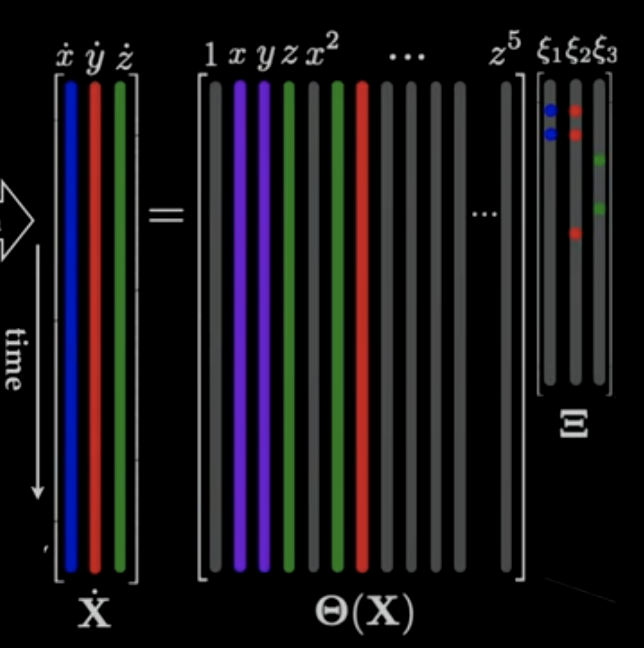

# Sparsity

Most natural signals, such as images and audio, are highly compressible. Compressibility means when the signal is written in an appropriate basis, then only a few modes are active, reducing the number of values that must be stored for an accurate representation.

Say we have a compressible vector $x$, the vector can be written as a sparse vector $s$ (containing mostly 0s, the non-zero coefficients are the coefficients that allows us to reconstruct $x$) with a transform matrix $\psi$ (universal basis) being the transform basis (an example would be the Fourier transform). $s$ has the same size as $x$.

$$
\begin{bmatrix} | \\ x \\ | \end{bmatrix} = \begin{bmatrix}  & &  \\  & \psi &  \\  & &  \end{bmatrix} \begin{bmatrix} | \\ s \\ | \end{bmatrix}
$$

When we compress a signal, we need to agree on a basis transformation $\psi$ before compressing.

We also have what's called the tailored basis. An example of this would be the SVD. For example, we know $x$ is a picture of a human face. Since we know that, we don't need all of those degree of freedom in $\psi$ that could encode all kinds of images. We can build a library of human faces $X$ then decompose it into $U_r \Sigma_r V_r^*$ with $U_r$ being the library (the basis) that we can use to represent human faces.

# Compressed sensing

What if we only have few measurements of a signal? Can we infer the non-zero Fourier coefficients (sparse vector $s$) of that signal. Then struct the approximation of that signal from $s$ through the inverse Fourier transform.

$$
\begin{aligned}
y &= C x
\\
&= C \psi s
\\
&= \Theta s
\end{aligned}
$$

$y$ is the measurement with much fewer entries than $x$. The amount of measurement in $y$ needs to be much larger than how many coefficients $s$ keeps. So if we keep 10% of the coefficients then we need $y$ to have 30% or 40% of the signal. Another thing is these measurements need to be random with respect to $\psi$. The $C$ matrix is a mask that's sampling the measurements in the $x$ matrix at random.

The goal of compressed sensing is given some measurement of a signal $y$, we need to solves for $s$ so that it's consistent with $y$, then use $s$ to approximate $x$.

> Note: This system of equation has infinitely many solutions.

This system of equations is underdetermined. Out of the infinite solutions of $s$, we want to find the sparsest solution that is the Fourier coefficients of the signal. This problem is called the underdetermined inverse problem.

An optimization for this problem is the below equation. We want the $\min|| C \psi s - y ||_2$ to be as close to 0 as possible, there are infinitely many $s$ that satisfies this condition. We also have a penalty term with the number $\lambda$ telling us how important the term $|| s ||_1$ is. That term promotes solutions in the system with as many zero entries as possible. We're minimizing the error in the fit with $C$, $\psi$, and $y$ known and solve for $s$ such that $s$ has the minimum 1-norm.

$$
\min|| C \psi s - y ||_2 + \lambda || s ||_1
$$

This solves the problem in a convex optimization. Another way of writing this would be constraining the $l1$ norm of $s$ to some constraints with $\epsilon$ being a threshold value:

$$
\min || s ||_1 \text{ such that } || C \psi s -y ||_2 < \epsilon
$$

$C$ should be incoherent with respect to $\psi$, meaning it cannot be too parallel to $\psi$, it needs to be relatively random. The vector $s$ is k-sparse if it has k non-zero entries. The number of measurements $p$ needs to be proportional to $k_1 k \log(n / k)$, with $k_1$ being the incoherence between $C$ and $\psi$. If those conditions are satisfied, $C\psi$ will act like a unitary matrix, preserving the geometry of the vector $s$. It's very expensive to solve for $s$. You only want to use this in applications where measuring the full $x$ vector is very expensive. An example is infant MRI.

# Shannon-Nyquist sampling theorem

A function containing no frequency higher than $\omega$Hz is completely determined by sampling at strictly greater than $2\omega$Hz. What this mean is to resolve all frequencies in a function, it must be sampled at twice the highest frequency present.

If we are sampling and there's a highest frequency in Hz that we care about, we'd have to sample at twice that highest frequency. This is sampling rate is the Nyquist rate (measured in seconds):

$$
\Delta t = \frac{1}{2\omega}
$$

> Fun fact: This is why audio recordings are sampled at 44kHz. Humans can hear at around 20kHz, so according to the Shannon-Nyquist theorem, we have to sample a 20kHz signal at twice its highest frequency to perfectly capture it, hence 44kHz (the extra 4kHz is for filtering and anti-aliasing purposes).

Say we have a sinusoidal signal, we might say that to capture the signal, we'd need get 2 measurements per period to get the highest point and lowest point. If we down-sampled this frequency and measure the frequency less frequently, we'd get some measurements that could be represented by a lower-frequency signal. If we don't measure at the Nyquist rate, we wouldn't be able to capture the full signal. A worse case than this is sampling the signal at a rate of $\omega$, so we're only capturing the peak of the signal. If we try to deduce a signal from those measurement points, we'd just get a constant straight signal line.

This phenomenon is called *aliasing*, which says that as far as the sampling is concerned, the different signal curves are aliases of one another, they might as well be the same thing as far as the measurements are concerned.

When we measure the signal at $\omega$, it's only going to look like we measured a system with half the frequency of $\omega$. With the measurement $\omega$, we can't really tell apart the true signal and the alias signal.

The Shannon-Nyquist theorem can be applied perfectly to broadband signals (dense signals with frequency content from low frequencies to high frequencies). However, for signals that are not broadband or dense, we can, sometimes, under some conditions, beat the Shannon-Nyquist theorem.

If we have signals that are not broadband or dense and we have a low average sampling rate (well below the Nyquist rate), we can measure the signal randomly. With the random measurements, we can fatefully reconstruct the sparse vector in the PSD, the inverse Fourier transform to reconstruct the signal with no aliasing. This is compressive sampling.

# Geometry of compression

The L0 norm solution for compressed sensing solves for the sparsest $s$ that satisfies $y$. However, L0 is an NP-hard problem. So what we do is we solve the L1 norm instead, which is computable. This analogy works even better in higher and higher dimensions.

# Robust regression

L2 norm has been used for solving overdetermined and underdetermined systems a long time in the engineering and science circle. It's easy to compute, easy to prove results, and it's fast and accurate. With compressed sensing, we now see that L1 norm also has a very important role in modern statistics and modern data processing.

Let's take a linear regression example. We have some input $x$ with some output $b$ with some distribution and we have a linear fit $ax = b$. We know $x$ and $b$ for all data points, we're solving for the slope $a$. This regression problem is often solved with least-squares (L2).

$$
a \begin{bmatrix} x_1 \\ x_2 \\ \vdots \\ x_n \end{bmatrix} = \begin{bmatrix} b_1 \\ b_2 \\ \vdots \\ b_n \end{bmatrix}
$$

Because there's noise in the data, this doesn't perfectly model the real world data measurements. We need to find an $a$ that minimizes the sum of the square of the error.

$$
a \text{ such that} \min(|| ax - b ||_2)
$$

This has a problem. If we have some outlier data points that deviates from the distribution completely (maybe because of some outside factor like machine broke that day), we'd knock our fit off of the distribution.

The L2 norm used in least-squares is basically the square root of the sum of each error squared ($|| \cdot ||_2 = \sqrt{\sum_j \epsilon_j^2}$), so each data point has a lot of influence on the fit. The square error for the outlier is so much larger compared to the other data points because the least-squares penalizes the distance error a lot.

A solution to this is using the L1 norm instead of the L2 norm. The L1 norm is the sum of each error ($|| \cdot || = \sum_j |\epsilon_j|$). This will put the fit much closes to the true distribution. The L1 norm fit is *robust* to big measurement errors.

# Least Absolute Shrinkage and Selection Operator (LASSO)

LASSO allows us to build models that is interpretable with as few descriptive factors as possible.

For a regression problem, if we have an overdetermined system, there might not even be a small $x$ that satisfies $b = Ax$ where $A$ is a matrix and $b$ has more elements than $x$. If we have an underdetermined system, there would be infinitely many $x$ that satisfies the condition. A lot of regression problems boil down to how to choose $x$ so that it's relevant and interpretable for the problem.

Say the $b$ elements describe the probability that a person would get a certain disease or some health outcome. The columns of $A$ would be the descriptive features for each of the person like age, height, BP, which pet they have, etc. Some features will be irrelevant to the thing we're trying to predict.

A simple loss function $L$ would be defined with the L2 norm:

$$
L = || Ax - b ||_2
$$

And we want to find $x$ so that minimizes the loss function

$$
\text{argmin}_x L(x)
$$

When we use this L2 loss function, the $x$ vector will be dense with no zero values, not sparse. This means the regression takes in to account all the factors, marking them all as important. We want $x$ to be sparse if some of the factors in the model shouldn't have much influence on the result.

Ridge regression (Tikhonov regularization):

$$
L = || Ax - b ||_2 + \alpha || x ||_2
$$

For many of the regression problem, even if it's underdetermined, the columns in the $A$ matrix might still be parallel or nearly linearly dependent. For example, BP, white cell count, calcium, etc, might be closely related as they are health related factors. A matrix with linearly dependent columns is ill-conditioned. If we do least-squares on these kinds of matrices and we have some noise in $b$, the noise will be amplified and $x$ will have a bunch of really big values trying to cancel each other out to fit the noise.

The ridge regression introduces the regularization factor $\alpha || x||_2$. This factor penalizes the model if $x$ has too large of a deviation. However, $x$ is still dense, it still needs all of the explanatory factors to describe the outcome.

LASSO:

$$
L = || Ax - b ||_2 + \lambda || x ||_1
$$

LASSO is similar to ridge regression in spirit. Instead of an L2 norm on $x$, we use L1 norm as the L1 norm promotes sparsity. We still want to fit the model to the data as good as possible, but we also want $x$ to be as sparse as possible. It highlights only a few columns of $A$ that are most correlated with the desired outcome. The $\lambda$ value allows us to tune how sparse we want $x$ to be, $\lambda$ is inversely proportional to the sparsity of $x$.

Note: If we accidentally kill a factor too early (at low $\lambda$ value), we're not getting that factor back as we keep increasing the $\lambda$ value.

For example, we want to predict the likelihood of a heart disease and we have a bunch of factors in $A$: age, blood pressure, heart rate, weight, height, calcium, etc. LASSO might pull out a few factors that best predicts the likelihood of a patient getting a heart disease: blood pressure, heart rate, smoking, etc.

A model that uses fewer factor while achieving relatively the same efficiency is a better model. Sparsity also helps prevent overfitting.

As $\lambda$ decreases and adding more factors into the model, making the model more complex, the error will drop. At some level of complexity, the cross-validated error will actually start increasing because we're adding in terms that doesn't have much correlation with our desired output.

Elastic net:

$$
L = || Ax - b ||_2 + \lambda || x ||_1 + \alpha || x ||_2
$$

This is a combination of LASSO and ridge regression. It balances both sparsity and noise reduction. Elastic net is also closely related to SVM.

> Note: [SR3](https://arxiv.org/pdf/1807.05411) (Sparse Relaxed Regularized Regression) is pretty good for solving the LASSO path breaking down problem. It can also improve many sparse algorithms.

An example usage of LASSO is in *SINDy* (Sparse Identification of Nonlinear Dynamics). Take the Lorenz equation for example:

$$
\begin{aligned}
&\dot{x} = \sigma (x - y)
\\
&\dot{y} = x (\rho - z) - y
\\
&\dot{z} = xz - \beta z
\end{aligned}
$$

If we have data from a simulation with measurements from the system's state, we can build a library of candidate terms $\Theta(X)$ that could be in the right hand side of the system of equations. Now we want to find the fewest columns of the matrix that add up to describe the measurements data. This allows us to discover the dynamical system that generated the measurement data.

$$
|| \dot{X} - \Theta(X) \Xi || + \lambda || \Xi ||_0
$$

With $\dot{X}$ being $b$, $A$ is $\Theta(X)$, and $x$ is $\Xi$. We're trying to find the sparsest $\Xi$ that describes the measurements $\dot{X}$.

> Note: This system has a known solution. This technique can be applied to system with unknown solutions too.

> Note: $\lambda$ being too low will lead to underfitting, $\lambda$ being too high will lead to the least-squares solution, which might be overfitting. A good model needs to balance between the complexity and the cross-validated error.

# Sparse Representation for Classification (SRC)

We have an image of a person. First thing we do is downsample that image and stack that as a vector. This process is repeated for all images in a large image library.

With the downsampled image, we can now use sparse regression because this is now an underdetermined problem (as the number of elements in the downsampled vector is less than the number of columns in the image library matrix)

The goal is to find a coefficient vector to be as sparse as possible so that when we transform the vector with the matrix, we get the image.

Now we go person by person in the coefficient and only using the coefficients corresponding to a specific part of the library, how much error would we have in approximating the image. The below graphs show an example image being approximated as person 7.

We can even add noise into the person's image and still be able to classify the person correctly, despite having higher error.

# Robust PCA (RPCA)

Say we have an image of a person who's face is occluded. Can we decompose the image into the person's face and the object that's obstructing the view of the person's face? In many cases, we can do it.

RPCA is a powerful algorithm that allows us to do this decomposition. This should be the PCA algorithm that you use on a day-to-day basis.

The idea of robustness in PCA was carried over from robust regression. Let's say we have some data with a Gaussian distribution and an outlier data point. 

![[rpca-gaussian-distributed-example.png]]

The true distribution is a Gaussian distribution. When we do standard PCA on this, the principle components will get skewed by the outlier. PCA can handle a small amount of white noise, but outliers and corruptions outside of the distribution will completely skew with it. RPCA will take the outliers into account by decomposing the data into a true distribution matrix and an outliers matrix, allowing us to fit the PCA better with the true distribution.

We can't decompose the data without a large library of what the true distribution should look like. Going with a human face image example, we can't do RPCA if we don't have a large library of images of human face for the model to learn how a human face look like. The idea is that even if we set half the image's pixel values to some outlier value like fully black, because of the statistics of the dataset, we can separate the data into a low-rank component that can be described by the principle components, and a sparse component that contains all the outliers.

$$
X = L + S
$$

Where $X$ is the distribution of the data with the outliers, $L$ is the low-rank matrix describing true distribution of the data and itself is well described with principal components, and $S$ is the sparse matrix representing the outliers.

This is an ill-conditioned and underdetermined problem with infinitely many solutions. We can solve these kinds of problem if we use the L1 regularization norm.

$$
\min_{LS} \text{rank}(L) + || S ||_0 \text{ such that } L + S = X
$$

We can't really solve this computationally as both $\text{rank}(L)$ and $||S||_0$ are non-convex. What we can do is "relax the convex". We introduce proxies to these norms that are easier to work with. The proxy for $\text{rank}()$ is the nuclear norm (sum of singular values) and the proxy for sparsity is the L1 norm and $\lambda = 1 / \sqrt{\max(n,m)}$. With high probability, the result of this is a low-rank $L$ and a sparse $S$.

$$
\min_{LS} ||L||_* + \lambda || S ||_1 \text{ such that } L + S = X
$$

The convex problem is known as the principal component pursuit (PCP) and can be solved using the augmented Lagrange multiplier (ALM) algorithm.

$$
\mathfrak{L}(L, S, Y) = ||L||_* + \lambda ||S||_1 + \langle Y, X - L - S \rangle + \frac{\mu}{2} ||X - L - S||_F^2
$$

A general solution would solve for the $L_k$ and $S_k$ that minimize $L$, update the Lagrange multipliers $Y_{k+1} = Y_k + \mu(X − L_k − S_k)$, and iterate until the solution converges. However, for this specific system, the alternating directions method ([ADM](https://optimization-online.org/wp-content/uploads/2009/11/2447.pdf)) provides a simple procedure to find $L$ and $S$.

Alternating Directions Method (ADM):
1. Construct shrinkage operator: $S_{\tau}(x) = \text{sign}(x) \max(|x| - \tau, 0)$
2. Construct Singular Value Threshold (SVT) operator: $\text{SVT}_{\tau}(X) = U S_{\tau} (\Sigma) V^*$
3. Use the $S_{\tau}$ and $SVT$ operators iteratively to solve for $L$ and $S$

We can often apply this to high-dimensional data as they often have low-dimensional principal components. With PCA, we can decompose the data into several principal components that best approximates the data. With RPCA, we can decompose a super noisy or corrupted data into an approximation of the data and the corruption or noise.