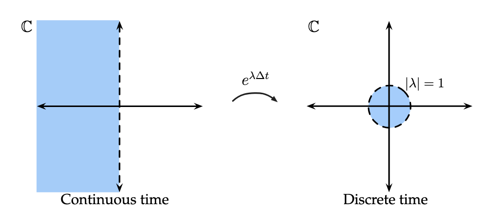
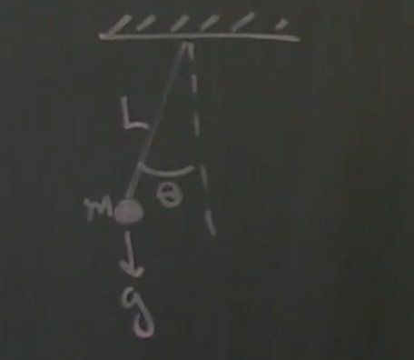
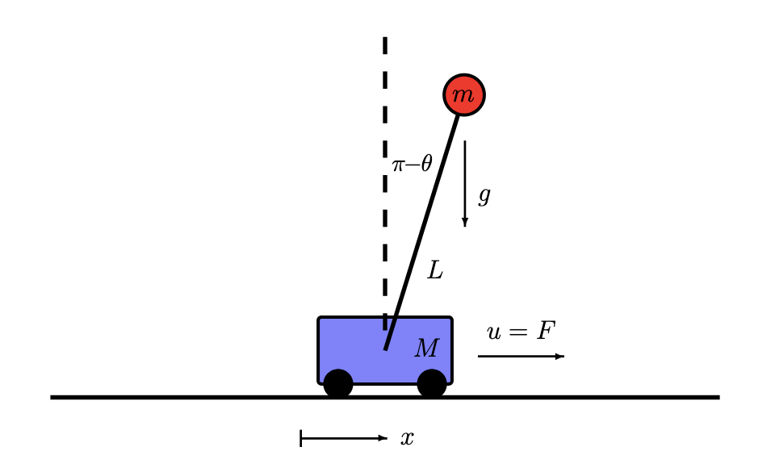
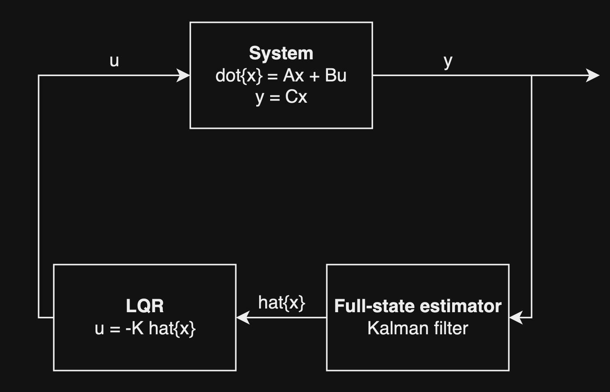
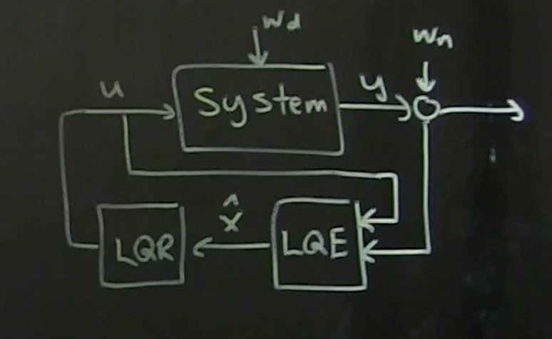

# Overview

Often, just describing the system of interest is not enough, we want to control the system actively to change its behaviors. There's a lot of different types of controls: passive control, active control, open loop control, closed loop feedback control.

# Linear Systems

$$
\dot{x} = Ax
$$

$x$ is a vector with $n$ elements, $A$ is an $n\times n$ matrix that tells us how the variables interact with each other and how the derivative of $x$ is dependent on the state vector. The basic solution of this is below:

$$
x(t) = e^{At} x(0)
$$

The $e^{At}$ term is calculated with the Taylor series of the exponential with the $At$ plugged in.

$$
e^{At} = I + At + \frac{A^2t^2}{2!} + \frac{A^3t^3}{3!} + ...
$$

It's not practical to compute this. Instead, we use the eigenvalues and eigenvectors of $A$ to get a coordinate transformation that will be applied onto $x$. This transformation will make it easier to compute $e^{At}$ and understand the dynamics.

$$
A \xi = \lambda \xi
$$

With $\xi$ being the eigenvector and $\lambda$ being the eigenvalue. So we can characterize this eigenvalues and eigenvectors in the form of matrices instead of vectors:

$$
\begin{aligned}
&A T = T D \rightarrow T^{-1} A T = D
\\
T &= \begin{bmatrix} | & | & & | \\ \xi_1 & \xi_2 & ... & \xi_n \\ | & | & & | \end{bmatrix}
\\
D &= \begin{bmatrix} \lambda_1 & 0 & ... & 0 \\ 0 & \lambda_2 & ... & 0 \\ \vdots & \vdots & \ddots & \vdots \\ 0 & 0 & ... & \lambda_n \end{bmatrix}
\end{aligned}
$$

It's not always true that we can write the systems in this eigenvectors and eigenvalues form, sometimes the eigenvectors are generalized, sometimes we have a Jordan form, etc. However, this eigenvectors and eigenvalues form is the most common case.

$$
x = Tz
$$

We can transform the system's state vector into this new eigencoordinate specified by the eigenvectors in $T$. $z$ is the system's state vector in this new eigencoordinate and because $T$ is invertible, we can apply $T$ on $z$ to get $x$.

Now, we can write our system's dynamics in terms of this new eigencoordinate:

$$
\begin{aligned}
&\dot{x} = T \dot{z} = A x
\\
&T \dot{z} = A Tz
\\
&\dot{x} = T^{-1} A T z = D z
\end{aligned}
$$

The dynamics of the system becomes diagonal in the eigencoordinate. The components of $z$ are completely decoupled from each other and $\dot{z_n} = \lambda_n z_n$.

$$
\frac{d}{dt} \begin{bmatrix} z_1 \\ z_2 \\ \vdots \\ z_n \end{bmatrix} = \begin{bmatrix} \lambda_1 & 0 & ... & 0 \\ 0 & \lambda_2 & ... & 0 \\ \vdots & \vdots & \ddots & \vdots \\ 0 & 0 & ... & \lambda_n \end{bmatrix} \begin{bmatrix} z_1 \\ z_2 \\ \vdots \\ z_n \end{bmatrix}
$$

The solution to this systems of equation is this:

$$
\begin{aligned}
z(t) &= e^{Dt} z(0)
\\
&= \begin{bmatrix} e^{\lambda_1 t} & 0 & ... & 0 \\ 0 & e^{\lambda_2 t} & ... & 0 \\ \vdots & \vdots & \ddots & \vdots \\ 0 & 0 & ... & e^{\lambda_n t}\end{bmatrix} z(0)
\end{aligned}
$$

We can write the dynamics of $x$ in terms of this eigenvectors relationship:

$$
A = TDT^{-1}
$$

We'll use this to simplify the Taylor series expression (with $TT^{-1}$ being the identity matrix).

$$
\begin{aligned}
&e^{At} = I + At + \frac{A^2t^2}{2!} + \frac{A^3t^3}{3!} + ...
\\
&e^{TDT^{-1} t} = TT^{-1} + TDT^{-1}t + \frac{(TDT^{-1})^2t^2}{2!} + \frac{(TDT^{-1})^3t^3}{3!} + ...
\\
&e^{TDT^{-1} t} = TT^{-1} + TDT^{-1}t + \frac{TD^2T^{-1}t^2}{2!} + \frac{TD^3T^{-1}t^3}{3!} + ...
\end{aligned}
$$

So $A^n = TD^n T^{-1}$. Notice how each term has $T$ on the left and $T^{-1}$ on the right. We can now factor them out:

$$
\begin{aligned}
e^{TDT^{-1} t} &= T \biggr[ I + Dt + \frac{D^2t^2}{2!} + \frac{D^3t^3}{3!} + ... \biggl] T^{-1}
\\
&= T e^{Dt} T^{-1}
\end{aligned}
$$

Now we can conclude an efficient way of computing the $e^{At}$ term.

$$
e^{At} = T e^{Dt} T^{-1}
$$

$e^{Dt}$ is very easy to compute as it's just a diagonal matrix. Now we can plug in this $e^{At}$ term into the solution of the differential equation:

$$
x(t) = T e^{Dt} T^{-1} x(0)
$$

Remember that $x = T z$, so mapping $x(0)$ through $T^{-1}$ would give us $z(0)$, which is the initial condition of the system in the eigencoordinate.

$$
x(t) = T e^{Dt} z(0)
$$

The $e^{Dt}$ term will advance the initial conditions of the system through time until we hit time $t$. So $e^{Dt}z(0)$ will give us $z(t)$.

$$
x(t) = T z(t)
$$

And T will just transform $z(t)$ from the eigencoordinate back into the original coordinate system $x(t)$.

# Stability

Stability has a lot to do with the eigenvalues (which can be complex) of the matrix $A$, which is heavily utilized in $e^{Dt}$. If any of the terms in the diagonal matrix $e^{Dt}$ blows up to infinity, there's a high probability that $x(t)$ will also blow up to infinity.

Each of the $\lambda$ value in the diagonal matrix has a real and imaginary part. We can imagine these eigenvalues in the complex plane.

$$
\begin{aligned}
&\lambda = a + ib
\\
&e^{Dt} = e^{at} [\cos(bt) + i \sin(bt)]
\end{aligned}
$$

If $a \gt 0$, the system is growing exponentially to $\infty$. If $a \lt 0$, the system is decaying exponentially to 0. So the system is stable if and **only if** all the real parts $a$ in all the eigenvalues $\lambda_n$ are negative, otherwise, the system is unstable. So if the system is unstable, a couple eigenvalues are positive, we can add a control term $+ Bu$ to the system $\dot{x} = Ax$ to try to drive the unstable eigenvalues to the negative side.

A real-life system is not continuous, it's measured in discrete time. With $x_k = x(k \Delta t)$, we have:

$$
x_{k+1} = \tilde{A} x_k
$$

This is a discrete update of the system, updating the state vector at time $k$ to time $k + 1$ with a time step of $\Delta t$. $\tilde{A}$ is how the $A$ matrix will update the dynamics based on the time step.

$$
\tilde{A} = e^{A\Delta t}
$$

In discrete time, there's also stability but it's a bit different. If we have $x_0$, we can compute trajectory of the system and all possible future states of the system by continuously multiply that initial state with $\tilde{A}$.

$$
x_N = \tilde{A}^N x_0
$$

So the same thing will happen in this discrete time case as in the continuous time case, $\tilde{A}$ can be expanded to $T e^{D \Delta t} T^{-1}$, and the $T$ matrix is just a coordinate transformation. $x_0$ will be multiplied with the diagonal matrix itself. What we find is that the eigenvalues will grow or decay. In the complex plain, the radius of the eigenvalue will expand or shrink.

So if the value of $\lambda$ is less than 1, the system is stable, else, if it's larger than 1, it's unstable.



Recap: The stability of the system is completely dependent on the eigenvalues of $A$. For continuous time systems, if the eigenvalues are **all** negative, the system is stable. For discrete time systems, if **all** the eigenvalues have a magnitude less than 1, the system is stable.

# Linearizing nonlinear systems

$$
\dot{x} = f(x)
$$

If $f$ is a nonlinear function in regards to $x$, how do we turn it into a linear system that we can use for control?

Steps:
1. Find some fixed points: $\bar{x}$ such that $f(\bar{x}) = 0$ (the system wouldn't move at these fixed points)
2. Linearize about $\bar{x}$, compute a matrix of PDEs and evaluate it at $\bar{x}$: $\frac{Df}{Dx} \biggr|_{\bar{x}} = \begin{bmatrix}\frac{\partial f_i}{\partial x_j}\end{bmatrix}$. This Jacobian is a matrix of partial derivatives.

$$
\begin{aligned}
\dot{x}_1 &= f_1(x_1, x_2) = x_1 + x_2
\\
\dot{x}_2 &= f_2(x_1, x_2) = x_1^2 + x_2^2
\\
\frac{Df}{Dx} &= \begin{bmatrix} \partial f_1 / \partial x_1 & \partial f_1 / \partial x_2 \\ \partial f_2 / \partial x_1 & \partial f_2 / \partial x_2 
\end{bmatrix}
\\
&= \begin{bmatrix} x_2 & x_1 \\ 2x_1 & 2x_2 \end{bmatrix}
\end{aligned}
$$

Basically, we're picking a fixed point $\bar{x}$ and zooming into that fixed point really closely so to the point where the dynamics around the fixed point becomes linear.

$$
\dot{x} - \dot{\bar{x}} = f(x) = f(\bar{x}) + \frac{Df}{Dx} \biggl|_{\bar{x}} (x - \bar{x}) + \frac{D^2f}{Dx^2} \biggl|_{\bar{x}} (x - \bar{x})^2 + ...
$$

When we expand the dynamics around the fixed point, we get this power series. However, $f(\bar{x})$ evaluates to 0 because of our first step, and the higher-order terms approaches 0 as we zoom closer and closer into the fixed point ($x - \bar{x}$ approaches 0), so the dynamics will look linear:

$$
\dot{x} - \dot{\bar{x}} = \frac{Df}{Dx} \biggl|_{\bar{x}} (x - \bar{x}) \rightarrow \Delta\dot{x} = \frac{Df}{Dx} \biggl|_{\bar{x}} \Delta x
$$

A good control law can keep the system close to these fixed point where the dynamics is linear. There's some catch though. According to the [Hartman-Grobman theorem](https://en.wikipedia.org/wiki/Hartman%E2%80%93Grobman_theorem), the linearization doesn't always characterize the dynamics around a nonlinear system. If all of the eigenvalues of the linearizing matrix around the fixed point has non-zero real parts in them (hyperbolic), then the linearization works. However, if that's not the case (some eigenvalues are purely imaginary), then the linearization fails to capture the dynamics around the fixed point. The nonlinear dynamics could break the linear dynamics around the fixed point, so the linearized dynamics don't capture the nonlinear dynamics.

Example: The pendulum.



The dynamics of the system is described with this nonlinear equation (with $\delta \dot{\theta}$ being the friction):

$$
\ddot{\theta} = -\frac{g}{L} \sin(\theta) - \delta \dot{\theta}
$$

This system has 2 basic fixed points at $\theta = 0$ (pendulum downwards) and $\theta = \pi$ (pendulum upwards). Let's introduce some state components into this problem:

$$
\begin{bmatrix} x_1 \\ x_2 \end{bmatrix} = \begin{bmatrix} \theta \\ \dot{\theta} \end{bmatrix}
$$

And we can compute the rate of change of this state matrix:

$$
\frac{d}{dt} \begin{bmatrix} x_1 \\ x_2 \end{bmatrix} = \begin{bmatrix} x_2 \\ -(g/L) \sin(x_1) - \delta x_2\end{bmatrix}
$$

Now, we need to pick fixed points in the system. We have 2 state variables to consider here. $x_2$ is fixed only when it's 0 (so that $\dot{x_1}$ can be 0). And $x_1$ is fixed when it's 0 or $\pi$ (so that $\sin(x_1)$ is 0). So we get 2 fixed points.

$$
\bar{x} = \begin{bmatrix} 0 \\ 0 \end{bmatrix}, \begin{bmatrix} \pi \\ 0 \end{bmatrix}
$$

Now we compute the Jacobian of the system's dynamics and pop the $\bar{x}$ into the Jacobian to see what the system looks like.

$$
\begin{aligned}
\frac{Df}{Dx} &= \begin{bmatrix} \partial f_1 / \partial x_1 & \partial f_1 / \partial x_2 \\ \partial f_2 / \partial x_1 & \partial f_2 / \partial x_2 \end{bmatrix}
\\
&= \begin{bmatrix} 0 & 1 \\ -(g/L)\cos(x_1) & - \delta \end{bmatrix}
\end{aligned}
$$

Now, we plug in a fixed point into the Jacobian, which gives us an $A$ matrix for our system linearized around the fixed point. So for the down position ($x_1 = 0$, $\cos(0) = 1$):

$$
A = \begin{bmatrix} 0 & 1 \\ -g/L & - \delta \end{bmatrix}
$$

And for the up position ($x_1 = \pi$, $\cos(\pi) = -1$):

$$
A = \begin{bmatrix} 0 & 1 \\ g/L & - \delta \end{bmatrix}
$$

With $\delta$ being a small value, the down position is a stable position with eigenvalues $\lambda = \pm i \sqrt{g/L}$, corresponding to oscillations at a natural frequency of $\sqrt{g/L}$. The up position is an unstable saddle position with eigenvalues $\lambda = \pm \sqrt{g/L}$.

We can confirm this using Python. Let's make it simple and set $g/L$ and $\delta$ to constants:

```python
import numpy as np

d = 0.1
g_L = 1

Ad = np.matrix(f'0 1 ; -{g_L} {d}')
Au = np.matrix(f'0 1 ; {g_L} {d}')

d_eig_vals, d_eig_vecs = np.linalg.eig(Ad)
u_eig_vals, u_eig_vecs = np.linalg.eig(Au)

print(d_eig_vals)
print(u_eig_vals)
```

Now, we can add controls to this system to try to stabilize the up position with feedback control.

# Controllability

We can add a control term to try to control the system to get the desired future state:

$$
\dot{x} = Ax + Bu
$$

$u$ can be a vector with $q$ elements and $B$ can be an $n \times q$ matrix. $u$ is the input that's fed into the system to control it, and the system will output a $y$, which can also be a vector. For now, we'll assume $y = x$, the state of the system. The output $y$ will be fed back into the input of the system through a loss function $-K x$, which will adjust the input $u$ to minimize the loss. This is optimal for linear systems.

$$
\dot{x} = Ax - BKx = (A-BK)x
$$

By choosing $K$, we can drive the dynamical system to be anything we want. This is controllability. The system is *controllable* if we can choose a $u=-Kx$ that can be placed into the system. We can manipulate the eigenvalues of $A$ by changing $K$. So with the right $u$, we can steer the system to anywhere in the state space that we desire.

Often, the system is pre-built, we already have $\dot{x} = Ax + B$. We need to control the system by modifying the control input. However, this is only possible if the system is controllable. $B$ is all the control surfaces (set of actuators) that tells us how the control input affects the forces, and therefore the dynamics and the state of the system.

Depending on the choice of $A$ and $B$, the system maybe easy to control or impossible to control. We need to be able to test whether the choice of $A$ and $B$ will give us a system that's controllable or not. There's a function in Python designed to do this:

```python
import control as ct

ct.ctrb(A, B)
```

This Python function from the `control` package was imported directly from Matlab.

Let's take a simple linear system for example:

$$
\begin{bmatrix} \dot{x}_1 \\ \dot{x}_2 \end{bmatrix} = \begin{bmatrix} 1 & 0 \\ 0 & 2 \end{bmatrix} \begin{bmatrix} x_1 \\ x_2 \end{bmatrix}
$$

Let's take this $B$ matrix for example:

$$
B = \begin{bmatrix} 0 \\ 1 \end{bmatrix}
$$

So our system is:

$$
\begin{bmatrix} \dot{x}_1 \\ \dot{x}_2 \end{bmatrix} = \begin{bmatrix} 1 & 0 \\ 0 & 2 \end{bmatrix} \begin{bmatrix} x_1 \\ x_2 \end{bmatrix} + \begin{bmatrix} 0 \\ 1 \end{bmatrix} u
$$

From this, we can deduce that $\dot{x}_2$ can be controlled because $u$ is fed directly into the $x_2$ state. $\dot{x}_1$, on the other hand, is decoupled from the system and cannot be controlled by $u$. So we can't stabilize the unstable dynamics, meaning the system is uncontrollable.

To modify this system to be controllable, we can add a control input into the system and modify the $B$ matrix to accommodate the new input:

$$
B = \begin{bmatrix} 1 & 0 \\0 & 1 \end{bmatrix}; \; u = \begin{bmatrix} u_1 \\ u_2 \end{bmatrix}
$$

Now our system is:

$$
\begin{bmatrix} \dot{x}_1 \\ \dot{x}_2 \end{bmatrix} = \begin{bmatrix} 1 & 0 \\ 0 & 2 \end{bmatrix} \begin{bmatrix} x_1 \\ x_2 \end{bmatrix} + \begin{bmatrix} 1 & 0 \\0 & 1 \end{bmatrix} \begin{bmatrix} u_1 \\ u_2 \end{bmatrix}
$$

This system is controllable as both of the state variables are influenced by the input. We have more control authority as we have more actuators and more inputs to tune.

Taking the same original uncontrollable system:

$$
\begin{bmatrix} \dot{x}_1 \\ \dot{x}_2 \end{bmatrix} = \begin{bmatrix} 1 & 0 \\ 0 & 2 \end{bmatrix} \begin{bmatrix} x_1 \\ x_2 \end{bmatrix} + \begin{bmatrix} 0 \\ 1 \end{bmatrix} u
$$

What we can also do is modify $A$ to have a coupling term:

$$
A = \begin{bmatrix} 1 & 1 \\ 0 & 2 \end{bmatrix}
$$

This makes the system becomes controllable because as $u$ control the $x_2$ state, it will also modify the $x_1$ state through that coupling term. So a coupled system could potentially allow us to get away with having relatively few actuators and control inputs.

If we have $A$ and $B$, we can calculate a special controllability matrix $\mathcal{C}$.

$$
\mathcal{C} = \begin{bmatrix} B & AB & A^2B & ... & A^{n-1}B \end{bmatrix}
$$

If this $\mathcal{C}$ matrix has full column rank, it's controllable. So in an $n$ dimensional system, if $\mathcal{C}$ has $n$ linearly independent columns, then the system is controllable. Else, there's some direction in the system that are uncontrollable.

This is an impulse response. Basically, we push the system in the $B$ direction and see how that push change the system over time. If all the directions of the $A$ matrix are reached, the system is controllable, else it's uncontrollable.

> If and only if $\text{rank}(\mathcal{C}) = n$, then the system is controllable.

This is quite binary, it doesn't tell us how controllable the system is.

Example: Uncontrollable system

Let's take the original uncontrollable system example:

$$
\begin{bmatrix} \dot{x}_1 \\ \dot{x}_2 \end{bmatrix} = \begin{bmatrix} 1 & 0 \\ 0 & 2 \end{bmatrix} \begin{bmatrix} x_1 \\ x_2 \end{bmatrix} + \begin{bmatrix} 0 \\ 1 \end{bmatrix} u
$$

The controllability matrix for this is:

$$
\mathcal{C} = \begin{bmatrix} 0 & 0 \\ 1 & 2 \end{bmatrix}
$$

Since the system is 2 dimensional, we can just stop here. If we kept going, we'd keep doubling the second state, getting 4, 8, 16, etc. We will always have a row of 0, meaning the matrix doesn't have full column rank as the second column depends on the first column (it's just 2 times the first column), with its rank being 1.

Now let's test out the controllable system:

$$
\begin{bmatrix} \dot{x}_1 \\ \dot{x}_2 \end{bmatrix} = \begin{bmatrix} 1 & 1 \\ 0 & 2 \end{bmatrix} \begin{bmatrix} x_1 \\ x_2 \end{bmatrix} + \begin{bmatrix} 0 \\ 1 \end{bmatrix} u
$$

The controllability matrix for this is:

$$
\mathcal{C} = \begin{bmatrix} 0 & 1 \\ 1 & 2 \end{bmatrix}
$$

This matrix has a rank of 2 (non-zero determinant), making it controllable.

A linearized nonlinear system might be uncontrollable. However, it may or may not be nonlinearly controllable, depending on the nonlinear terms. This is cutting edge territory.

If we look at the SVD of $\mathcal{C}$, the singular vectors will be ordered from most controllable states to least controllable states.

Below is the code for the 2 examples:

```python
import numpy as np
import control as ct

A = np.matrix('1 0 ; 0 2')
B = np.matrix('0 ; 1')

C = ct.ctrb(A, B)
print(C)
print(np.linalg.matrix_rank(C))
```

```python
import numpy as np
import control as ct

A = np.matrix('1 1 ; 0 2')
B = np.matrix('0 ; 1')

C = ct.ctrb(A, B)
print(C)
print(np.linalg.matrix_rank(C))
```

# Reachability and Eigenvalue Placement

Equivalences:
- The system is controllable
- Arbitrary poles (eigenvalues) placements ($u = -Kx \rightarrow \dot{x} = (A - BK)x$, we can pick any arbitrary eigenvalues for the closed-loop system $(A - BK)$ and there exists a gain matrix $K$ that turns the closed-loop system in to a system with the desired eigenvalues)
- Reachability (full reachability in $R^n$, which the state space set containing any possible states for the system): If the system is controllable, we can create a $u(t)$ that allows us to steer the system to any state $x$. The idea is the reachable set, given a $u(t)$, extends to encompass all of $R^n$.

$$
\begin{aligned}
\text{Reachable set: } \mathcal{R}_t &= \{ \xi \in R^n \text{ s.t there's an input } u(t) \text{ so that } x(t) = \xi \}
\\
\mathcal{R}_t &= R^n
\end{aligned}
$$

Take the inverted pendulum for example, we can drive the eigenvalues of the system into the stable side using the pole placement as long as the eigenvalues are distinct. In Python, this can be done like this:

```python
K = ct.place(A, B, eigs)
```

# Discrete Time Impulse Response

$$
x_{k+1} = \tilde{A}x_k + \tilde{B}u_k
$$

Impulse response is pushing the system in the direction of $u_k$ and measure $x_{k+1}$. For this example, let's set $u_0 = 1$ and all other $u_m = 0$ and measure how the system evolves. We also have an initial $x_0 = 0$, so $x_1 = B u_0 = B$, $x_2 = A x_1 = AB$, ..., $x_m = A^{m-1} B$.

So if we look at $n-1$ matrices in $\mathcal{C}$ and it hits all the direction of $R^n$, then the system is controllable.

If we push the system with $u_k$ and it doesn't reaches all the states in $R^n$, then there's some state that is uncontrollable.

# Degrees of Controllability

We can look at how controllable a system is by looking at the controllability Gramian (which is the SVD of $\mathcal{C}$). We have the dynamical system:

$$
x(t) = e^{At} +x(0) + \int_0^t e^{A(t - \tau)} Bu(\tau) d\tau
$$

The integral term is the convolution of $e^{At}$ with $u$. The controllability Gramian is given by this:

$$
W_t = \int_0^t e^{A\tau} BB^* e^{A^* \tau} d\tau
$$

$W_t$ is an $n \times n$ matrix. We can eigendecompose this matrix:

$$
W_t \xi = \lambda \xi
$$

We can order the eigenvalues from biggest to smallest. The eigenvectors corresponding to the biggest eigenvalues are the most controllable directions in state space (going farther in those direction with the same amount of input energy).

For discrete time systems:

$$
W_t \approx \mathcal{C}\mathcal{C}^T
$$

The eigenvalues and eigenvectors in the discrete time matrix are the singular values and singular vectors of $\mathcal{C}$.

$$
U, \Sigma, V^* = \text{SVD}(\mathcal{C})
$$

Now, the eigenvalues are the singular vales in the diagonal matrix $\Sigma$ and the eigenvectors are the left singular vectors in $U$. The singular vectors and singular values are stored hierarchically, so the first ones contain the most controllable directions (going farther in that direction with the same amount of input energy).

In control system, some directions are easier to go in and some directions are harder to go in (example: parallel parking is harder to go in than going forward). We can determine these directions with the eigenvalues and eigenvectors of the Gramian controllability matrix.

It's too much to ask for all the states in $R^n$ to be controllable. We want the system to be stabilizable, so all the unstable directions are controllable, which is only true if all the unstable and lightly damped (barely stable) eigenvectors of $A$ are in the controllable subspace (column space of $\mathcal{C}$).

# The PBH Test

The PBH test is a simple test for controllability. It also gives us insight into how and why a system is controllable.

$(A, B)$ is controllable if and only if $\text{rank}(\begin{bmatrix}(A-\lambda I) & B\end{bmatrix}) = n \forall\lambda \in \mathbb{C}$ (for all $\lambda$ in complex plane $\mathbb{C}$).

$(A-\lambda I)$ only have rank $n$ if $\lambda$ is not an eigenvalue of $A$, the determinant will not be 0. So we only need to perform the PBH test with $\lambda$ equal to all the eigenvalues of $A$. If we pick a $\lambda$ value that is equal to an eigenvalue of $A$, we'd have a rank deficient matrix $(A-\lambda I)$, but only in the corresponding eigenvector direction. We need to look at the *null space* to get the eigenvector. The eigenvector is what makes the matrix multiply to equal to 0.

So because $(A-\lambda I)$ is rank deficient, if we want $\text{rank}(\begin{bmatrix}(A-\lambda I) & B\end{bmatrix}) = n$ to be true, $B$ would have to have some complement component pointing in each of the eigenvector directions. That will allow it to be linearly independent from the rank deficient matrix.

If $B$ is a random vector column vector with $n$ elements, $(A, B)$ will be controllable with high probability. If $B$ is an eigenvector of $A$, then $\text{rank}(\begin{bmatrix}(A-\lambda I) & B\end{bmatrix})$ will have rank $n$ for that particular eigenvalue, which is also specified by $\lambda$. However, for all other $\lambda$, $B$ won't really help in any way. So $B$ needs some components in every eigenvectors. If $B$ is random, there's a high probability that it will have some component in all the eigenvectors of $A$.

This also tells us how many control channels are needed to control the system. The PBH test tells us the minimum number of actuator needed to control the system (minimum number of columns in $B$ needed for a given $A$ matrix). If the multiplicity of $\lambda$ is greater than 1 (repeated eigenvalue), then the number of columns in $B$ will increase as there can be more eigenvector directions in the null space of that eigenvalue.

If the eigenvalues of $A$ are distinct, we can get away with having 1 column in $B$ that has a high probability of complementing, and therefore being able to control all of those eigenvector directions. If the multiplicity of an eigenvalue is greater than 1, we need extra columns in $B$ that corresponds to the multiplicity in order to capture those extra directions and fill in the rank.

If we have 2 eigenvalues that are really close to each other or 2 eigenvectors that are really close to each other, then $A-\lambda I$ is approximately degenerate. The system might be controllable, but it will be barely controllable. In these cases, we'd want to have multiple columns of $B$ anyway to boost our control authority.

Recap: This test (although is not commonly computed for all the eigenvalues of $A$) tells us when a system is controllable in terms of the eigenvectors and eigenvalues of $A$. It tells us $B$ needs to align with all the eigenvectors of $A$. If we have a subspace with repeated eigenvalues, we need multiple columns of $B$ to simultaneously control those repeated directions.

# Cayley-Hamilton Theorem

Every square matrix $A$ satisfies its own characteristic (eigenvalue) equation.

$$
\det(A - \lambda I) = 0
$$

This eigenvalue is only true to special $\lambda$ values that are eigenvalues of $A$. Next, we have this characteristic polynomial, the roots of which are the eigenvalues of the $A$ matrix.

$$
\lambda^n + a_{n-1}\lambda^{n-1} + ... + a_{2}\lambda^{2} + a_1\lambda + a_0 = 0
$$

The C-H theorem states that if we plug in the $A$ matrix into this equation, it stays true:

$$
\begin{aligned}
&A^n + a_{n-1}A^{n-1} + ... + a_{2}A^{2} + a_1A + a_0 I = 0
\\
&A^n = -a_0 I - a_1A - a_{2}A^{2} - ... - a_{n-1}A^{n-1}
\end{aligned}
$$

$A^n$ is a linear combination of all those basis matrices. So we have this equation for all larger or equal to $n$ powers of $A$:

$$
A^{\ge n} = \sum_{j=0}^{n-1} \alpha_j A^j
$$

So with this equation, we can rewrite the $e^{At}$ term's infinite sum power series as this finite sum of time-variant coefficients of the $A$ matrix:

$$
e^{At} = \phi_0(t) I + \phi_1(t)A + \phi_{2}(t)A^{2} + ... + \phi_{n-1}(t)A^{n-1}
$$

Cayley-Hamilton theorem's finite sum representation allows us to show that controllability and reachability are equivalent.

If $\xi \in R^n$ is reachable then $\xi = \int^t_0 e^{A(t - \tau)} Bu (\tau) d\tau$ (for some $u(t)$). Now, C-H expression can be put into this integral and then expanded to prove that the reachability is equivalent to the controllability.

$$
\begin{aligned}
\xi &= \int_0^t \biggr( \phi_0(t - \tau) u(\tau) IB + \phi_1(t- \tau)u(\tau) AB + \phi_{2}(t- \tau)u(\tau)A^{2}B + ... + \phi_{n-1}(t- \tau)u(\tau)A^{n-1}B \biggl) d\tau
\\
&= B \int_0^t \phi_0(t - \tau) u(\tau) d\tau + AB\int_0^t \phi_1(t- \tau)u(\tau)d\tau + A^{2}B \int_0^t \phi_{2}(t- \tau)u(\tau) d\tau + ... + A^{n-1}B \int_0^t\phi_{n-1}(t- \tau)u(\tau) d\tau
\end{aligned}
$$

Now each integral terms are just convolution integral, which can be evaluated inside the integral. Therefore, it is possible to evaluate this expression with 2 matrices:

$$
\xi = \begin{bmatrix} B & AB & ... & A^{n-1}B \end{bmatrix} \begin{bmatrix} \int_0^t \phi_0(t - \tau) u(\tau) d\tau \\ \int_0^t \phi_1(t- \tau)u(\tau)d\tau \\ \int_0^t \phi_{2}(t- \tau)u(\tau) d\tau \\ \vdots \\ \int_0^t\phi_{n-1}(t- \tau)u(\tau) d\tau \end{bmatrix} = \mathcal{C} \begin{bmatrix} \int_0^t \phi_0(t - \tau) u(\tau) d\tau \\ \int_0^t \phi_1(t- \tau)u(\tau)d\tau \\ \int_0^t \phi_{2}(t- \tau)u(\tau) d\tau \\ \vdots \\ \int_0^t\phi_{n-1}(t- \tau)u(\tau) d\tau \end{bmatrix}
$$

To conclude, $\xi$ can be written as the product of the controllability matrix and the convolution integral of all the time-varying coefficients and the control input.

If $\mathcal{C}$ spans all of the $R^n$ space (has rank $n$), then there exists some coefficients in the convolution integral matrix where if we take the linear combination, we get any key in $R^n$. Essentially, if $\mathcal{C}$ is full rank, we can create a linear combination of $\mathcal{C}$ that can get up to any state in the state space. If it's not full rank then there's no way to create a linear combination that allows us to get to any state.

There's infinitely many $u$ that we can use to get to a desired state $\xi$ if the system is controllable. There's a $u$ that takes us to $\xi$ with a straight, linear path, there's a $u$ that takes us to $\xi$ with a roundabout path, etc. If there are $q$ control inputs, then the number of unique $u$ needed to get to $\xi$ is $n \times q$.

# Inverted pendulum on a cart

## Dynamics



We want to try to stabilize the inverted pendulum by moving the cart around.

The state of the system:
- $x$: Position of the cart
- $\dot{x}$: Velocity of the cart
- $\theta$: Angle of the pendulum arm
- $\dot{\theta}$: Angular velocity of the pendulum arm

$$
\underline{x} = \begin{bmatrix} x \\ \dot{x} \\ \theta \\ \dot{\theta} \end{bmatrix}
$$

So we get 4 coupled nonlinear ODEs:

$$
\frac{d}{dt} \underline{x} = \underline{f}(\underline{x}) 
$$

Fixed points of the system:
- $\theta = 0$: Pendulum down
- $\theta = \pi$: Pendulum up
- $\dot{\theta} = 0$: No pendulum movement
- $\dot{x} = 0$: No cart velocity
- $x$ is free: Doesn't matter which position the cart is at

With these equations and fixed points, we can use Euler-Lagrange ($Df/Dx$ evaluated at a fixed point) to compute the Jacobian:

$$
\frac{d}{dt} \underline{x} = \underline{f}(\underline{x}) \xrightarrow{Df/Dx|_\bar{x}} \underline{\dot{x}} = A\underline{x} + Bu
$$

$u$ would be the force put on the cart in the $x$ direction.

```python
def pendcart(x, t, m, M, L, g, d, uf):
    u = uf(x) # evaluate anonymous function at x
    Sx = np.sin(x[2])
    Cx = np.cos(x[2])
    D = m * L * L * (M + m * (1 - Cx**2))
    
    dx = np.zeros(4)
    dx[0] = x[1]
    dx[1] = (1 / D) * (-(m**2) * (L**2) * g * Cx * Sx + m * (L**2) * (m * L * (x[3]**2) * Sx - d * x[1])) + m * L * L * (1 / D) * u
    dx[2] = x[3]
    dx[3] = (1 / D) * ((m + M) * m * g * L * Sx - m * L * Cx * (m * L * (x[3]**2) * Sx - d * x[1])) - m * L * Cx * (1 / D) * u;
    
    return dx
```

This function builds the nonlinear ODEs on the right hand side of $\frac{d}{dt} \underline{x} = \underline{f}(\underline{x})$. It gives us the time derivatives given the state `x` at time `t`. `m` is the mass of the pendulum ball and `M` is the mass of the cart. `L` is the length of the pendulum arm, `g` is the gravitational constant, `d` is the damping term (opposing $\dot{x}$, damping on the cart like friction), and `u` is the control input on the cart.

## Pole placement

There's a couple of positive eigenvalues in $A$, which means they're unstable. We want to drive these eigenvalues to a stable position by using the `place` command:

```python
poles = [-1.1, -1.2, -1.3, -1.4]
K = ct.place(A, B, poles)
```

This will create a $K$ controller gain that will stabilize the system. Now, if we try to get the eigenvalues of the system with $K$, we get our specified stable eigenvalues:

```python
np.linalg.eig(A - B * K)
```

This is only possible with a controllable system. To make the control more aggressive, we can move the poles further into the negative side. However, it will put more strains on the actuators. If we move it too far into the negative side, the system actually becomes unstable as it becomes less robust. There's a sweet spot where the trade off between the performance and the control effort is minimal.

## Linear Quadratic Regulator (LQR)

The LQR gives us the optimal gain matrix $K$, that balances between performance and control effort. The LQR basically is a cost function for the performance of the controller. We can also put a cost on the actuation.

$$
J = \int_0^{t} x^T(\tau) Q x(\tau) + u^T(\tau) R u(\tau) d\tau
$$

> Note: We just integrate for a while, not to infinity.

The $Q$ matrix ($n \times n$) tells us how much of a penalty it is if $x$ is not where we need it to be and the $R$ matrix ($m \times m$) tells us how much of a penalty it is if $u$ spends too much energy. $Q$ is non-negative. We integrate with respect to $t$ because both $x$ and $u$ are functions of $t$. The 2 penalty terms will be added together. If the system's state is not where we want it to be, $x^T Q x$ will be big. We need to stabilize the the system to the desired state quickly if we want it to be small. If the controller spends too much energy to get to the desired state, $u^TRu$ will be big. $Q$ and $R$ are diagonal matrices that tells us how much to penalize if the system and controller is not following our order. The larger the value, the more we penalize it. Smaller value means we want the controller to be more aggressive.

For our case, we have 4 state variables in the state vector, so we need a $4\times 4$ matrix for $Q$ and 1 control input so $R$ is just 1 variable. We can do this using this command in Python:

```python
from control.matlab import *

K = lqr(A, B, Q, R)
```

Note: LQR has a time complexity of $O(n^3)$, so for larger systems with larger state variables, it's not optimal to use LQR.

# Observability

In real life, we don't always have access to the full state of the system. We probably have access to some limited state measurements $y$ ($y\in R^p$ with $p$ being much less than $n$).

$$
y = C x
$$

In many cases, even with a big system, maybe a 1 million dimensional system, we can still get full estimation with 1 measurement of the state. This is the observability of the system.

$$
\text{obsv}(A, C)
$$

The calculation here is almost identical the the calculation in $\text{ctrb}(A, B)$. While controllability means can we steer the system anywhere with some $u$, observability means can we estimate any state $\underline{x}$ from measurements $y(t)$.



Note: I made a mistake while drawing this diagram, you also need to put $u$ into the full-state estimator because we need to know how we're changing the system in order to estimate the full state of the system. So the diagram needs an arrow going from the LQR output into the full-state estimator.

If the matrix from this calculation has rank $n$, spanning the state space, we can develop an optimal full-state estimator. The full-state estimator will take in the control inputs $u$ and measurements $y$ and output $\hat{x}$, which is the estimated full state of the system. This estimator is a dynamical system:

$$
\begin{aligned}
\frac{d}{dt} \hat{x} &= A \hat{x} + Bu + K_f (y - \hat{y})
\\
\hat{y} &= C \hat{x}
\end{aligned}
$$

$K_f$ is a gain matrix for the estimator, $\hat{y}$ is the estimated measurements. Every time we get new measurements, we compare it with the estimated measurements and correct the full state based on the difference between the 2.

$$
\begin{aligned}
\frac{d}{dt} \hat{x} &= A \hat{x} + Bu + K_f (y - \hat{y})
\\
&=A \hat{x} + Bu + K_f y - K_f C \hat{x}
\\
&= (A -  K_f C) \hat{x} + Bu + K_f y
\\
&= (A -  K_f C) \hat{x} + \begin{bmatrix}B & K_f\end{bmatrix}  \begin{bmatrix}u \\ y\end{bmatrix}
\end{aligned}
$$

Now, we want to make the dynamics $A - K_fC$ of $\hat{x}$ stable. If they are stable, then $\hat{x}$ will stably converge to $x$. If $A$ and $C$ are observable, we can choose $K_f$ and place the eigenvalues of the dynamics matrix anywhere we want.

Error of the estimation:

$$
\varepsilon = x - \hat{x}
$$

We want the error to go to 0.

$$
\begin{aligned}
\frac{d}{dt} \varepsilon &= \frac{d}{dt} x - \frac{d}{dt} \hat{x}
\\
&= Ax + Bu - \biggr((A -  K_f C) \hat{x} + \begin{bmatrix}B & K_f\end{bmatrix}  \begin{bmatrix}u \\ y\end{bmatrix}\biggl)
\\
&= Ax + Bu - A\hat{x} +  K_f C \hat{x} - Bu - K_f y
\\
&= A (x - \hat{x}) + K_f C\hat{x} - K_f Cx
\\
&= A (x - \hat{x}) + K_f C(\hat{x} - x)
\\
&= A (x - \hat{x}) - K_f C(x - \hat{x})
\\
&= (A- K_f C) (x - \hat{x})
\\
&= (A- K_f C) \varepsilon
\end{aligned}
$$

If the system is observable, we can place the eigenvalues into the estimator by choosing $K_f$ and driving the error between the true full state and the estimated full state to 0.

There's always going to be some measurement noise and system noise when measuring the system.

$$
\begin{aligned}
y &= C x + w_n
\\
\dot{x} &= Ax + Bu + w_d
\end{aligned}
$$

With $w_n$ being the measurement noise and $w_d$ being the disturbance noise in the system. We find the optimal $K_f$ to find the optimal negative eigenvalues of the estimator's dynamical system given some knowledge about the magnitude of disturbances and the magnitude of the sensor noise.

# The Kalman Filter

The Kalman filter is the analog of the LQR for full-state estimation. It's the optimal full-state estimator given some knowledge about the noise and disturbances.

We assume $w_d$ ($n \times n$) is a Gaussian white noise with variance $V_d$, $w_n$ is also a Gaussian white noise with variance $V_n$. If $w_d$ is larger or smaller than the $w_n$ than we can trust one or the other more.

If the system has bad sensor noise, the estimator can't trust $y$ very much, it has to rely on the system model. If the system has big disturbances then it should trust $y$ more.

The eigenvalues in the estimator system minimizes a lost function:

$$
J = \lim_{t \rightarrow \infty} \mathcal{E}\biggr( (x(t) - \hat{x}(t))^T (x(t) - \hat{x}(t)) \biggl)
$$

With $\mathcal{E}$ being the expected error between $x$ and $\hat{x}$. We want to choose $K_f$ such that it minimizes this loss function.

$K_f$ can be calculated using a process similar to $K_r$ of the LQR.

$$
K_f = Y C^T V_n^{-1}
$$

Where $Y$ is the solution to another Riccati equation:

$$
YA^T + AY − Y C^T V^{−1}_n CY + V_d = 0
$$

Python computation:

```python
from control.matlab import *

Kf = lqe(A, I, C, Vd, Vn)
```

# Linear Quadratic Gaussian (LQG)



If we have a linear system that's controllable and observable, we can develop an LQR and LQE to optimally estimate the full state of the system and control the system even when there's some Gaussian noise and disturbances. This is called the Linear Quadratic Gaussian (LQG) control. There are some limitations to this and is the motivation for robust control.

$$
\begin{aligned}
\varepsilon &= x - \hat{x}
\\
\hat{x} &= x - (x - \hat{x})
\\
\dot{x} &= Ax - BK_r \hat{x} + w_d
\\
& = Ax - BK_r x + BK_r (x - \hat{x}) + w_d
\\
\dot{\varepsilon} &= (A - K_f C) \varepsilon + w_d - K_f w_n
\end{aligned}
$$

Now we want to build a state space equation that stabilize the full state $x$ and error of the estimation $\varepsilon$:

$$
\frac{d}{dt} \begin{bmatrix} x \\ \varepsilon \end{bmatrix} = \begin{bmatrix} (A - BK_r) & BK_r \\ 0 & (A - K_fC) \end{bmatrix} \begin{bmatrix} x \\ \varepsilon \end{bmatrix} + \begin{bmatrix} I & 0 \\ I & -K_f \end{bmatrix} \begin{bmatrix} w_d \\ w_n \end{bmatrix}
$$

Even when we combine the LQR and LQE systems, the eigenvalues of the full state $x$ is still stabilized by the LQR controller $(A-BK_r)$, and the eigenvalues for the error of the estimation $\varepsilon$ is given by the LQE estimator $(A-K_fC)$.

This is called the *separation principal*. We can design the LQR and the LQE separately and when we combine them, we can still retain the desirable properties of the 2 separate systems.

