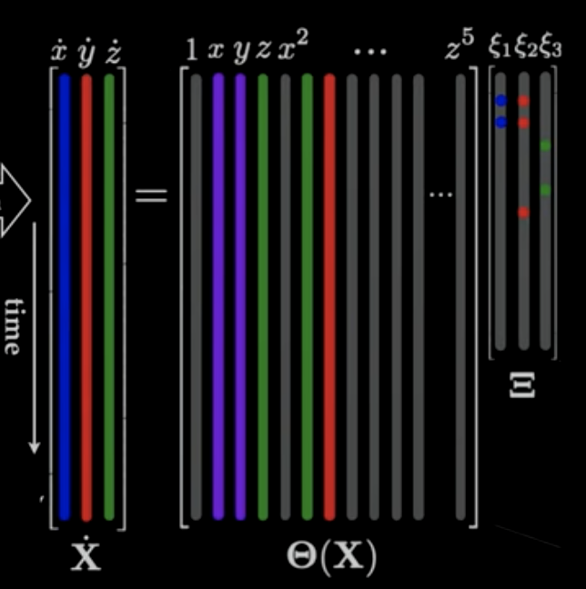
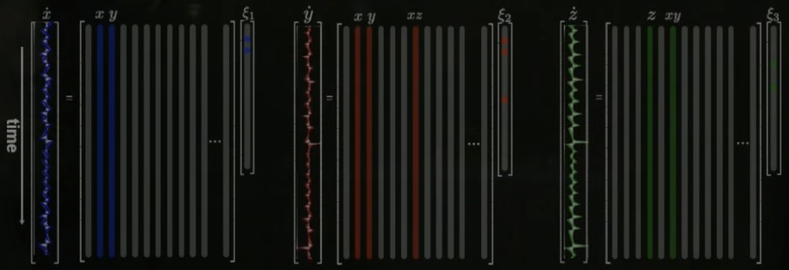

# Data-driven Dynamical Systems

In some field, there's no physics equation that capable of modeling the system that that field is researching. However, there are more and more data in those fields. We can utilize those data to build models. First principle physics model wouldn't be applicable to building models of these kinds of systems, we'll have to use data.

Big problems in modern dynamical systems: Linear systems are fully understood. Nonlinear systems ($f$) makes it hard to understand and control the system. Sometimes $f$ is unknown and we need to discover it from data. High dimensional systems uses very high dimensional state vector (large $x$). Chaotic and transient systems, noisy and stochastic measurements, multi-scale dynamics, uncertainty in systems are also challenging.

Uses of models: Predicting future states, design and optimization, control, etc.

Techniques: Regression (Linear, sparse, etc), Deep learning, Genetic programming, etc.

> Note: All systems have some constraints. We can enforce these constraints in these systems to improve the models.

# Anatomy of Dynamical Systems

Dynamical systems describe the evolving world around us. It's linked to how a system change in time.

$$
\dot{x} = \frac{d}{dt}x = f(x, t, u; \beta) + d
$$

Where:
- $x$ being the system's state (minimal description vector with the minimal number of values needed to describe the system)
- $t$ is time (lots of dynamical systems change in time)
- $u$ is control input (actuation, some variables we have control over that can change the system)
- $\beta$ are the parameters of the system that we don't have control over (some systems has a lot of parameters, we can understand the reliance of the system on these parameters)
- $d$ is the external disturbances in the system (most dynamical systems have this)
- $f$ is the dynamics. A set of functions that describe the dynamics of each of the states (It's a vector field because it's a vector, telling us how fast $x$ is changing and in which direction is it changing to - which direction the derivative of $x$ is pointing in space)

Sometimes we don't have access to $x$ because it's exceedingly large, so we have some small subset of measurements $y$ (with $n$ being the noise in the system).

$$
y = g(x, t) + n
$$

# The Lorenz System

One of the earliest chaotic models. It's a 3D model that gets a lot of the features of chaotic atmospheric convection.

$$
\begin{aligned}

\dot{x} &= \sigma (y - x)

\\

\dot{y} &= x (\rho - z) - y

\\

\dot{z} &= xy - \beta z

\\

\underline{\beta} &= \begin{bmatrix} \sigma & \rho & \beta \end{bmatrix}^T, \underline{x} = \begin{bmatrix} x & y & z \end{bmatrix}^T

\end{aligned}
$$

With $\underline{\beta}$ being the parameters vector and $\underline{x}$ being the state vector.

$$
\frac{d}{dt} \underline{x} = f(\underline{x}, t, \underline{\beta})
$$

# Discrete-Time Dynamical Systems

Continuous time system:

$$
\dot{x} = f(x(t))
$$

Discrete time system (more general than continuous time systems):

$$
\begin{aligned}
&x_{k + 1} = F (x_k)
\\
&x_k = x(k \Delta t)
\end{aligned}
$$

Example: We're sampling an evolving population. We sample the system every day, so $\Delta t$ might be 1-day sampling, $k$ would be the current day (day 1, day 2, day 3, etc).

Flow map ($F_{\Delta t}$):

$$
x_{k+1} = x_k + \int_{k\Delta t}^{(k+1)\Delta t} f(x(\tau)) d\tau
$$

Integrate the trajectory through the dynamical system for 1 $\Delta t$ to get the next $x$. Flowing the state from 1 point to another. The integral term evaluates the vector field $f$ as the state $x$ evolves.

We can always go from a continuous time system to a discrete time system, but not always back.

Simple flow map approximation with forward Euler:

$$
\begin{aligned}
&\frac{x_{k + 1} - x_k}{\Delta t} \approx f(x_k)
\\
&x_{k+1} = x_k + \Delta t f(x_k)
\end{aligned}
$$

In general, for most nonlinear dynamical systems, the flow map is hard to compute, so we'll have to approximate it numerically with schemes like forward Euler, Runge-Kutta, etc.

# Logistic map

$$
x_{k+1} = \beta x_k (1 - x_k)
$$

As the parameter $\beta$ is increased (0 to 1), the attracting set becomes increasingly complex. A series of period-doubling bifurcations occur until the attracting set becomes fractal.

Good model for population dynamics. The population grows at an exponential rate described by $\beta$, as it gets close to the capacity limit 1, it gradually levels off (because $1 - x_k$ gets closer to 0).

As the growth rate β gets larger (faster), the system gets more chaotic. Break-neck population growth is a bad idea.

# Dynamic Mode Decomposition (DMD)

DMD can be used to obtain linear reduced-order models for high dimensional complex systems. We can also extract spatial and temporal structures from the data.

DMD gives you a coupled system of spatial and temporal modes. It's a purely data-driven method and it doesn't require any knowledge of the underlying equations of motion.

Say we have an movie of fluid flow measurements, we can split up the movie into individual images or snapshots. The snapshots $x_m$ illustrates how the system evolves in time.

We can organize these snapshots data into these big matrices by reshaping the snapshot into column vectors. The $X$ matrix shows us how the system evolves in time from time 1 to time $m-1$. $X'$ is the same as $X$, but shifted by 1 time step ($\Delta t$) into the future.

$$
\begin{aligned}
&X = \begin{bmatrix} | & | & & | \\ x_1 & x_2 & ... & x_{m-1} \\ | & | & & |\end{bmatrix}
\\
&X' = \begin{bmatrix} | & | & & | \\ x_2 & x_3 & ... & x_m \\ | & | & & |\end{bmatrix}
\end{aligned}
$$

In our case, these are nonlinear Navier-Stokes equations. These matrices are usually very tall an skinny.

With these matrices, the DMD will find a best-fit linear operator $A$ (a matrix) that advances $X$ into $X'$ (maps $X$ into $X'$).

$$
X' \approx A X
$$

We definitely don't want to compute the $A$ matrix as it is too large. The DMD approximates the leading eigendecomposition of the dominant eigenvalues and eigenvectors of the $A$ matrix without actually computing the matrix itself.

The eigenvectors give us these spatial dynamic modes and the eigenvalues corresponds to the time dynamic. So the eigendecomposition gives us these coherent dominant structures and tells us how these modes evolve in time.

With $A$, we can use it to predict how the system will evolve:

$$
x_{k+1} = A x_k
$$

Uses: system diagnostic, state prediction, control.

DMD computation (4 steps):

$$
\begin{aligned}
&\text{1. } X = U\Sigma V^* \text{; } X' = A U \Sigma V^*
\\
&\text{2. } U^* X' V \Sigma^{-1} = U^* A U = \tilde{A}
\\
&\text{3. } \tilde{A} W = W \Lambda
\\
&\text{4. } \Phi = X' V \Sigma^{-1} W
\end{aligned}
$$

In most high dimensional complex dynamical systems of interest, with enough data snapshots, there's usually dominant coherent patterns that emerge.

First step is computing an SVD of $X$, the columns of $U$ are the dominant structure of the data. $X'$ is now $A$ times the SVD of $X$. Next, we can project $A$ on to the $U$ matrix with $U^*AU$ and get an approximation of $A$. $\tilde{A}$ is a best-fit linear dynamical system that tells us how the modes in $U$ evolve in time with the same eigenvalues as the $A$ matrix. Next, we decompose the approximation matrix $\tilde{A}$ to get the eigenvalues of $A$ with $W$ being the eigenvectors of $\tilde{A}$ and $\Lambda$ being the eigenvalues of $\tilde{A}$. Lastly, we want the eigenvectors of the original $A$ matrix, $\Phi$.

If the first few columns of $U$ manage to capture most of the energy of $X$ then we can truncate the SVD and have a much smaller $\tilde{A}$. With these 2 matrices, we can now predict the future state of the system, with $b_0$ being the initial amplitude of each of the modes in $\Phi$.

$$
\hat{X}(k\Delta t) = \Phi \Lambda^t b_0
$$

This works great for periodic or quasi-periodic systems even if the system is nonlinear.

DMD is kind of the spiritual child of both PCA and Fourier transform. We built a linear regression model on the SVD modes then we diagonalizes the model to find the dominant patterns in time.

DMD has a strong connection to the Koopman analysis. There's a lot of extension for DMD. It's also highly applicable to different fields and applications.

Example an 80x80 video with 2 signals: a square blinking fast, and a gaussian blinking phasing in and out slowly with the 2 of them overlapping each other a little bit. The PCA can only decompose the signal in the spatial domain. Applying the PCA on this signal will give us the principal components, which gets the rank and the structure of the system correctly, but it doesn't split up the 2 different signals that are blinking at different rate. DMD is able to do this because it analyze the system in both the spatial domain and the temporal domain, allowing us to separate the fast and slow dynamics of the system, capturing the frequency of the evolution of those dynamics while still capturing the dominant spatial structure.

# Sparse Identification of Nonlinear Dynamics (SINDy)

SINDy allows us to discover governing equations for nonlinear dynamical systems purely from measurement data.

Example: Lorenz system. In the Lorenz system, the only constant terms are $\sigma$, $\rho$, and $\beta$. Let's say we don't know the Lorenz system's ODEs but we have 2 big matrices containing measurements of the system. 1 matrix contain the result $\dot{x}$, $\dot{y}$, $\dot{z}$ at time $t$. 1 matrix contain the condition at of the system $x$, $y$, $z$ that lead to the result at time $t$.

Next, we construct a matrix with vectors of all possible polynomial nonlinearities up to order 5.

We'll apply some kind of regression to find which linear combination of these nonlinear terms represent the results $\dot{x}$, $\dot{y}$, $\dot{z}$. We're relying on the fact that the right-hand side dynamics of the Lorenz system is sparse.

We start with $\dot{x}$, we apply sparse regression to find the fewest columns of the library $\Theta(X)$ that are needed to describe $\dot{x}$. What we might find is all we need is the $x$ and $y$ columns, which means we just need $x$ and $y$ in some linear combination to represent $\dot{x}$, all other terms are unnecessary to $\dot{x}$. Then we do the same thing for both $\dot{y}$ and $\dot{z}$.

In principle, we don't want to actually measure $x$, $y$, $z$, and the derivative. In a lot of systems, we don't get to measure the derivatives, we have to compute them from the measurements. Even with noisy data, we can still identify the structure of the data.