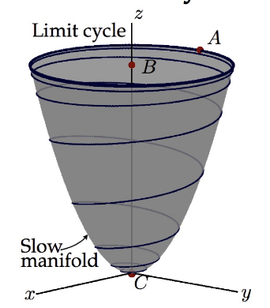

# Data-driven Dynamical Systems

In some field, there's no physics equation that capable of modeling the system that that field is researching. However, there are more and more data in those fields. We can utilize those data to build models. First principle physics model wouldn't be applicable to building models of these kinds of systems, we'll have to use data.

Big problems in modern dynamical systems: Linear systems are fully understood. Nonlinear systems ($f$) makes it hard to understand and control the system. Sometimes $f$ is unknown and we need to discover it from data. High dimensional systems uses very high dimensional state vector (large $x$). Chaotic and transient systems, noisy and stochastic measurements, multi-scale dynamics, uncertainty in systems are also challenging.

Uses of models: Predicting future states, design and optimization, control, etc.

Techniques: Regression (Linear, sparse, etc), Deep learning, Genetic programming, etc.

> Note: All systems have some constraints. We can enforce these constraints in these systems to improve the models.

# Anatomy of Dynamical Systems

Dynamical systems describe the evolving world around us. It's linked to how a system change in time.

$$
\dot{x} = \frac{d}{dt}x = f(x, t, u; \beta) + d
$$

Where:
- $x$ being the system's state (minimal description vector with the minimal number of values needed to describe the system)
- $t$ is time (lots of dynamical systems change in time)
- $u$ is control input (actuation, some variables we have control over that can change the system)
- $\beta$ are the parameters of the system that we don't have control over (some systems has a lot of parameters, we can understand the reliance of the system on these parameters)
- $d$ is the external disturbances in the system (most dynamical systems have this)
- $f$ is the dynamics. A set of functions that describe the dynamics of each of the states (It's a vector field because it's a vector, telling us how fast $x$ is changing and in which direction is it changing to - which direction the derivative of $x$ is pointing in space)

Sometimes we don't have access to $x$ because it's exceedingly large, so we have some small subset of measurements $y$ (with $n$ being the noise in the system).

$$
y = g(x, t) + n
$$

# The Lorenz System

One of the earliest chaotic models. It's a 3D model that gets a lot of the features of chaotic atmospheric convection.

$$
\begin{aligned}

\dot{x} &= \sigma (y - x)

\\

\dot{y} &= x (\rho - z) - y

\\

\dot{z} &= xy - \beta z

\\

\underline{\beta} &= \begin{bmatrix} \sigma & \rho & \beta \end{bmatrix}^T, \underline{x} = \begin{bmatrix} x & y & z \end{bmatrix}^T

\end{aligned}
$$

With $\underline{\beta}$ being the parameters vector and $\underline{x}$ being the state vector.

$$
\frac{d}{dt} \underline{x} = f(\underline{x}, t, \underline{\beta})
$$

# Discrete-Time Dynamical Systems

Continuous time system:

$$
\dot{x} = f(x(t))
$$

Discrete time system (more general than continuous time systems):

$$
\begin{aligned}
&x_{k + 1} = F (x_k)
\\
&x_k = x(k \Delta t)
\end{aligned}
$$

Example: We're sampling an evolving population. We sample the system every day, so $\Delta t$ might be 1-day sampling, $k$ would be the current day (day 1, day 2, day 3, etc).

Flow map ($F_{\Delta t}$):

$$
x_{k+1} = x_k + \int_{k\Delta t}^{(k+1)\Delta t} f(x(\tau)) d\tau
$$

Integrate the trajectory through the dynamical system for 1 $\Delta t$ to get the next $x$. Flowing the state from 1 point to another. The integral term evaluates the vector field $f$ as the state $x$ evolves.

We can always go from a continuous time system to a discrete time system, but not always back.

Simple flow map approximation with forward Euler:

$$
\begin{aligned}
&\frac{x_{k + 1} - x_k}{\Delta t} \approx f(x_k)
\\
&x_{k+1} = x_k + \Delta t f(x_k)
\end{aligned}
$$

In general, for most nonlinear dynamical systems, the flow map is hard to compute, so we'll have to approximate it numerically with schemes like forward Euler, Runge-Kutta, etc.

# Logistic map

$$
x_{k+1} = \beta x_k (1 - x_k)
$$

As the parameter $\beta$ is increased (0 to 1), the attracting set becomes increasingly complex. A series of period-doubling bifurcations occur until the attracting set becomes fractal.

Good model for population dynamics. The population grows at an exponential rate described by $\beta$, as it gets close to the capacity limit 1, it gradually levels off (because $1 - x_k$ gets closer to 0).

As the growth rate β gets larger (faster), the system gets more chaotic. Break-neck population growth is a bad idea.

# Dynamic Mode Decomposition (DMD)

DMD can be used to obtain linear reduced-order models for high dimensional complex systems. We can also extract spatial and temporal structures from the data.

DMD gives you a coupled system of spatial and temporal modes. It's a purely data-driven method and it doesn't require any knowledge of the underlying equations of motion.

Say we have an movie of fluid flow measurements, we can split up the movie into individual images or snapshots. The snapshots $x_m$ illustrates how the system evolves in time.

We can organize these snapshots data into these big matrices by reshaping the snapshot into column vectors. The $X$ matrix shows us how the system evolves in time from time 1 to time $m-1$. $X'$ is the same as $X$, but shifted by 1 time step ($\Delta t$) into the future.

$$
\begin{aligned}
&X = \begin{bmatrix} | & | & & | \\ x_1 & x_2 & ... & x_{m-1} \\ | & | & & |\end{bmatrix}
\\
&X' = \begin{bmatrix} | & | & & | \\ x_2 & x_3 & ... & x_m \\ | & | & & |\end{bmatrix}
\end{aligned}
$$

In our case, these are nonlinear Navier-Stokes equations. These matrices are usually very tall an skinny.

With these matrices, the DMD will find a best-fit linear operator $A$ (a matrix) that advances $X$ into $X'$ (maps $X$ into $X'$).

$$
X' \approx A X
$$

We definitely don't want to compute the $A$ matrix as it is too large. The DMD approximates the leading eigendecomposition of the dominant eigenvalues and eigenvectors of the $A$ matrix without actually computing the matrix itself.

The eigenvectors give us these spatial dynamic modes and the eigenvalues corresponds to the time dynamic. So the eigendecomposition gives us these coherent dominant structures and tells us how these modes evolve in time.

With $A$, we can use it to predict how the system will evolve:

$$
x_{k+1} = A x_k
$$

Uses: system diagnostic, state prediction, control.

DMD computation (4 steps):

$$
\begin{aligned}
&\text{1. } X = U\Sigma V^* \text{; } X' = A U \Sigma V^*
\\
&\text{2. } U^* X' V \Sigma^{-1} = U^* A U = \tilde{A}
\\
&\text{3. } \tilde{A} W = W \Lambda
\\
&\text{4. } \Phi = X' V \Sigma^{-1} W
\end{aligned}
$$

In most high dimensional complex dynamical systems of interest, with enough data snapshots, there's usually dominant coherent patterns that emerge.

First step is computing an SVD of $X$, the columns of $U$ are the dominant structure of the data. $X'$ is now $A$ times the SVD of $X$. Next, we can project $A$ on to the $U$ matrix with $U^*AU$ and get an approximation of $A$. $\tilde{A}$ is a best-fit linear dynamical system that tells us how the modes in $U$ evolve in time with the same eigenvalues as the $A$ matrix. Next, we decompose the approximation matrix $\tilde{A}$ to get the eigenvalues of $A$ with $W$ being the eigenvectors of $\tilde{A}$ and $\Lambda$ being the eigenvalues of $\tilde{A}$. Lastly, we want the eigenvectors of the original $A$ matrix, $\Phi$.

If the first few columns of $U$ manage to capture most of the energy of $X$ then we can truncate the SVD and have a much smaller $\tilde{A}$. With these 2 matrices, we can now predict the future state of the system, with $b_0$ being the initial amplitude of each of the modes in $\Phi$.

$$
\hat{X}(k\Delta t) = \Phi \Lambda^t b_0
$$

This works great for periodic or quasi-periodic systems even if the system is nonlinear.

DMD is kind of the spiritual child of both PCA and Fourier transform. We built a linear regression model on the SVD modes then we diagonalizes the model to find the dominant patterns in time.

DMD has a strong connection to the Koopman analysis. There's a lot of extension for DMD. It's also highly applicable to different fields and applications.

Example an 80x80 video with 2 signals: a square blinking fast, and a gaussian blinking phasing in and out slowly with the 2 of them overlapping each other a little bit. The PCA can only decompose the signal in the spatial domain. Applying the PCA on this signal will give us the principal components, which gets the rank and the structure of the system correctly, but it doesn't split up the 2 different signals that are blinking at different rate. DMD is able to do this because it analyze the system in both the spatial domain and the temporal domain, allowing us to separate the fast and slow dynamics of the system, capturing the frequency of the evolution of those dynamics while still capturing the dominant spatial structure.

# Sparse Identification of Nonlinear Dynamics (SINDy)

SINDy allows us to discover governing equations for nonlinear dynamical systems purely from measurement data.

Example: Lorenz system. In the Lorenz system, the only constant terms are $\sigma$, $\rho$, and $\beta$. Let's say we don't know the Lorenz system's ODEs but we have 2 big matrices containing measurements of the system. 1 matrix contain the result $\dot{x}$, $\dot{y}$, $\dot{z}$ at time $t$. 1 matrix contain the condition at of the system $x$, $y$, $z$ that lead to the result at time $t$.

Next, we construct a matrix with vectors of all possible polynomial nonlinearities up to order 5.


We'll apply some kind of regression to find which linear combination of these nonlinear terms represent the results $\dot{x}$, $\dot{y}$, $\dot{z}$. We're relying on the fact that the right-hand side dynamics of the Lorenz system is sparse.

We start with $\dot{x}$, we apply sparse regression to find the fewest columns of the library $\Theta(X)$ that are needed to describe $\dot{x}$. What we might find is all we need is the $x$ and $y$ columns, which means we just need $x$ and $y$ in some linear combination to represent $\dot{x}$, all other terms are unnecessary to $\dot{x}$. Then we do the same thing for both $\dot{y}$ and $\dot{z}$.


In principle, we don't want to actually measure $x$, $y$, $z$, and the derivative. In a lot of systems, we don't get to measure the derivatives, we have to compute them from the measurements. Even with noisy data, we can still identify the structure of the data.

```
’’ ’xdot’ ’ydot’ ’zdot’
’1’ [ 0] [ 0] [ 0]
’x’ [-10.0000] [28.0000] [ 0]
’y’ [ 10.0000] [-1.0000] [ 0]
’z’ [ 0] [ 0] [-2.6667]
’xx’ [ 0] [ 0] [ 0]
’xy’ [ 0] [ 0] [ 1.0000]
’xz’ [ 0] [-1.0000] [ 0]
’yy’ [ 0] [ 0] [ 0]
’yz’ [ 0] [ 0] [ 0]
’zz’ [ 0] [ 0] [ 0]
’xxx’ [ 0] [ 0] [ 0]
’xxy’ [ 0] [ 0] [ 0]
’xxz’ [ 0] [ 0] [ 0]
’xyy’ [ 0] [ 0] [ 0]
’xyz’ [ 0] [ 0] [ 0]
’xzz’ [ 0] [ 0] [ 0]
’yyy’ [ 0] [ 0] [ 0]
’yyz’ [ 0] [ 0] [ 0]
’yzz’ [ 0] [ 0] [ 0]
’zzz’ [ 0] [ 0] [ 0]
```

Example: Vortex shredding past a cylinder

The question here is how do we capture a 3rd-order Hopf bifurcation phenomenon of a fluid system that has quadratic nonlinearities. Below is a solution to how we can get a Hopf bifurcation with a system of quadratic nonlinearities.

$$
\begin{aligned}
&\dot{x} = \mu x - \omega y + Axz
\\
&\dot{y} = \omega x + \mu y + Ayz
\\
&\dot{z} = -\lambda (z - x^2 - y^2)
\end{aligned}
$$

The ODEs above are nonlinear quadratics, but they still exhibit the Hopf bifurcation phenomenon.



The ideas is we could have a fast directions of the flow and slow directions of the flow. $z$ is a fast variable in the fast direction between some unstable fixed point and the mean flow of the vortex shredding $B$. $z$ rapidly adheres the the slow parabolic manifold. $x$ and $y$ are the magnitude of the vortex shredding. $z$ will wraps around the manifold until we get the periodic vortex shredding in $x$ and $y$. $z$ is called the shift mode and $x$ and $y$ are the modes that describes vortex shredding.


We collect data from the simulation then do some dimensionality reduction like PCA to find the modes that describes the vortex shredding and the shift mode. We plug those 3 time series (the 2 modes and shift mode). The identified system has structurally the same form.

> Note: To actually correctly identify the quadratic nonlinearities for the problem, we have to kick the system off the attractor for systems that have some sort of attractor to see how the system falls back on the attractor.

Sometimes the dynamical system is not just evolving in its natural state but is also being forced on.

$$
\begin{aligned}
\dot{x} &= \sigma (y - x) + g(u)
\\
\dot{y} &= x (\rho - z) - y
\\
\dot{z} &= xy - \beta z
\end{aligned}
$$

> Note: $g(u)$ can be placed in $x$, $y$, or $z$ or all 3 of them. 

$g(u)$ allows us to enter a control signal linearly or nonlinearly. $u$ can be a nonlinear function itself, like this state feedback control for example:

$$
u(t) = 26 - x(t) +d(t)
$$

SINDy can be applied to this too, we just also have to take $u$ into consideration along with $x$, $y$, and $z$.

Recap: In SINDy, we first measure $x$, $y$, $z$ of the system (if we only measure $x$, we can build time delay coordinates). Then we find some basis library that represents the possible nonlinear dynamics that explains the measurements. Then we use LASSO or sparse regression to find the fewest features required to explain the measurements.

[PDE-FIND](https://pysindy.readthedocs.io/en/latest/examples/10_PDEFIND_examples/example.html) - SINDy for discovering PDEs.

# Koopman Operator Theory

$$
\frac{d}{dt} x = f(x)
$$

For many systems of interest, the equations for the dynamical system is unknown or partially unknown. Koopman can help us discover these equations. It can also help us understand the nonlinear dynamical systems better, it can also help us find the optimal nonlinear control and estimation for these systems. Chaos, transients, intermittent phenomena are very challenging along with multi-scale physics like turbulent or disease or neuroscience or etc (big open problem).

## Overview

Koopman analysis impact nonlinearity the most. It makes nonlinear systems more amenable to linear analysis. Koopman analysis is a coordinate transformation that transform into some special measurement coordinate where nonlinear systems look linear and can be analyzed linearly.

It is possible to represent a nonlinear dynamical system in terms of an infinite-dimensional linear operator acting on a Hilbert space of measurement functions of the state of the system. This Koopman operator is linear, and its spectral decomposition completely characterizes the behavior of a nonlinear system. Because the operator is infinite, we need to try to find some approximation or embeddings that best represents it.

In the state-space model of nonlinear equations, we can integrate trajectories through the equations and watch the model evolve through time. 

$$
\begin{aligned}
\frac{d}{dt} x = f(x) &\rightarrow F_t(x(t_0)) = x(t_0 + t) = x(t_0) + \int_{t_0}^{t_0+t} f(x(\tau)) d\tau
\\
&\rightarrow x_{k+1} = F_t(x_k)
\end{aligned}
$$

The Koopman operator thinks about measurements of the system $g$ instead ($\circ$ is the composition operator).

$$
\begin{aligned}
\mathcal{K}_t g = g \circ F_t &\rightarrow \mathcal{K}_tg(x_k) = g(F_t(g_k)) = g(x_{k+1})
\\
&\rightarrow g(x_{k+1}) = \mathcal{K}_tg(x_k)
\end{aligned}
$$

$g$ could be any measurement of $x$ in the infinite-dimensional Hilbert space of measurements (some inner products of the measurements). If we pick a basis (like Fourier or Taylor), we can write it $g$ down as an infinite-dimensional vector of coefficients in that basis. The Koopman operator $\mathcal{K}$ advances the measurements by 1 time step then remeasures the system at that time step. We want to find an linear approximation matrix that advances the measurements forward in time. We can compute the eigenvalues and eigenvectors and get future predictions and controls.

We need to try to identify the eigenfunctions of the Koopman operator.

Example: Koopman linear embeddings

$$
\begin{aligned}
&\dot{x_1} = \mu x_1
\\
&\dot{x_2} = \lambda (x_2 - x_1^2)
\end{aligned}
$$

The first state variable $\dot{x_1}$ is decoupled and is purely linear (no $x_2$ dependency). The second state variable $\dot{x_2}$ is nonlinear and if $\lambda$ is more stable than $\mu$ (more negative real part) then $x_2$ will rapidly equal $x_1^2$.

According to the Koopman operator theory, if we take the measurements at $x_1$ and $x_2$ along with an extra measurement $x_1^2$ (nonlinear), we can write the nonlinear dynamical system as a linear dynamical system

$$
\frac{d}{dt} \begin{bmatrix} y_1 \\ y_2 \\ y_3 \end{bmatrix} = \begin{bmatrix} \mu & 0 & 0 \\ 0 & \lambda & -\lambda \\ 0 & 0 & 2\mu \end{bmatrix} \begin{bmatrix} y_1 \\ y_2 \\ y_3 \end{bmatrix} \text{ for } \begin{bmatrix} y_1 \\ y_2 \\ y_3 \end{bmatrix} = \begin{bmatrix} x_1 \\ x_2 \\ x_1^2 \end{bmatrix}
$$

Note: the derivative of $y_3$, which is $x_1^2$, is $2\mu x_1$ as the derivative of $x_1$ is $\mu x_1$.

Linear dynamics in eigenfunction coordinates:

$$
\frac{d}{dt} \phi (x) = \lambda \phi(x)
$$

We want to find $\phi(x)$ so that the dynamics can be described linearly.

$$
\frac{d}{dt} \phi (x) = \triangledown \phi(x) \cdot \dot{x} = \triangledown \phi(x) \cdot f(x)
$$

We can calculate the derivative of $\phi(x)$ by taking the gradient of $\phi(x)$ dotted with $f(x)$. So we have this PDE for Koopman eigenfunctions:

$$
\lambda \phi(x) = \triangledown \phi(x) \cdot f(x)
$$

Any smooth, continuous Koopman eigenfunction has to be a solution of this PDE. For low-dimensional dynamical systems where you know $f(x)$, we can solve for eigenfunctions analytically using the Taylor or Laurent series.

In practice, most of the time, we don't really know $f(x)$ and we can't solve it analytically. Instead, we have to use DMD to approximate the Koopman operator. For a movie of measurements with snapshots going from $x_1$ to $x_m$, we can take the DMD of it and find the best-fit linear operator that advances the data forward in time and that operator should be related to the Koopman operator.

The Koopman operator advances measurements forward in time linearly, which is pretty similar to the best-fit linear operator $A$ in DMD. DMD is useful for extracting the coherent structures that have simple time dynamics as the nonlinear system evolves. The Koopman eigenfunction needs to do just that, we want these mixture of measurements at which if we measure our system, we get linear dynamics.

## Representations

So we can use the Koopman operator to find these coordinate systems where nonlinear systems start to look linear. We want to find the eigenfunctions of the Koopman operator to transform the system into these measurements. Then we can use those linear embeddings for linear estimations, predictions, controls, analyses, etc.

Finding these representations is still very difficult. [Extended DMD](https://arxiv.org/pdf/1408.4408) is a method that allows us to efficiently find these representations. What eDMD does is it augments the state vector $X$ with a bunch of nonlinear measurements ($x^2$, $x^3$, etc), then find the best-fit linear operator that advances the entire augmented nonlinear state forward in time. That gets much close to approximating the Koopman operator.

For a large augmented matrix, we could run into overfitting if we're not careful. To avoid overfitting, we can use sparsity in the regression. We use sparsity-promoting regression to find eigenfunctions directly. The eDMD tries to find a gigantic $A$ matrix that maps the nonlinear measurements forward in time. The eigenvalues and eigenvectors of $A$ are often nonlinear even though $A$ is a linear regression matrix. So instead of building this huge matrix, we can identify the relevant eigenfunctions directly and use sparse regression to prevent overfitting.

PDE for Koopman eigenfunctions:

$$
\triangledown \phi(x) \cdot f(x) = \lambda \phi(x)
$$

With this PDE, first we'll try to expand the $\phi(x)$ with a library of candidate functions $\Theta(x)$.

$$
\begin{aligned}
&\Theta (x) = \begin{bmatrix} \theta_1(x) & \theta_2(x) & ... & \theta_n(x) \end{bmatrix}
\\
&\phi(x) = \sum_{k=1}^n \theta_k(x) \xi_k = \Theta(x)\xi
\end{aligned}
$$

$\xi$ is a sparse vector of coefficients. It's sparse because we only want to pick a few of these functions in $\Theta(x)$ then add up a linear combination to approximate the eigenfunction.


We can construct $\Theta(X)$, we can also construct $\Gamma(X, \dot{X})$, which is the chain rule derivative on the PDE. With these 2 matrices, we can construct the sparse regression to solve for the sparse vector $\xi$:

$$
\begin{aligned}
&(\lambda\Theta(X) - \Gamma(X, \dot{X}))\xi = 0
\\
&\lambda \xi = \Theta^{\dagger} \Theta' \xi
\end{aligned}
$$

Below is a diagram for the Koopman eigenfunctions approximation for the Duffing oscillator.

$$
\begin{aligned}
&\dot{x} = f(x)
\\
&\dot{x} = y
\\
&\dot{y} = x - x^3
\end{aligned}
$$


DMD has a high-error for transient, intermittent, or chaotic systems but low complexity. The full Koopman eigenfunctions on the other hand, has very low error for those kinds of systems, but it's highly complex (cuz infinite-dimensional). What we want is to find a trade-off model that is a middle ground between the error and the complexity scale.


If we don't cross-validate the data and try to fit the training error perfectly, we might run into overfitting. Some good models that fits the error-complexity criteria are [DeepKoopman](https://github.com/BethanyL/DeepKoopman), [KRONIC](https://github.com/eurika-kaiser/KRONIC), eDMD, [VAC](https://refubium.fu-berlin.de/bitstream/handle/fub188/7187/Thesis_Published.pdf?sequence=1).

