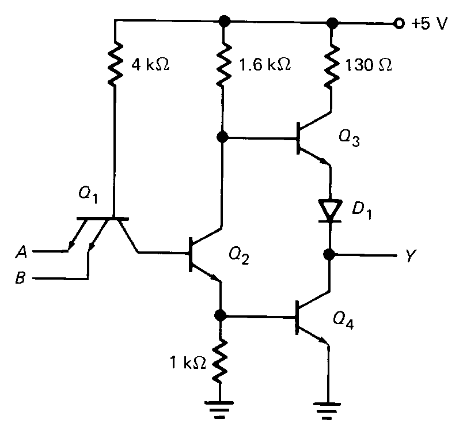
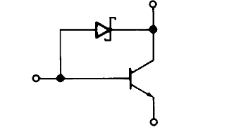
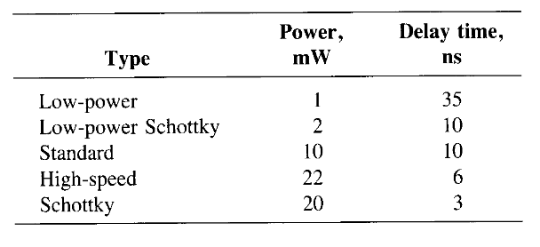
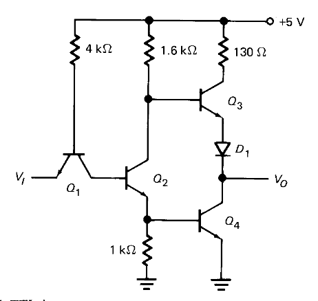
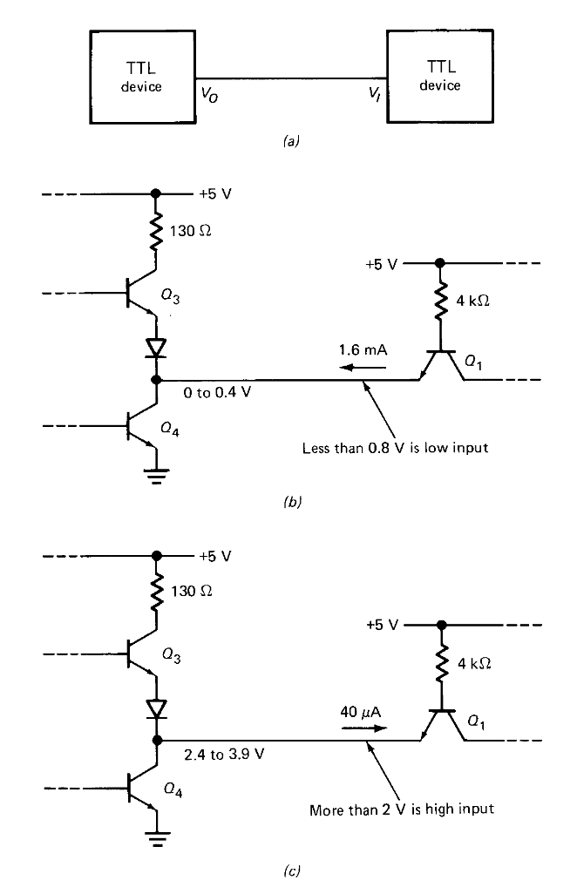
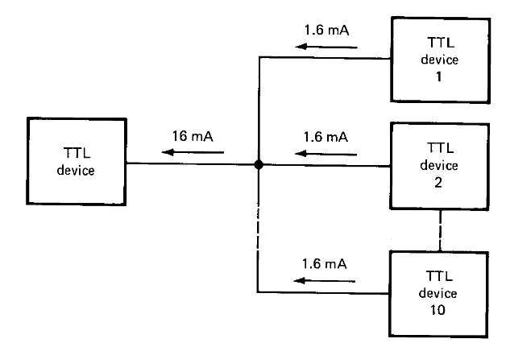
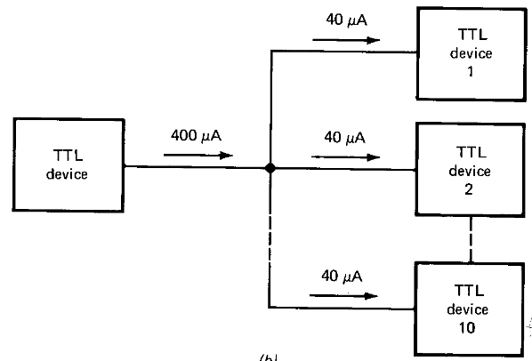
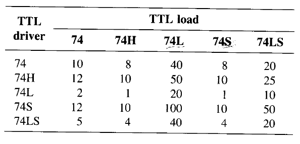
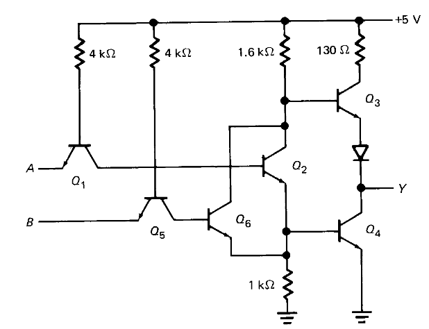

> Transistor-transistor logic

# Digital integrated circuits
- Miniature circuits on the surface of a chip is called an integrated circuit (IC)

## Levels of integration
- Small-scale integration (SSI): refers to ICs with fewer than 12 gates per chip
- Medium-scale integration (MSI): refers to ICs with 12 - 100 gates per chip
- Large-scale integration (LSI): refers to ICs with more than 100 gates per chip

- The typical microcomputer has its microprocessor, memory, I/O circuits on LSI chips (SSI and MSI chips are used to support LSI chips)

## Technologies and families
> 2 basic technologies for ICs: Bipolar (bipolar transistors) and MOS (MOSFETs)

- *Bipolar* is preferred for SSI and MSI because it's faster
- *MOS* dominates LSI because more MOSFETs can be packed on the same chip area

- Digital family: a group of compatible devices with the same logic levels and supply voltages

## Bipolar families
- Basic families:
	- *DTL*: Diode-transistor logic (obsolete)
	- *TTL*: Transistor-transistor logic (most popular)
	- *ECL*: Emitter-coupled logic (fastest, used for high speed applications)

## MOS families
- Basic families:
	- *PMOS*: p-channel MOSFETs (obsolete)
	- *NMOS*: n-channel MOSFETs (used for LSI, microprocessors and memories)
	- *CMOS*: Complementary MOSFETs (a push-pull arrangement of n- and p-channel MOSFETs, used where low power consumption is needed)

___
# 7400 devices
> 7400 series: A line of TTL circuits, most widely used of all bipolar ICs

## Standard TTL
- Standard TTL NAND gate

- The multiple-emitter input transistor is typical of all the gates and circuits in the 7400 series
- Each emitter acts like a diode, so $Q_1$ acts like a 2-input AND gate
- The rest of the circuit inverts the signal

## Totem-pole connection
- When $Q_3$ is on, output is high. When $Q_4$ is on, output is low 
- This produce a low output impedance, reduces switching time (short RC time constant)

## Propagation delay time and power dissipation
- A standard TTL gate has a power dissipation of about 10mW (on average)
- Propagation delay time is the amount of time it takes for the output of a gate to change after the inputs have changed
- Propagation delay time of a TTL gate is in the vicinity of 10ns

## High-speed TTL
- The above circuit is called standard TTL
- By decreasing the resistances, we can lower the internal time constants, which decreases the propagation delay time
- The smaller resistances increase the power dissipation (high-speed TTL)
- High-speed TTL gate has a power dissipation around 22mW and a propagation delay time of 6ns

## Low-power TTL
- Increasing internal resistances will reduce power dissipation (Low-power TTL)
- Larger time constants (slower)
- Low-power TTL gate has a power dissipation around 1mW and a propagation delay time of 35ns

## Schottky TTL
- With the above TTLs, the transistors go into saturation cause extra carriers to flood the base
- Trying to switch this transistor from saturation to cutoff will cause a delay called saturation delay time (wait for the extra carriers to flow out of the base)

- To reduce this, we use Schottky TTL: fabricate a Schottky diode along with each bipolar transistor of a TTL circuit

- This prevents the transistor from saturating fully (virtually eliminates saturation delay time)

## Low-power Schottky TTL
- By increasing internal resistances as well as using Schottky diodes, we get low-power Schottky TTL (best compromise between low power and high speed)

> Standard TTL and low-power Schottky TTL are the mainstays of the digital designer

___
# TTL characteristics
> 7400-series devices are guaranteed to work reliably over $0-70 \degree C$ and $4.75-5.25V$

## Floating inputs
- When a TTL input is floating, no emitter current is possible. So a floating TTL input is equivalent to a high input
- A floating input is considered high because the input connects the emitter of a transistor to $0V$ and turns it off, while grounding the input turns the transistor on
> In building circuits any floating TTL input will act like a high input

- Example:

## Worst-case input voltages
Inverter: 

- $V_I$: input voltage
- $V_O$: output voltage

- When $V_I$ is $0V$ (grounded), output voltage is high
- With TTL devices, we can raise $V_I$ to $0.8V$ and still have a high output
- The max low-level input voltage is designated $V_{IL}$ (worst case low input)

- Suppose $V_I$ is $5V$, the output of the inverter is low
- $V_I$ can decrease all the way down to $2V$ and the output will still be low
- The min high-level input voltage is designated $V_{IH}$ (worst case high input)

> Any input voltage from 2 - 5V is a high input for TTL devices

## Worst-case output voltages
> Ideally, 0V is the low output and 5V is the high output
- These ideal values cannot be attained because of internal voltage drops
- When output is low in the above circuit, $Q_4$ is saturated and has a small voltage drop across it (with TTL, any voltage from $0$ - $0.4V$ is low)
- When output is high, $Q_3$ acts like an emitter follower

- Because of the drop across $Q_3$, $D_1$, and the $130\ohm$ resistor, the output is less than $5V$ (with TTL, high output is between $2.4$ - $3.9V$)

- Worst-case output values:
$$
\begin{aligned}
V_{OL} = 0.4V \\
V_{OH} = 2.4V
\end{aligned}
$$

## Compatibility
- The values from the table above indicate that TTL devices are compatible

- b: A low TTL output ($0$ - $0.4V$)
- c: A high TTL output ($2.4$ - $3.9V$)

## Noise margin
- In the worst case, there's a margin of $0.4V$ between the driver and load in b and c, this is called the noise margin (represents protection against noise)
- The connecting wire between a TTL driver and a TTL load may pick up stray noise voltages (as long as these voltages are less than $0.4V$, we get no false triggering of the TTL load)

## Sourcing and sinking
- When b happens, an emitter current of 1.6mA (worst case) exists in the direction shown. The charges flow from the emitter of $Q_1$ to the collector of $Q_4$
- Because it's saturated, $Q_4$ acts like a current sink; charges flow through it to ground

- When c happens, a reverse emitter current of 40$\micro$A (worst case) exists in the direction shown. The charges flow from $Q_3$ to the emitter of $Q_1$. In this case, $Q_3$ acts like a source
$$
\begin{aligned}
I_{IL} = -1.6mA \\
I_{IH} = 40\micro A
\end{aligned}
$$

> Minus sign indicates that current is out of the device, plus sign means the current is into the device

## Standard loading
- A TTL device can source current (high output) or it can sink current (low output)
- Since maximum output currents are 10x as large, we can connect up to 10 TTL emitters to any TTL output

- Example (low):

- This is a low output
- The TTL driver sinking 16mA, sum of 10 TTL load currents
- Try connecting more than 10 emitters and output voltage may rise above $0.4V$

- Example (high):

- This is a high output with 400$\micro$A for 10 TTL loads of 40$\micro$A each
- The output voltage is $2.4V$ or more under worst-case conditions

## Loading rules
- The max number of TTL emitters that can be reliably driven under worst-case conditions is called the *fanout*
- With the standard TTL, fanout is 10

- Sometimes, we may want to use a standard TTL device to drive low-power Schottky devices
- In this case, the fanout increases because low-power Schottky devices have less input current

- TTL fanout table

# TTL overview
## NAND gates
- The backbone of the entire series
- The least expensive devices in the 7400 series

## NOR gates

- $Q_5$ and $Q_6$ have been added to produce OR-ing
- $Q_{1-4}$ are the same as in the basic design
- $Q_2$ and $Q_6$ are in parallel (The key to OR-ing followed by inversion to get NOR-ing)

- When A and B are both low, $Q_1$ and $Q_5$ are saturated; this cuts off $Q_2$ and $Q_6$
- $Q_3$ acts like an emitter follower and we get a high output

- If A or B or both are high, $Q_1$ or $Q_5$ or both are cut off, forcing $Q_2$ and $Q_6$ or both to turn on. When this happens, $Q_4$ saturates and pulls the output down to a low voltage

## AND and OR gates
- A common-emitter stage is inserted before the totem-pole output of the basic NAND gate design
