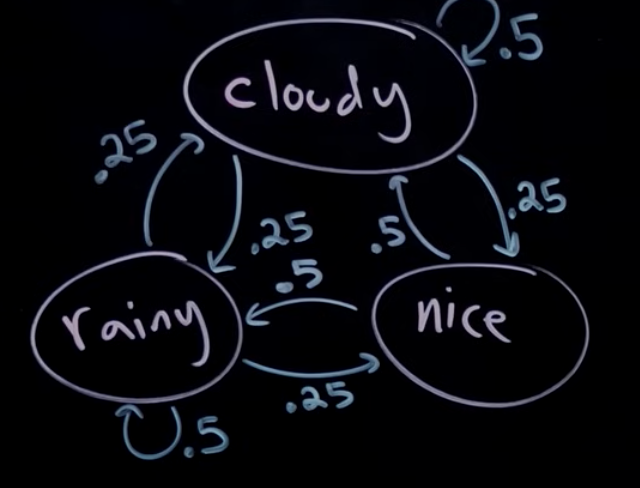

# Probabilistic weather model

3 types of weather: rainy, cloudy, nice. We can build a weather model that tells us the probability of the weather existing in any of the 3 states.

Below tells us the probability of tomorrow's weather based on today's weather:

Dynamical system:

$$
\underline{x}_{today} = \begin{bmatrix} pr(R) \\ pr(N) \\ pr(C) \end{bmatrix}
$$

$$
\underline{x}_{tomorrow} = A \underline{x}_{today}
$$

$A$ is the transition probability matrix. It tells us the probability of the weather tomorrow based on the state of the weather today. The column is the state of the weather today and the row is the state of the weather tomorrow. Each of the column will add up to 1 because probability.

$$
A = \begin{bmatrix} 0.5 & 0.5 & 0.25 \\ 0.25 & 0 & 0.25 \\ 0.25 & 0.5 & 0.5 \end{bmatrix}
$$

In this case, the columns follow this order (today): Rain, Nice, Cloudy. The rows follow this order (tomorrow): Rain, Nice, Cloudy.

Now, we can use this to propagate the system through time with this matrix and some initial condition. For this particular system, the conditions will eventually converges.