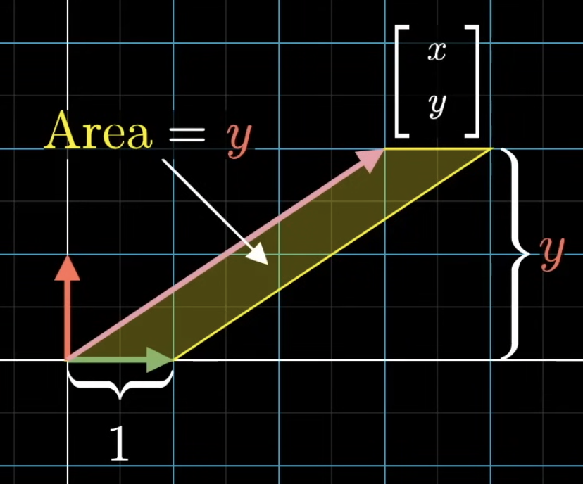
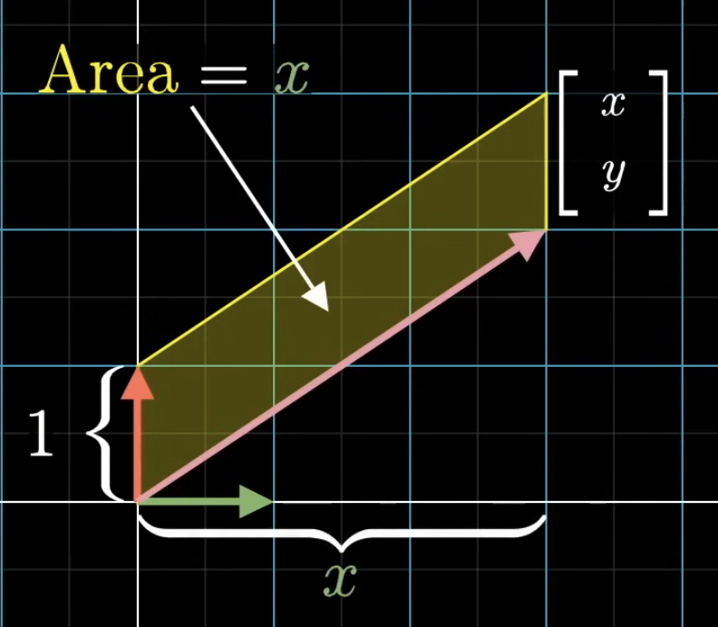

# Cramer's rule

This is a method for computing the solutions to linear systems of equations. 

> Note: This is not the best rule for computing solutions for linear systems of equations. Gaussian elimination is much faster. But this is still useful to learn to understand linear algebra better.

Setup:

$$
\begin{aligned}
3x + 2y &= -4
\\
-1x + 2y &= -2
\end{aligned}
$$

> The principle here will still work for systems with larger number of unknowns and equations.

The system above can be represented with matrices and vectors:

$$
\begin{aligned}
\begin{bmatrix} 3 & 2 \\ -1 & 2 \end{bmatrix} \begin{bmatrix} x \\ y \end{bmatrix} &= \begin{bmatrix} -4 \\ -2 \end{bmatrix}
\\
x\begin{bmatrix} 3 \\ -1 \end{bmatrix} + y \begin{bmatrix} 2 \\ 2 \end{bmatrix} &= \begin{bmatrix} -4 \\ -2 \end{bmatrix}
\end{aligned} 
$$

Geometrically speaking, this is a known transformation matrix transforming an unknown input vector into a known output vector. So the job here is to find that unknown input vector that fits the known output vector when the transformation matrix is applied on it. We want to figure out the exact linear combination that gives us this output vector.

The solution can depend on whether the transformation squishes all of space into a lower dimension (determinant is 0). 

$$
\begin{aligned}
&A\vec{x} = \vec{v}
\\
&\det(A) = 0
\end{aligned}
$$

In this case, either none of the inputs land on the given output (land outside of the lower-dimension line), or there's a bunch of inputs that land on that particular output (land on the lower-dimension line).

For a non-zero determinant (no squishing), the output will span the whole space that it started in. Every input has 1 output, every output has 1 input.

# Orthogonality

We can get the $x$ coordinate of the unknown vector by taking its dot product with the $\hat{i}$ basis vector (X-axis basis vector). And the $y$ coordinate of the unknown vector by taking its dot product with the $\hat{j}$ basis vector (Y-axis basis vector).

$$
\begin{aligned}
\begin{bmatrix} x \\ y \end{bmatrix} \cdot \begin{bmatrix} 1 \\ 0 \end{bmatrix} = x
\\
\begin{bmatrix} x \\ y \end{bmatrix} \cdot \begin{bmatrix} 0 \\ 1 \end{bmatrix} = y
\end{aligned}
$$

This is true for all cases. But this doesn't stay true after a transformation, at least not true for all transformation. Some transformation pull vectors apart from each other, or perpendicular vectors getting transformed into non-perpendicular vectors.

If the vectors are getting stretched out only, then the dot product will be reserved. The transformation that do preserve the dot product are called *orthogonal*.

$$
T(\vec{v}) \cdot T(\vec{w}) = \vec{v} \cdot \vec{w} \text{ for all } \vec{v} \text{ and } \vec{w}
$$

> Orthonormality describes a set of vectors which are all unit length and are orthogonal vectors (2 vectors are orthogonal if they are perpendicular to each other - their dot product is 0).

In the case of this transformation it's pretty simple. Taking the dot product of the output vector with the columns in the matrix is the same as taking the dot product of the input vector and the basis vectors.

$$
\begin{aligned}
\begin{bmatrix} a \\ c \end{bmatrix} \cdot \begin{bmatrix} 1 \\ 2 \end{bmatrix} = x
\\
\begin{bmatrix} b \\ d \end{bmatrix} \cdot \begin{bmatrix} 1 \\ 2 \end{bmatrix} = y
\end{aligned}
$$

# The actual Cramer's rule

Take the parallelogram of defined by $\hat{i}$ and the unknown vector. The area is the base times the height ($|\hat{i}| \times y \rightarrow y$). This area basically describes the vector's y-coordinate. This is signed too, so if the area is negative, the y-coordinate is negative. 

The same idea goes for the x-coordinate and $\hat{j}$.

This is useful to think about because when a transformation is applied, the determinant will indicate how much any arbitrary area is scaled by. So we can determine the new area by multiplying the determinant with the old area, which is the coordinate value.

$$
\begin{aligned}
A = \begin{bmatrix} 2 & -1 \\ 0 & 1 \end{bmatrix}
\\
\text{Area} = \det(A) y
\\
y = \frac{\text{Area}}{\det(A)}
\end{aligned}
$$

Since the transformation has been applied, we now have the value of the output vector. So we can use the output vector to figure out the new area, which will allow us to calculate for the original coordinates:

$$
\begin{aligned}
\vec{p} = \begin{bmatrix} 4 \\ 2 \end{bmatrix}
\\
\begin{bmatrix} 2 & -1 \\ 0 & 1 \end{bmatrix} \begin{bmatrix} x \\ y \end{bmatrix} = \begin{bmatrix} 4 \\ 2 \end{bmatrix}
\\
\text{Area} = \det \biggr( \begin{bmatrix} 2 & 4 \\ 0 & 2 \end{bmatrix} \biggl)
\end{aligned}
$$

We calculated the new area because the area is defined by the transformed matrix vector $\hat{i}$ and the new output vector (which we'll call $\vec{p}$). With the new area, and the determinant of the matrix, we can calculate the coordinates:

$$
y = \frac{\text{Area}}{\det(A)} = \frac{\det \biggr( \begin{bmatrix} 2 & 4 \\ 0 & 2 \end{bmatrix} \biggl)}{\det \biggr( \begin{bmatrix} 2 & -1 \\ 0 & 1 \end{bmatrix} \biggl)} = \frac{4}{2} = 2
$$

We can do the same thing for the x-coordinate:

$$
x = \frac{\text{Area}}{\det(A)} = \frac{\det \biggr( \begin{bmatrix} 4 & -1 \\ 2 & 1 \end{bmatrix} \biggl)}{\det \biggr( \begin{bmatrix} 2 & -1 \\ 0 & 1 \end{bmatrix} \biggl)} = \frac{6}{2} = 3
$$

Cramer's rule can be applied to cases with 3 dimensions or more.

$$
\begin{aligned}
&\begin{bmatrix} -4 & 2 & 3 \\ -1 & 0 & 2 \\ -4 & 6 & -9 \end{bmatrix} 
\begin{bmatrix} x \\ y \\ z \end{bmatrix} = \begin{bmatrix} 7 \\ -8 \\ 3 \end{bmatrix}
\\
&x = \frac{\det \biggr( \begin{bmatrix} 7 & 2 & 3 \\ -8 & 0 & 2 \\ 3 & 6 & -9 \end{bmatrix} \biggl)}{ \det \biggr( \begin{bmatrix} -4 & 2 & 3 \\ -1 & 0 & 2 \\ -4 & 6 & -9 \end{bmatrix}  \biggl)}
\\
&y = \frac{\det \biggr( \begin{bmatrix} -4 & 7 & 3 \\ -1 & -8 & 2 \\ -4 & 3 & -9 \end{bmatrix} \biggl)}{ \det \biggr( \begin{bmatrix} -4 & 2 & 3 \\ -1 & 0 & 2 \\ -4 & 6 & -9 \end{bmatrix}  \biggl)}
\\
&z = \frac{\det \biggr( \begin{bmatrix} -4 & 2 & 7 \\ -1 & 0 & -8 \\ -4 & 6 & 3 \end{bmatrix} \biggl)}{ \det \biggr( \begin{bmatrix} -4 & 2 & 3 \\ -1 & 0 & 2 \\ -4 & 6 & -9 \end{bmatrix}  \biggl)}
\end{aligned}
$$