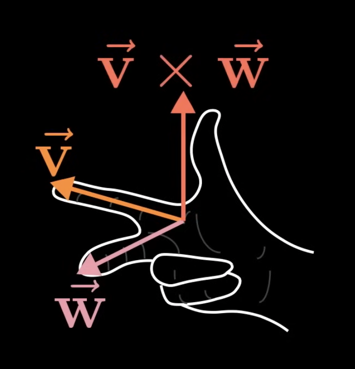

When we compare the dot product and the cross product, there are 3 main differences:
1. The dot product returns a number, but the cross product returns a _vector_.
2. The dot product works in any number of dimensions, but the cross product _only works in 3D_.
3. The dot product measures how much two vectors point in the same direction, but the cross product measures how much two vectors point in _different_ directions.

If we have 2 vectors $\vec{v}$ and $\vec{w}$, think of the parallelogram that they span out. The cross product of $\vec{v}$ and $\vec{w}$ is the area of this parallelogram.

$$
\vec{v} \times \vec{w} = \text{Area of parellelogram}
$$

We also need to consider orientation. If $\vec{v}$ is on the right of $\vec{w}$, then the cross product will be positive of the area. Else, then the cross product will be the negative of the area. 

$$
\vec{v} \times \vec{w} = - \vec{w} \times \vec{v}
$$

Example: The basis vectors ($\hat{i}$ on the X-axis, $\hat{j}$ on the Y-axis)

$$
\begin{aligned}
\hat{i} \times \hat{j} = +1
\\
\hat{j} \times \hat{i} = -1
\end{aligned}
$$

Because the cross product is basically just the area of the parallelogram, we can use the determinant to determine the cross product:

$$
\begin{aligned}
\vec{v} = \begin{bmatrix} 3 \\ 1 \end{bmatrix}, \vec{w} = \begin{bmatrix} 2 \\ -1\end{bmatrix}
\\
\vec{v} \times \vec{w} = \det \biggr( \begin{bmatrix} 3 & 2 \\ 1 & -1 \end{bmatrix} \biggr)
\end{aligned}
$$

The intuition behind this is the matrix is basically a transformation for the basis vectors, after the transformation, the parallelogram between the 2 basis vectors is the original square of the 2 basis vectors. So by taking the determinant of that transformation, we can get the area of the parallelogram. Because the determinant measures the factor by which the areas are changed, and the original basis square has an area of 1, using the determinant can give us the area of the parallelogram.

> Note: 1 neat thing about the determinant calculation is that the determinant allows for negative values, so if it does result in a negative value, we know that the position of $\vec{v}$ and $\vec{w}$ was flipped during the transformation.

This is technically the 2D version of something similar to the cross product. The actual cross product works on the 3D space. It combines 2 different 3D vectors to get a new 3D vector.

Consider the same thing here, but in 3D, vectors $\vec{v}$ and $\vec{w}$ with an area for the parallelogram. The cross product *is a vector*, not a number. The value of the area is the length of the vector $\vec{p}$. The direction of the new vector will be perpendicular to that parallelogram. You can determine which way it will point in by using the *right hand rule*: Index finger in the direction of $\vec{v}$, middle finger in the direction of $\vec{w}$, thumb in the direction of $\vec{p}$.

Example:

$$
\begin{aligned}
\vec{v} = \begin{bmatrix} 0 \\ 0 \\ 2 \end{bmatrix},
\vec{w} = \begin{bmatrix} 0 \\ 2 \\ 0 \end{bmatrix}
\end{aligned}
$$

The parallelogram here has an area of 4 and is a square. So the cross product is a vector with the length of 4. And the direction could be determined by the right hand rule. The cross product vector is actually pointing in the negative direction in this case.

$$
\vec{v} \times \vec{w} = \begin{bmatrix} -4 \\ 0 \\ 0 \end{bmatrix}
$$

The formula for this computation is this:

$$
\begin{bmatrix} v_1 \\ v_2 \\ v_3 \end{bmatrix} \times 
\begin{bmatrix} w_1 \\ w_2 \\ w_3 \end{bmatrix} = 
\begin{bmatrix} v_2 \cdot w_3 - w_2 \cdot v3 \\ v_3 \cdot w_1 - w_3 \cdot v_1 \\ v_1 \cdot w_2 - w_1 \cdot v_2 \end{bmatrix}
$$

This actually came from this computation:

$$
\begin{aligned}
\begin{bmatrix} v_1 \\ v_2 \\ v_3 \end{bmatrix} \times 
\begin{bmatrix} w_1 \\ w_2 \\ w_3 \end{bmatrix} = \det \biggr(
\begin{bmatrix} \hat{i} & v_1 & w_1 \\ \hat{j} & v_2 & w_2 \\ \hat{k} & v_3 & w_3 \end{bmatrix} \biggr)
\\
= \hat{i} (v_2w_3 - v_3w_2) + \hat{j} (v_3w_1 - v_1w_3) + \hat{k} (v_1w_2 - v_2w_1)
\end{aligned}
$$