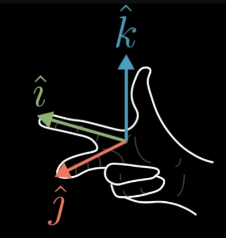

It's pretty useful to know the scaling factor of a particular area after a transformation. Getting the scaling factor of the unit vector's square can tell us the scaling factor of any possible region in the 2D space (How they change through transformation).

Any shape that's a grid square will follow the transformation of that unit square. Any shape that's not a grid square can be approximated by grid squares.

The scaling factor of a transformation is called the *determinant* of a transformation.

Example: The determinant of a transformation is 3 if that transformation increases the area of a region by 3. Or the determinant would be 0.5 if it squishes the area of a region down to half its size. Or the determinant would be 0 if it squishes all space into 1 line or 1 point because the area of all regions would be 0.

Determinant allows for negative values. The negative scaling has to do with orientation. If after a transformation, the unit vectors switch sides (Example, $\hat{i}$ goes from being on the right of $\hat{j}$ to on the left of it), then the orientation of space has been inverted. This happens when the determinant is negative. However, the absolute value still tells us the scaling factor of the areas.

For 3D space, the determinant tells us the scaling factor of the *volume*. Just like the 2D version, we can focus on the 1x1x1 basis cube. After the transformation, the determinant will give us the scaling factor of the volume of that cube. A determinant of 0 would mean the transformation squished everything into a flat plane, a line, or a single point.

For the negative scaling (rotation), there's a right hand rule for that:

If the right hand rule still applies after the transformation, then the determinant is positive (no rotation). If after the transformation, you can do the right hand rule with your left hand, then the determinant is negative (rotation).

For a 2x2 matrix, determinant can be calculated like this:

$$
\det \biggr(\begin{bmatrix} a & b \\ c & d \end{bmatrix} \biggr) = ad - bc
$$

> Intuition: The term $a$ tells you how much $\hat{i}$ stretches in the X-axis and $d$ tells you how much $\hat{j}$ stretches in the Y-axis. The $b$ and $c$ terms tells you how much the area is stretched or squished in the diagonal direction

For a 3x3 matrix, determinant can be calculated like this:

$$
\det \Biggr(\begin{bmatrix} a & b & c \\ d & e & f \\ g & h & i \end{bmatrix} \Biggr) = a \det \biggr( \begin{bmatrix} e & f \\ h & i \end{bmatrix} \biggr) - b \det \biggr( \begin{bmatrix} d & f \\ g & i \end{bmatrix} \biggr) + c \det \biggr( \begin{bmatrix} d & e \\ g & h \end{bmatrix} \biggr)
$$