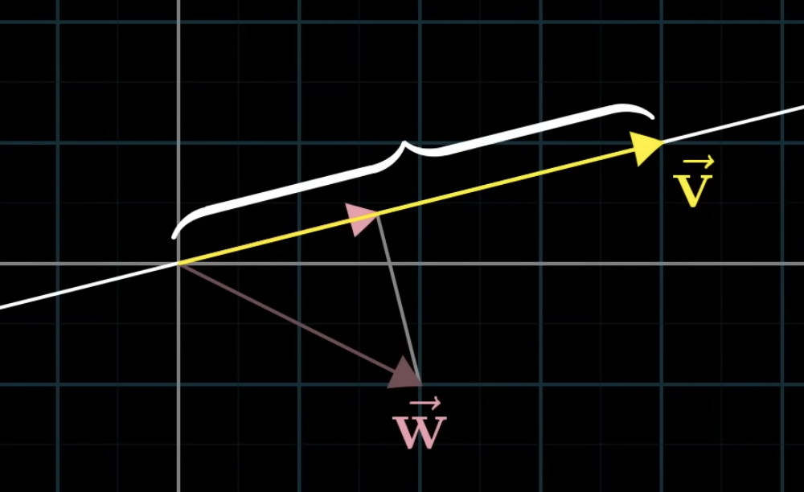

# Dot product

If we have 2 vectors of the same dimension, taking their dot product means pairing up all the coordinates, multiplying those pairs, and adding the result.

$$
\begin{bmatrix} 2\\7\\1 \end{bmatrix} \cdot \begin{bmatrix} 8\\2\\8 \end{bmatrix} = 2 \cdot 8 + 7 \cdot 2 + 1 \cdot 8
$$

Geometrically speaking, imagine 2 vectors $\vec{v}$ and $\vec{w}$. Imagine projecting $\vec{w}$ onto the line that passes through the origin and the tip of $\vec{v}$. Multiply length of the projected $\vec{w}$ and length of $\vec{v}$ and you get the dot product.

When the projection is in the opposite direction of $\vec{v}$, the dot product will be negative.

Properties of dot product:
- When they generally point in the same direction, the dot product will be positive.
- When they are perpendicular, the dot product will be 0 (Because the projection of 1 onto the other will land on the origin).
- When they generally point in the opposite direction, the dot product will be negative.

The dot product multiplication and vector projection is connected because of *duality*. The multiplication seems to be similar to the [matrix - vector multiplication](./Transformation.md), since the matrix seems like tilted vectors and vice versa.

In a sense, the dot product is vector - vector multiplication that also takes into account the difference in direction of the vectors. It represents the product of the magnitude of 1 vector and the magnitude of the other vector along the direction of the first vector.