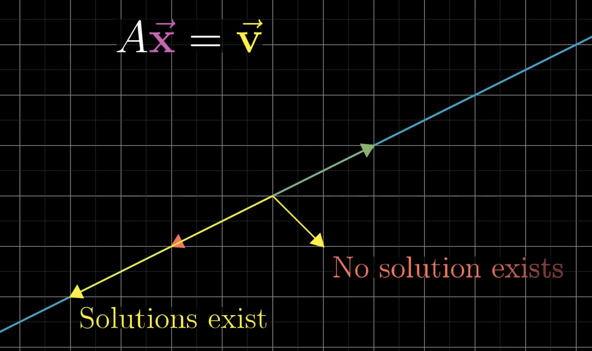

# Matrix multiplication

Applying 2 transformation is called *composing*. The resulting transformation after applying 2 transformation (1 after the other) is called a *composition*. This transformation can be describe using a matrix by following $\hat{i}$ and $\hat{j}$.

The composition matrix is the product of the 2 other transformation matrices. For example, applying a rotation followed with a shear means the composition matrix is the product of the rotation matrix and the shear matrix. 

Example (Read from right to left for the left hand side, first matrix from the right is the first transformation. Then multiplication is taking the left matrix and multiply it with $\hat{i}$ and $\hat{j}$ on the matrix on the right):

$$
\begin{bmatrix} a & b \\ c & d \end{bmatrix}
\begin{bmatrix} e & f \\ g & h \end{bmatrix} = 
\begin{bmatrix} ae + bg & af + bh \\ ce + dg & cf + dh \end{bmatrix}
$$

> Note: ORDER MATTERS FOR THIS

For 3D space, there's 3 basis vectors for this: $\hat{i}$ for the X-axis, $\hat{j}$ for the Y-axis, $\hat{k}$ for the Z-axis.

Example:

$$
\begin{bmatrix} 1 & 1 & 1 \\ 0 & 1 & 0 \\ -1 & 0 & 1 \end{bmatrix}
$$

Figuring out vector transformation based on the basis vector transformation is similar to the 2D version:

$$
\vec{v} = \begin{bmatrix} x \\ y \\ z \end{bmatrix} = x \hat{i} + y \hat{j} + z \hat{k}
$$

The 3D composition multiplication one is similar to the 2D version:

$$
\begin{bmatrix} a & b & c \\ d & e & f \\ g & h & i \end{bmatrix} 
\begin{bmatrix} j & k & l \\ m & n & o \\ p & q & r \end{bmatrix} =
\begin{bmatrix} aj + bm + cp & ak + bn + cq & al + bo + cr \\ dj + em + fp & dk + en + fq & dl + eo + fr \\ gj + hm + ip & gk + hn + iq & gl + ho + ir \end{bmatrix} 
$$

# Inverse matrix

With an inverse matrix $A^{-1}$, if you apply a transformation with the matrix $A$, and apply the inverse matrix, you land back where you started. So multiplying the 2 matrix together gives us a matrix that does nothing. This is called an *identity transformation*. 

$$
A^{-1} A = \begin{bmatrix} 1 & 0 \\ 0 & 1 \end{bmatrix}
$$

The inverse transformation only exist if the determinant of $A$ is non-zero. When the determinant $A$ is 0, there is no inverse.

This can be used for calculating systems of equations.

$$
A \vec{x} = \vec{v}
$$

For systems of equations, even when the determinant of $A$ is 0, there could still be a solution, but you'd have to be really lucky that the $\vec{v}$ lands somewhere on that line.

# Non-square matrix

