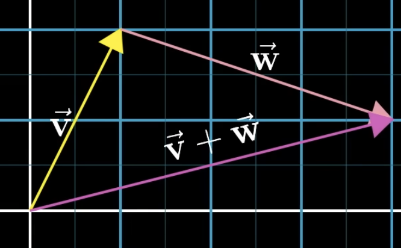

# Basics

Perspectives
- Physics: Vectors are arrows pointing in space. A vector is defined by its length and direction. As long as those 2 are the same, a vector can be moved around and still be called the same vector.
- CS: Vectors are ordered lists of numbers. It's pretty much just a fancy word for list.
- Maths: A vector can be anything where there's adding 2 vectors and multiplying a vector by a number. It's pretty abstract.

In a 2D space, the point where the X-axis and the Y-axis intersect is called the *origin*. It's the center of space and the root of all vectors.

The coordinate of a vector is basically how to get from the origin to the specified coordinate.

$$
\begin{bmatrix}
-2
\\
3
\end{bmatrix}
$$

First element ($-2$) indicates offset in the X-axis. Second element ($3$) indicates offset in the Y-axis.

> The vertical column vector is a convention to distinguish them from points

In a 3D space, an extra axis is introduced: the Z-Axis, which is perpendicular to X and Y.

$$
\begin{bmatrix}
-2
\\
3
\\
4
\end{bmatrix}
$$

First element ($-2$) indicates offset in the X-axis. Second element ($3$) indicates offset in the Y-axis. Third element ($4$) indicates offset in the Z-axis.

Vectors can be added and multiplied:

$$
\begin{aligned}
\vec{v} + \vec{w} = \begin{bmatrix}3 \\ -5\end{bmatrix} + \begin{bmatrix}2 \\ 1\end{bmatrix} = \begin{bmatrix}3 + 2 \\ -5 + 1\end{bmatrix}
\\
2 \times \vec{v} = 2 \times \begin{bmatrix}3 \\ -5\end{bmatrix} = \begin{bmatrix}2 \times 3 \\ 2 \times -5\end{bmatrix}
\end{aligned}
$$

We can visualize the vector addition by moving the second vector to the tip of the first vector and taking the length of the vector pointing from the origin of the first vector to the tip of the second vector. Each vector kinda represents a certain movement, a step in a certain direction with a certain distance in space.

Multiplication is basically just stretching or shrinking or flipping the vector based on the multiplied scalar value.

# Basis vectors

Unit vectors have a length of 1.
- $\hat{i}$: The unit vector in the X-axis
- $\hat{j}$: The unit vector in the Y-axis

The values in a vector is basically scalars used to scale these unit vectors. The vector that the coordinate describes is the sum of the 2 scaled vectors.

$$
\begin{bmatrix}
-2
\\
3
\end{bmatrix}
\rightarrow
3\hat{i} + -2\hat{j}
$$

Technical definition: The basis of a vector space is a set of linearly independent vectors that span the full space.

# Linear combination

Anytime we scale 2 vectors and add them together, it's called a *linear combination*.

$$
a \vec{v} + b \vec{w}
$$

If the 2 vectors line up, you can only move in 2 direction (Forward and backward). Worst case is both vectors are 0, so you're stuck at the origin. Otherwise with linear combination, you can reach anywhere in the 2D space.

The *span* of $\vec{v}$ and $\vec{w}$ is the set of all their linear combinations.

In a 3D space, with only 2 vectors, the span of the 2 vectors will be on a flat sheet where the scaling or the 2 vectors can happen so it will transform in 2 axes, but stays the same in 1 axis. However, with 3 vectors, the span will be in every possible coordinate in the 3D space.

$$
a \vec{v} + b \vec{w} + c \vec{u}
$$

Special condition: If the 3rd vector is on the span of the other 2 vectors, then the new span will be the same as the span of the 2 vectors. 

When there's multiple vectors where you can remove 1 without reducing the span, that's called *linear dependency*. That redundant vector could also be expressed as a linear combination of the other vectors:

$$
\vec{u} = a\vec{v} + b\vec{w}
$$

So if a vector does add another dimension to the span, it's *linearly independent*:

$$
\vec{u} \ne a\vec{v} + b\vec{w}
$$