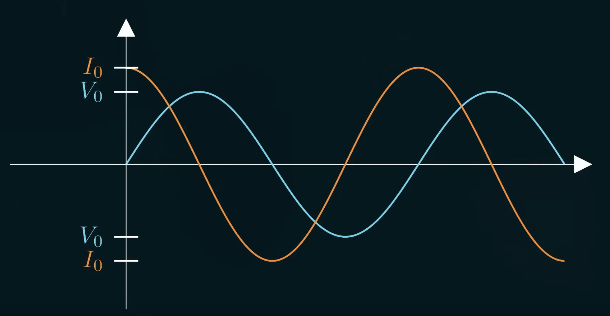
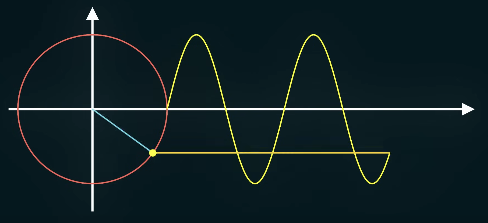
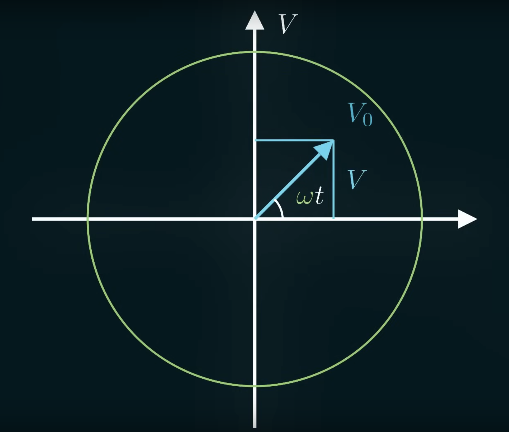
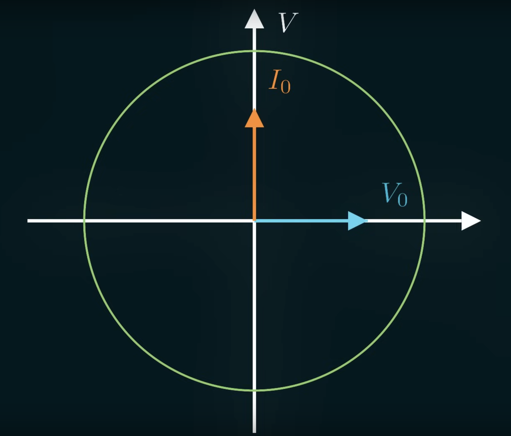
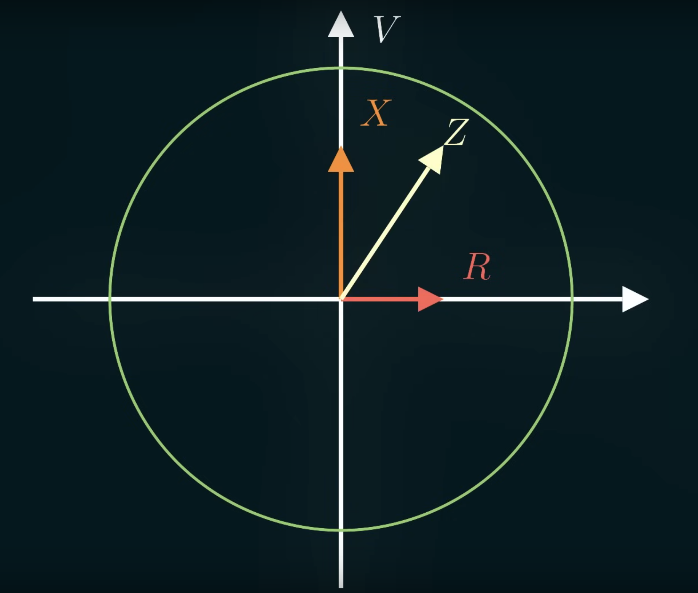

This is alternating current.

For most AC circuits, it'll look like a normal sine wave scaled up by a factor of $V_0$, sped up by the angular frequency $\omega$, and shifted by a constant $\delta$.

$$
V = V_0 \sin(\omega t + \delta)
$$

> For simplicity, $\delta$ will be ignored for now. Giving us this $V = V_0 \sin(\omega t)$

Ohm's law can still be applied for AC for find current and resistance.

$$
I = \frac{V}{R} = \frac{V_0}{R} \sin(\omega t)
$$

Measuring AC is a little more complicated compared to DC. We can't just take the average because the sine waves will always average to 0. What we do is square the wave, then take the average of that wave, then take the square root of that average. This is the *Root Mean Square (RMS)*.

$$
RMS: \sqrt{avg(I^2)}
$$

This is the quantity that people refer to when they talk about AC circuits (eg. Wall voltage is usually around $100V$ - $300V$, which are RMS voltages). Ohm's law and power laws work fine with RMS voltage and current.

When it comes to capacitors in AC, in low frequency AC, the capacitor will get to charge up and get to oppose the current flow a lot of the time. In high frequency AC, it won't have enough time to charge up, so it will let more current through. So the opposition to AC current is inversely proportional to the frequency. Also the better the capacitance, the more the capacitor will be charging and discharging, the more it's not going to be opposing voltage as much. 

$$
\begin{align}
opposition \propto \frac{1}{\omega}
\\
opposition \propto \frac{1}{C}
\end{align}
$$

Through the definition of capacitance in the sine wave or the proportionalities, we can derive that the proportionality between current and voltage in AC is this quantity:

$$
V_0 = I_0 (\frac{1}{\omega C})
$$

It's similar to resistance, but it depends on how quickly the circuit is changing. This is *reactance* ($X$).

$$
X = \frac{1}{\omega C}
$$

If we have a smaller capacitor or a slower changing circuit, there won't be as much max current when we apply a max voltage. These relations mean the current on a capacitor will always lead the voltage source by $90\degree$.

$$
\begin{align}
Q = V_0 C \sin(\omega t)
\\
I = V_0 C \omega \cos(\omega t)
\end{align}
$$

When we first turn on voltage, the capacitor acts like a wire, it starts letting current goes through and accumulating charge. Then the voltage starts to level off, and the current starts to level off too. This is when the capacitor is fully charged. When the voltage starts to decrease, the capacitor has excess charge on it, so it will try to discharge by sending current in the opposite direction, giving us negative current. It keeps discharging until voltage is 0. This is when the capacitor is fully discharged. When the capacitor is fully discharged, it will start acting like a wire again, and the cycle continues but in the opposite direction.

A different way to imagine this is showing the sine wave as spinning vectors like above, with the vertical axis representing the voltage across the circuit.

The voltage is the blue vector. Maximum voltage is $V_0$. The angle under the vector is $\omega t$, it represents how far along the wave we are. It starts at $0\degree$ and increases as we go along the path. The height is the voltage.

Using `soh cah toa`, we can calculate the sine of the angle under the vector:

$$
\begin{align}
\sin(\omega t) = \frac{opposite}{hypotenuse} = \frac{V}{V_0}
\\
V = V_0 \sin(\omega t)
\end{align}
$$

For capacitors, the current will always be $90\degree$ ahead of the voltage.

If we have an RC circuit (resistor capacitor circuit), the resistor will follow the voltage, the reactance will follow the current, and resistance in series will add. So we can get the total amount of *impedance* (total amount of resistance to current) by adding up the resistance and reactance.

The magnitude of the impedance is equal to the length of the vectors added together. Since the reactance and resistance vectors are always perpendicular, we get a square triangle, with the impedance as the hypotenuse of the triangle.

$$
Z = \sqrt{X^2 + R^2}
$$

We can use impedance in Ohm's law too:

$$
V_{RMS} = I_{RMS} Z
$$

In AC circuits, the frequency needs to be taken into account when using impedance. This sets impedance apart from resistance.