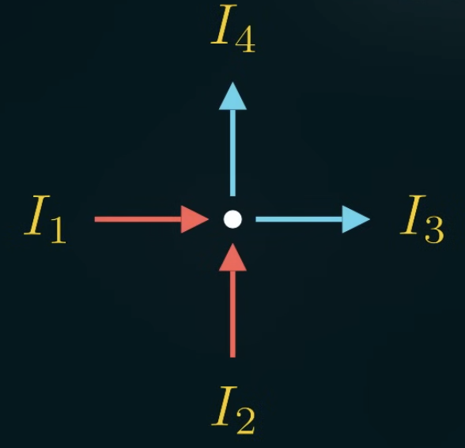
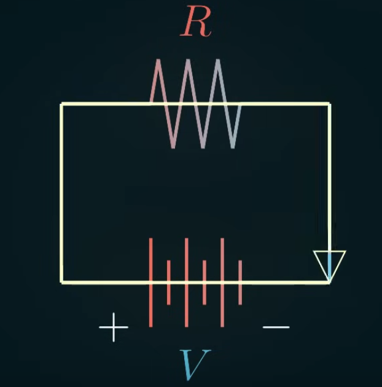

Kirchhoff's laws basically describe charge conservation in electricity.

## Junction rule

A junction is a point where the wires meet. The total charge going in must equal to the total charge going out.

$$
I_1 + I_2 = I_3 + I_4
$$

## Loop rule

If you start and end in the same place (going in a loop), the sum of all electric potential differences is zero.

$$
V - IR = 0
$$

