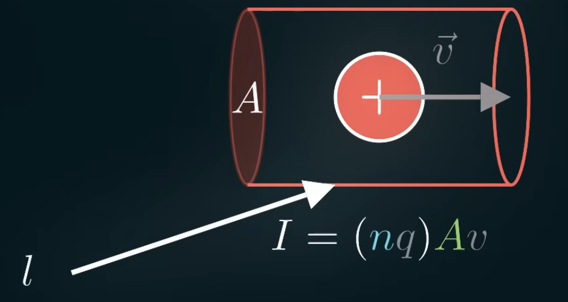

When we connect 2 ends of a battery together, the electrons would go from 1 end (with higher potential) to the other end (with lower potential). The electrons also don't just jump to the other end all at once, so there's something stopping the electrons. That is *resistance*.

$$
R = \frac{V}{flow}
$$

Resistance measures the proportion between the voltage applied and the flow of electron. We can measure the flow of electrons (*current*) by measuring the amount of charges flowing through some area in a certain amount of time.

$$
I = \frac{\Delta Q}{\Delta t} = \frac{Q}{t}
$$

Where:
- $\Delta Q$ is the change in charge
- $\Delta t$ is the change in time

So current is the measure of the amount of charge flowing through a area in a certain amount of time. We can also define the current geometrically. Take a charge flowing through an area (wire):

The charge is equal to the charge per volume times the volume:

$$
Q = (\frac{Q}{V})V
$$

We can rewrite the charge per volume as the charge carrier density (example: 10 atoms of charge carriers per $cm^3$) times the charge on each carrier. So the charge of an electron would be the charge on each carrier.

$$
Q = (nq) V
$$

We can also rewrite the volume as the area times the length. Length here is the same thing as the velocity of the charges times some change in time.

$$
Q = (nq) Al = (nq) A v \Delta t
$$

So we get this current equation:

$$
I = \frac{Q}{\Delta t} = (nq) A v
$$

The current (change in charge over change in time) is equal to the number of charge carrier ($n$) times the charge on each of those carriers ($q$) times the cross-sectional area of the wire ($A$) times the velocity of the charges ($v$).

For the velocity of the charges in the wire:

$$
v = \frac{I}{(nq)A}
$$

So we can replace the variables with some example values:
- $I = 10A$
- 12 gauge wire:
	- $diameter = 2.05mm$
	- $A = 3.31 \times 10^{-6}m^2$
- Copper density: $n = 8.48 \times 10^{28} \frac{atoms}{m^3}$
- Assuming 1 free electron per atom: q = e = $1.6 \times 10^{-19} C$

$$
v = \frac{10}{8.48 \times 10^{28} \times 1.6 \times 10^{-19} \times 3.31 \times 10^{-6}} = 2.23 \times 10^{-4} \frac{m}{s} = 0.223 \frac{mm}{s}
$$

The reason why circuit seems so instantaneous when you turn them on is because you don't have send a charge through the whole circuit to get it going. It's more like a queue, 1 charge goes in, 1 charge goes out, the process happens almost instantly.

Resistance is how much voltage is required to get a certain amount of current.

$$
R = \frac{V}{I}
$$

Example: If we have a resistance of $2 \ohm$ then we'd need a voltage of $2V$ to get $1A$ of current. This is *Ohm's law*.

Imagine a water pipe. If the pipe has high resistance (small pipe, rugged surface, etc), then in order to get the water flow in the pipe to reach a desired flow rate, we'd need a high potential (large difference in pressure between 2 ends of the pipe). That's basically what Ohm's law is.

If a resistor is longer, there'll be more resistance. If a resistor is wider, there'll be less resistance.

$$
\begin{align}
R \propto l
\\
R \propto \frac{1}{A}
\\
R = \frac{\rho l}{A}
\\
R = \int{\frac{\rho dl}{A}}
\end{align}
$$

We can get the resistance of multiple resistor by integrating the resistance across each differential length. Resistor in series effectively creates a larger resistor with *larger length*.

$$
R_T = R_1 + R_2 +  ... + R_n
$$

Resistor in parallel effectively creates a larger resistor with *larger area*. Since resistance is inversely proportional to the area, we can calculate resistance by adding up inverse of the resistance of each resistor.

$$
\frac{1}{R_T} = \frac{1}{R_1} + \frac{1}{R_2} + ... + \frac{1}{R_n}
$$