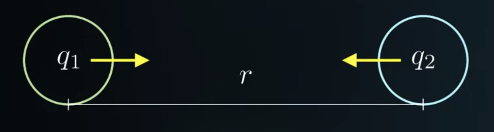
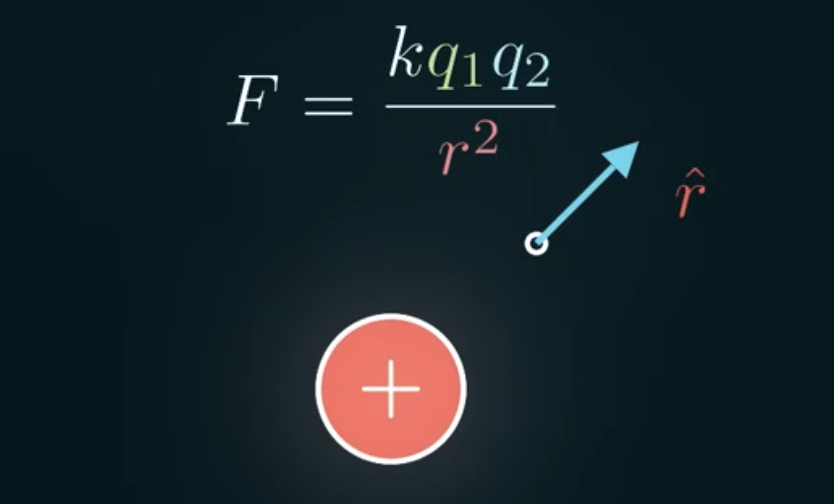
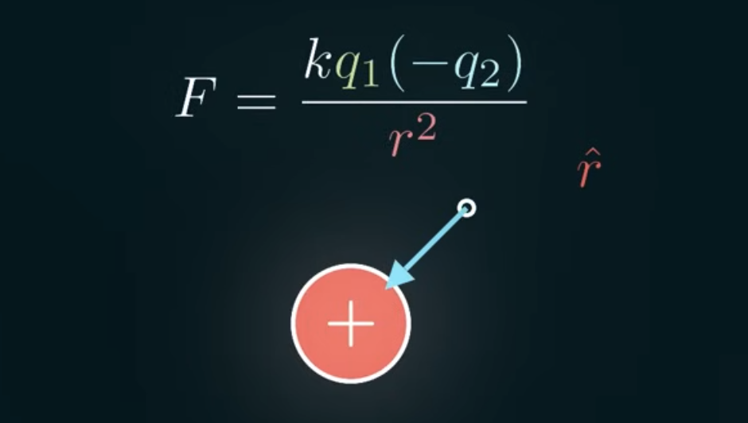
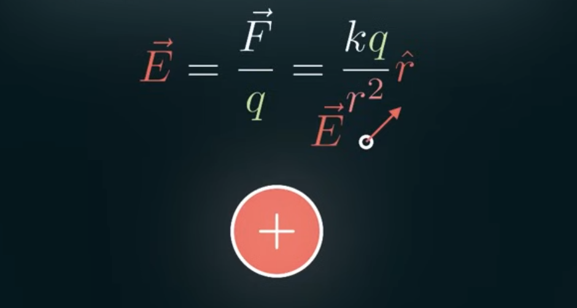

An atom contains Protons (*+* charge) and Neutrons (*neutral* charge) inside the nucleus, and electrons (*-* charge) outside the nucleus.

Charges of the same type repels each other. Charges of the opposite type attracts each other.

Measuring the repulsion and attraction meaning measuring the force between 2 charged objects. The force between 2 charged objects is proportional to the charge on each of those objects. The force is also inversely proportional to the radius squared.

$$
\begin{align} 
F \propto q_1 
\\
F \propto q_2
\\
F \propto \frac{1}{r^2}
\end{align}
$$

Where:
- $F$ is force
- $q_1$ is the charge of object 1, $q_2$ is the charge of object 2
- $r$ is the radius

Combining all the force equations give us this:

$$
F = \frac{k q_1 q_2}{r^2}
$$

With $k = 8.99 \times 10^9$

The force is equal to the constant $k$ times both the charges divided by the radius squared. This is the *Coulomb's law*. Compared to the Newton's law of gravitation equation, the equation looks almost identical.

What if we only have 1 charge? Imagine a positive charge and select a point in space and say if we were to put a charge here, what would happen to it? We know the magnitude of the force through Coulomb's law, and we know they're either going to attract or repel, so the force will point from one to the other. 

If we make a unit vector $\hat{r}$ (vector with length 1) pointing from the positive charge to the selected point, it's gonna give us the direction of the force.

If the charges are opposite, we get a negative sign and the vector will point in the opposite direction

The equation for the force in this point's direction is this:

$$
F = \frac{k q_1 q_2}{r^2} \hat{r}
$$

If we set the charge at the selected point ($q_2$) equal to $+1$, then one of our charges is out of the equation. What's left in the equation is the *Electric field*:

$$
\vec{E} = \frac{\vec{F}}{q} = \frac{kq}{r^2} \hat{r}
$$

Where:
- $\vec{E}$ is the electric field vector, represents the measure of the force experienced by a charged particle per unit charge at a given point in space. It has both magnitude and direction.
- $\vec{F}$ is the electric force vector acting on the particle, the force that is exerted on a charged particle by an electric field.
- $q$ is the charge of the particle

The electric field tells us how much force we're going to get if we put a positive charge at any of this point. The electric field at a given point is equal to the electric force experienced by a charge particle at that point divided by the charge of the particle.

We can illustrate the electric field of a charged particle like this:

The positive charge will have the electric field flowing away from it because the positive charges want to repel each other.

Same thing for the negative charge, except the arrows flow into the charge instead of away flow away from it because the hypothetical $+1$ charge at the selected point will want to attract the negative:

We can use this model and checkout how the electric field between 2 oppositely charge particles will look like:

At every single point, we calculate the electric field from the negative charge plus the electric field from the positive charge.

Calculating the electric field of a continuous object, we can break up the object into tiny charges and add up the electric field for each of those charges. We do that by using the electric field equation like normal, but now the $q$ is infinitely small. So we use $dQ$ for differential charge:

$$
\vec{E} = \int{\frac{k dQ}{r^2} \hat{r}}
$$

Assuming the object is a continuous line on a graph

$$
Q = (\frac{Q}{L})L = \sigma L
$$

Where:
- $Q$ is the total charge on the line
- $L$ is the length of the line
- $\sigma$ is the charge density

So the differential charge is equal to the charge density times a very tiny length $dx$:

$$
dQ = \sigma dL = \sigma dx
$$

If we add up the differential charges using an integral, we can calculate the electric field of the continuous object

$$
\vec{E} = \int{\frac{k \sigma dx}{r^2} \hat{r}}
$$

> This method of calculating the electric field is pretty difficult, but luckily there's an easier method of doing that. But we need to know about [[flux]].