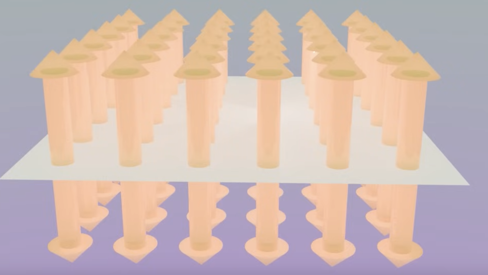
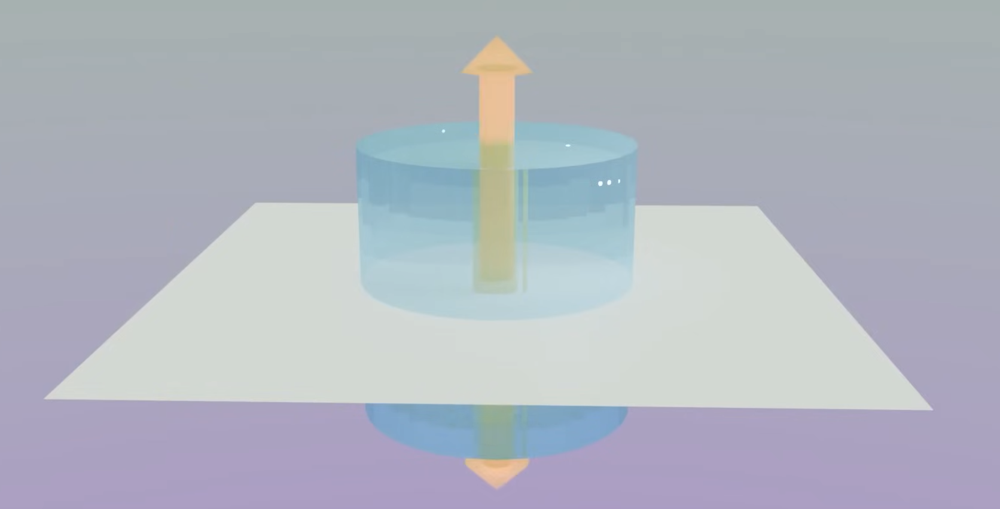
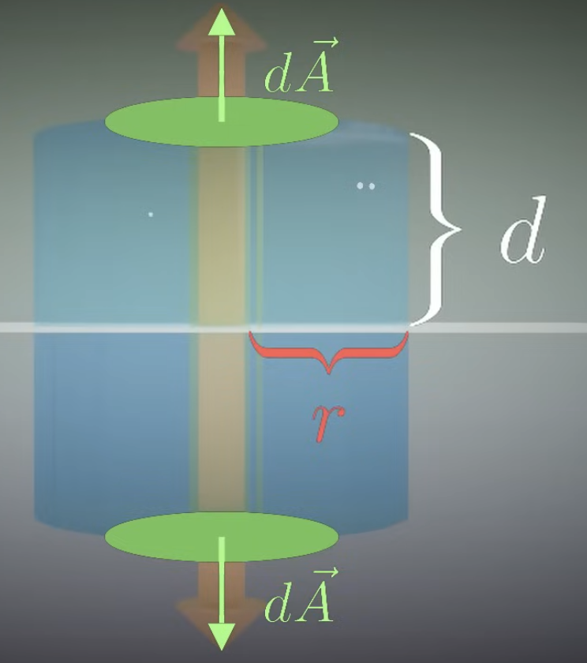

Make sure you already read through [Coulomb's Law](Coulomb's%20Law.md) and [Flux](./Flux.md) first.

Say we have a large sheet of charges the electric field of the sheet of charges will point away from both sides of the sheet.

If we want to find the electric field some distance away from the sheet, we need to create a Gaussian surface. We can bring in a cylinder (to simplify things, we put all the vectors into a single big vector through the cylinder)

We can start with Gauss's law for calculating this:

$$
\phi_E = \oint{\vec{E} \cdot d\vec{A}} = \frac{q_{enc}}{\epsilon_0}
$$

We start with the integration part. Since we're at a constant distance from the charge along the cylinder and the electric field is always perpendicular to the surface of the cylinder, the integral simplifies to $EA$, where $A$ is the area of both the top and bottom circle. Since the area is a circle, we can evaluate the area of the circle with $2\pi r^2$.

So the integral is simplified to $E 2 \pi r^2$.

For the right-most side of the Gauss's law equation, we'll need to make some assumptions. We assume the whole sheet has a charge $Q$ and an area $A$. The charge density $\sigma$ is the charge per unit area ($\frac{Q}{A}$). So the charge of the region enclosed is:

$$
\begin{align}
Q = \frac{Q}{A} A = \sigma A = \sigma \pi r^2
\\
\frac{Q}{\epsilon_0} = \frac{\sigma \pi r^2}{\epsilon_0}
\end{align}
$$

Since the 2 sides are equal to each other, we can simplify both into this equation that describes the calculation of the electric field of the cylinder:

$$
\begin{align}
E 2 \pi r^2 = \frac{\sigma \pi r^2}{\epsilon_0}
\\
E = \frac{\sigma}{2 \epsilon_0}
\end{align}
$$