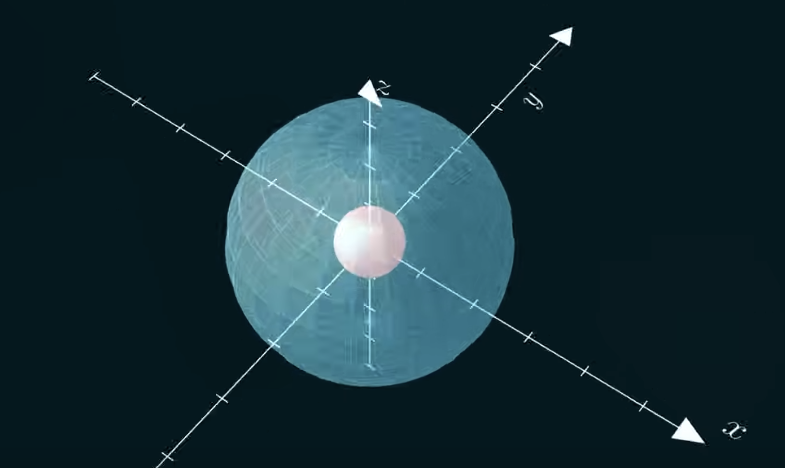

Let's say we have a vector field that represents the wind and we want to catch the wind with a net, how do we measure how much wind is captured by the net?

We know that if the wind is stronger or the net is bigger, it will catch more wind. And if the net points perpendicular to the wind, we'll also get more.

To describe this, we need to get the net area vector (a vector that's perpendicular to the net's area) and the length (net's area).

If the circle has an area of 5 then the vector will have the length of 5. If the wind is bigger, the net's area is bigger, or they point more in the same direction, then we'll catch more wind.

So the ability to catch wind is the dot product of the wind in the area vectors:

$$
\begin{aligned}
\phi = W A cos(\theta)
\\
\phi = \vec{W} \cdot \vec{A}
\end{aligned}
$$

This is what flux is. It's just how much a vector field flows through a given area. If we have a more complicated surface, we just break it up into smaller areas ($d\vec{A}$) and add up the flux across the whole surface:

$$
\phi = \int{\vec{W} \cdot d\vec{A}}
$$

The *electric flux* is how much the electric field flows throw an area. To calculate electric flux, we start with a charge, and we surround it with a sphere (This is 3D):

We know that the electric field of a positively charged particle points outwards. We need to find the electric flux on the sphere. We first restrict our view to the electric field on the surface of the sphere. Since the field is pointing away from the charge, then the differential area vector needs to point out away from the sphere (because they have to be perpendicular) to the surface. 

Flux equation:

$$
\phi_E = \oint{\vec{E} \cdot d\vec{A}}
$$

> The circle integral means we're adding up over a closed surface.

Since both the electric field and the area vector points in the same direction away from the charge, we can simplify from the dot product to the scalar product:

$$
\phi_E = \oint E dA
$$

The electric field is a function of radius, but in the case of the sphere, the radius is constant:

$$
E(r) = \frac{kq}{r^2}
$$

Since it's constant, we can pull the $E$ out of the integral:

$$
\phi_E = E \oint{dA}
$$

The integral of the differential area can be simplified to just area. So the entire flux of the sphere evaluate to $EA$:

$$
\phi_E = E A
$$

Plugging things in to the equation, we get this:

$$
\phi_E = \frac{kq}{r^2} 4 \pi r^2 = kq 4\pi
$$

If we put $k4\pi$ into a new constant (since those 3 are already constants) called $\epsilon_0$, we get *Gauss's law*:

$$
\phi_E = \oint{\vec{E} \cdot d\vec{A}} = \frac{q}{\epsilon_0}
$$

This law works for any closed surface (called a *Gaussian surface*):

$$
\phi_{E2} = E_1 A_1 = \phi_{E1}
$$

If we have another charge into the outer surface, we can make the same flux argument. Since the fluxes are going to add up, then the flux is the sum of the flux from the charges. So flux is equal to the total charge enclosed by the surface divided by $\epsilon_0$.

$$
\phi_E = \frac{q_{enc}}{\epsilon_0}
$$

If we have a charge outside of the surface, it will have a flux that goes both into and out of the surface:

Using the same arguments, the amount of flux going into the surface has to be equal to the amount of flux going out of the surface, so they cancel each other, leaving *zero net flux* for charges outside of the surface.

Now we have *Gauss's law*:

$$
\begin{align}
\phi_E = \oint{\vec{E} \cdot d\vec{A}} = \frac{q_{enc}}{\epsilon_0}
\\
\phi_{E2} = E_1 A_1 = \phi_{E1}
\end{align}
$$

This makes calculating electric field a whole lot easier.