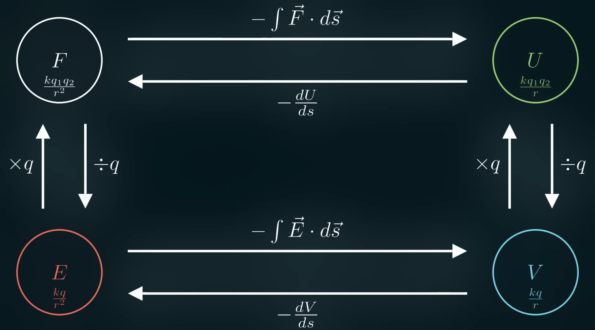

Recapping the *Electricity* chapter.

Force is a push or pull on an object. Between 2 charges, force is a constant times each charge divided by the distance between them squared.

$$
F = \frac{kq_1q_2}{r^2}
$$

Electric field is the force that occurs at some location if you put a $+1$ charge there with another charge. One of the charge ends up being dropped out of the equation, so the electric field is a constant times the charge divided by the distance squared.

$$
E = \frac{kq}{r^2}
$$

Potential energy is the ability of some object to do work. When you push something against the force field, potential energy is created because now it has the potential to move through the force field.

$$
U = \frac{kq_1q_2}{r}
$$

Voltage is the electric potential energy if you put a $+1$ charge at some location.

$$
V = \frac{kq}{r}
$$

We can go between force and electric field or potential energy and voltage by adding or removing a charge. We can go between electric field and voltage by adding up the negative accumulation of electric field or finding the slope of the voltage. We can go between force and potential energy by adding up the negative accumulation of force or finding the slope of the potential energy.