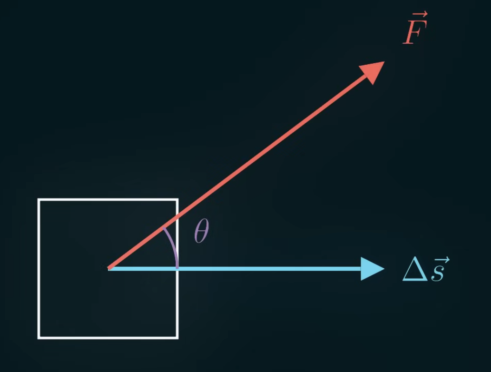
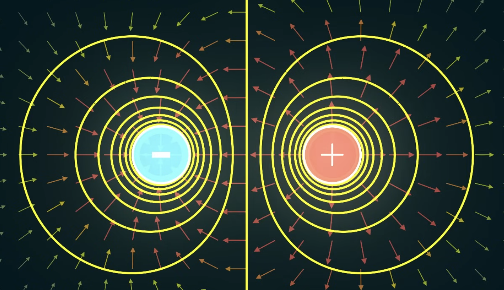
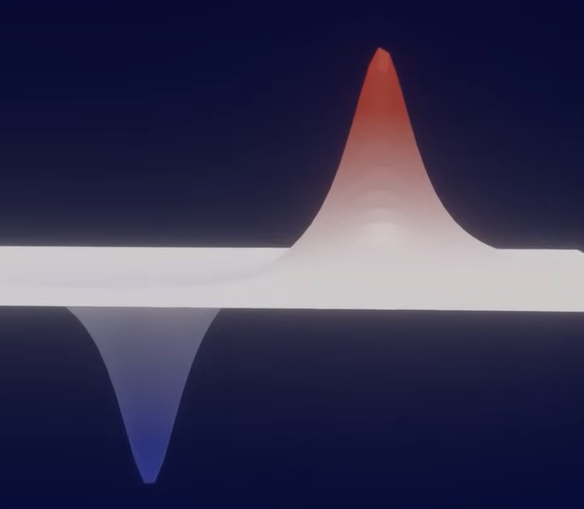

Take a square object for example. *Work* ($W$) describes the alignment of force ($\vec{F}$) and displacement ($\Delta \vec{s}$) of an object.

$$
W = F \Delta s \cos(\theta)
$$

Treating the displacement as gravity for example, the force of gravity is always pointing downwards. When we move an object against the force of gravity (holding it up, displacing it upwards but the force is downwards), we've created potential energy (because the object now has the potential to move downwards, following the flow of gravity).

So when we do negative work, we get potential energy:

$$
\begin{align}
U = -F \Delta s \cos(\theta)
\\
U = - \vec{F} \cdot \vec{\Delta s}
\end{align}
$$

If the force changes as we move along the path, we can integrate the potential energy:

$$
U = - \int{\vec{F} \cdot d\vec{s}}
$$

For the electric potential energy, we can put force to be the electric force equation and the change in distance to be the change in the $\hat{r}$ direction (radius direction, $dr\hat{r}$). We can start with the 2 charges infinitely far away from each other (if they're infinitely far away, they won't exert any forces on each other, meaning no potential energy), then we'll being them in to some radius $r'$.

$$
\begin{align}
\vec{F} = \frac{kq_1q_2}{r^2} \hat{r}
\\
d\vec{s} = dr \hat{r}
\\
U = - \int{\frac{kq_1q_2}{r^2} \hat{r} \cdot dr \hat{r}}
\end{align}
$$

Solving for the radius $r'$ equation:

$$
\begin{align}
U = - \int^{r'}_{\infty}{\frac{kq_1q_2}{r^2} \hat{r} \cdot dr \hat{r}}
\\
U = - \int^{r'}_{\infty}{\frac{kq_1q_2}{r^2} dr}
\\
U = \frac{kq_1q_2}{r^2} \biggr\rvert^{r'}_{\infty}
\\
U = \frac{kq_1q_2}{r'}
\end{align}
$$

This describe the potential energy between 2 charges of $r'$ radius.

Voltage is basically *potential energy* per unit of charge at some location.

$$
V = \frac{U}{q} = \frac{kq}{r}
$$

If electric field helps us figure out what force we'd get if we put a $+1$ charge here, voltage helps us figure out the potential energy of that $+1$ charge. We can also solve for voltage using the potential energy integration equation:

$$
V = \frac{U}{q} = -\frac{1}{q} \int{\vec{F} \cdot d\vec{s}}
$$

Notice that the rightmost side has $\frac{1}{q}$ along with the force. If we have force per unit charge, we get the electric field. So we can simplify this equation

$$
V = - \int{\vec{E} \cdot d\vec{s}}
$$

So the voltage is the negative of the accumulation of the electric field across some distance. If we take some charge in the electric field and move it against the electric field, we create voltage (*electric potential*) because now the charge has the ability to flow along the field back in the direction it came from.

To calculate the absolute voltage, we need to calculate the integral from infinity to the radius $r'$

$$
V = - \int_{\infty}^{r'}{\vec{E} \cdot d\vec{s}}
$$

To calculate the change in voltage between 2 locations, we can just go from location A to location B:

$$
\Delta V = - \int_{a}^{b}{\vec{E} \cdot d\vec{s}}
$$

If the change in distance and the electric field are perpendicular, there'll be no change in voltage. If we draw some lines perpendicular to the electric fields, all of those lines will be at the same voltage. These lines are called *Equipotential lines*.

Let's label the left side as $-1V$ and the right side as $+1V$. A nice way to visualize this is with a contour map.

Since the electric fields are perpendicular to the contours (going from the $+1V$ hill to the $-1V$ valley), the positive charge will always follow the path of steepest descent. So a charge on the $+1V$ hill will flow downwards into the $-1V$ valley because that's where the voltage is lowest, so it's basically decreasing its potential energy. If we put a charge at the bottom of the $-1V$ valley, it's actually going to roll upwards into the peak of the $+1V$ hill because the signs are flipped.

The charges won't care how high or low the hills and valleys are. So, for example, a $3V$ battery means one end has $3V$ of more potential energy than the other end. And if we connect two $3V$ battery in series, we get $6V$ of difference between the two ends.