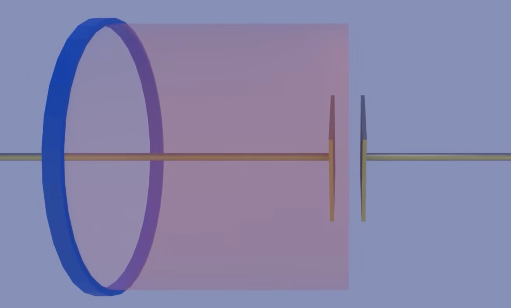
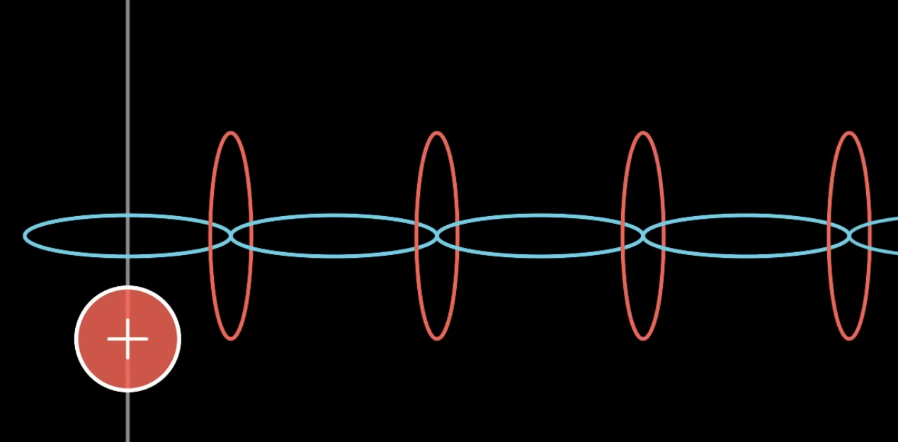
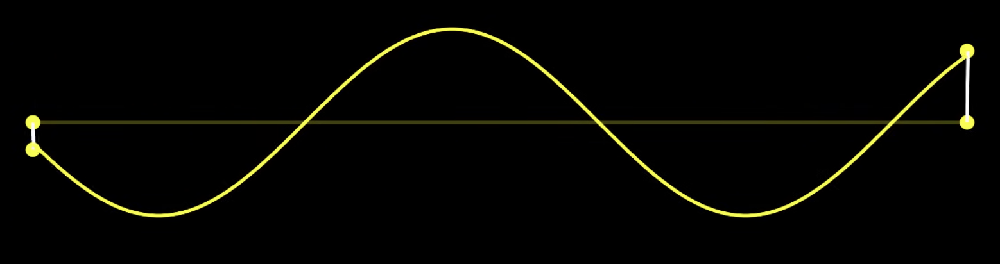

Combining Gauss's Law, Gauss's Law for Magnetism, Ampere's Law, Faraday's Law, and the force equation for charges gives us the basis of the theory of electromagnetism.

There's a small problem with how we write Ampere's Law in the [Magnetism](../Magnetism/) chapter. When we create a loop around our wire, we find the current through the loop is the charges flowing through any surface bounded by that loop.

Ampere's law states that the magnetic field around a closed loop is proportional to the electric current passing through the loop. In situations where the electric field changes over time, such as in a charging capacitor, this form of Ampere's law becomes problematic. Between the capacitor plates, there is no physical current, but there is a changing electric field. According to the original Ampere's law, this would suggest no magnetic field in this region, which contradicts experimental observations. If we were to measure the current through the loop's surface, we'd get the current on the wire. But the current through the entire cylinder surface is 0 as there's a gap.

So we get 2 different current depending on which surface we choose. To fix this, we have to add a *displacement current*, which is $\epsilon_0$ times the change in electric flux over change in time.

$$
\begin{align}
\oint{\vec{B} \cdot d\vec{l}} = \mu_0 (I_{enc} + I_d)
\\
I_d = \epsilon_0 \frac{d\phi_E}{dt}
\end{align}
$$

This fixes the capacitor problem because while the current is running, the capacitor is charging up, so there's changing electric flux ($\phi_E = \int{E \cdot dA}$) through this cylinder surface, and there's also current through the loop's surface.

This revision gives us the *Maxwell's equations*.

$$
\begin{gather}
\text{Gauss's Law:} 
\\
\oint{\vec{E} \cdot d\vec{A}} = \frac{q_{enc}}{\epsilon_0}
\\
\\
\text{Gauss's Law for Magnetism:} 
\\
\oint{\vec{B} \cdot d\vec{A}} = 0
\\
\\
\text{Ampere's Law:} 
\\
\oint{\vec{B} \cdot d\vec{l}} = \mu_0 (I_{enc} + \epsilon_0 \frac{d\phi_E}{dt})
\\
\\
\text{Faraday's Law:} 
\\
\oint{(\vec{E} + \vec{v} \times \vec{B}) \cdot d\vec{l}} = - \frac{d\phi_B}{dt}
\end{gather}
$$

Say we have a wire running AC, because of Ampere's law, this current creates a curling magnetic field. But because of Faraday's law, the curling magnetic field creates an electric field. And because of our addition to Ampere's law, the changing electric field creates a curling magnetic field, and that creates an electric field, and so on.

> As a recap, a charge by itself creates an electric field. A moving charge creates a magnetic field, and an accelerating charge creates an electromagnetic wave.

We can work backwards from Maxwell's equation and end up with a form of the wave equation.

$$
\frac{\partial^2 u}{\partial t^2} = c^2 \frac{\partial^2 u}{\partial x^2}
$$

If we assume the point on a wave only move up and down, they should be accelerated in the direction of the curvature.

So if it's curling down, the wave get's accelerated downwards at that point. The proportionality between the curvature and the acceleration is the speed of the wave squared ($c^2$). So we can plug the constants we have into the wave equation to get the speed of these waves.

$$
\frac{\partial \vec{E}}{\partial x^2} = \mu_0 \epsilon_0 \frac{\partial^2 \vec{E}}{\partial t^2}
$$

In a vacuum, these waves move at this speed:

$$
c = \frac{1}{\sqrt{\mu_0 \epsilon_0}} = 3 \times 10^8 \frac{m}{s}
$$

This is exactly the speed of light in a vacuum. Meaning these electric and magnetic waves are the same as light.

$$
E(t) = E_0 \sin(kx - \omega t + \Delta)
$$

A useful solution to the wave equation is the general sine wave in AC circuits, except now we have the $k x$ term because the wave changes with both space and time. 

$k$ is the wave number. It's $2\pi$ divided by the wavelength: 

$$
k = \frac{2\pi}{\lambda}
$$

When you multiply the wave number by some length the wave traveled ($x$), we get the angular length that traveled. This is usually the kind of input you use in the sine function.

The *linear frequency* ($f$) tells you how many full cycles it goes through in a second. We can convert from angular to linear frequency with a factor of $2\pi$.

$$
\begin{align}
f = \frac{cycles}{second}
\\
\omega = 2\pi f
\end{align}
$$

The speed of the wave can be written as the wavelength times the number of wavelengths that occur per second, or the wavelength times the frequency.

$$
c = \lambda f
$$