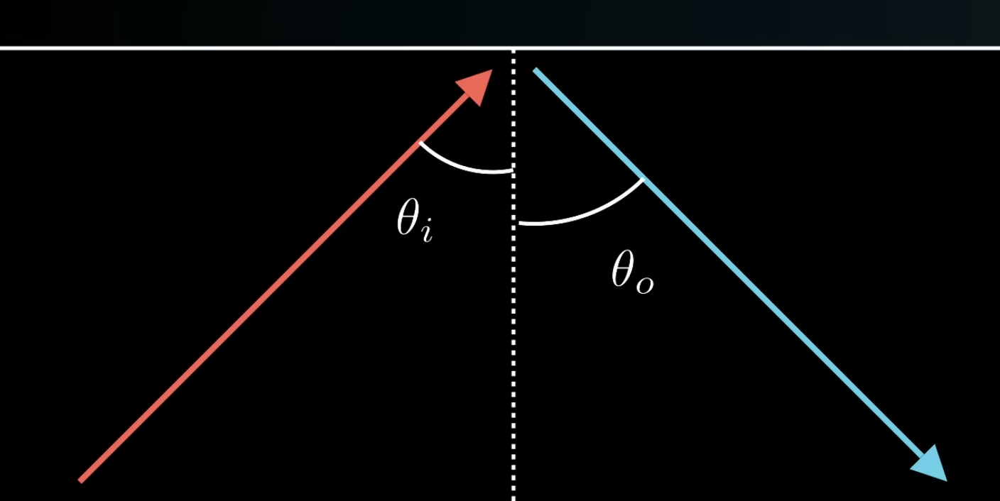
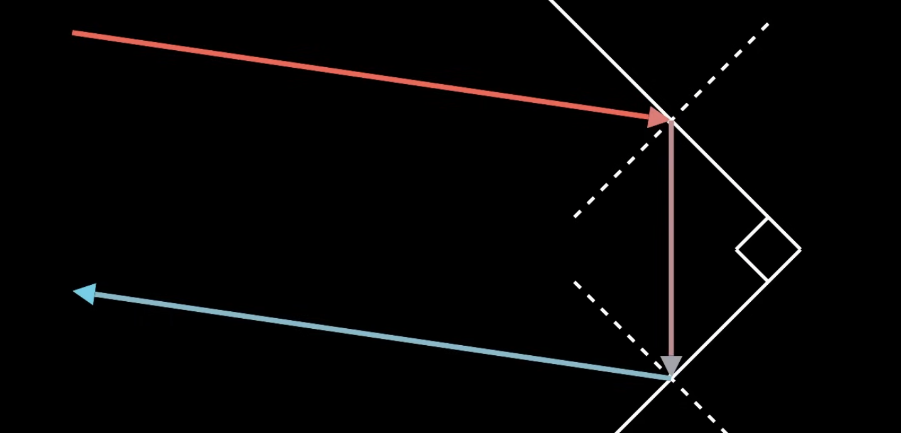
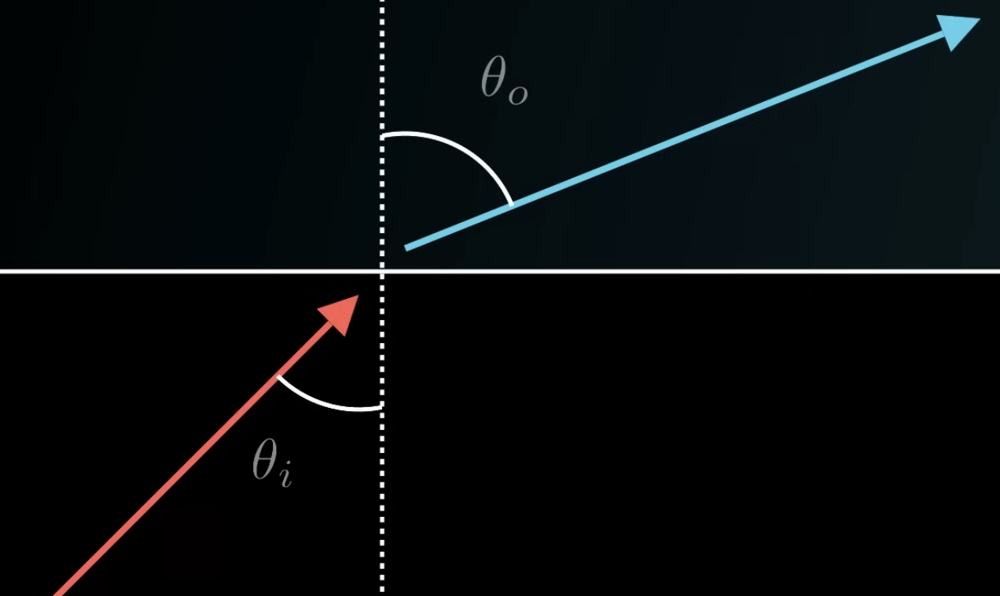
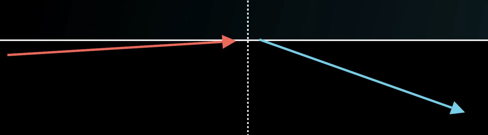
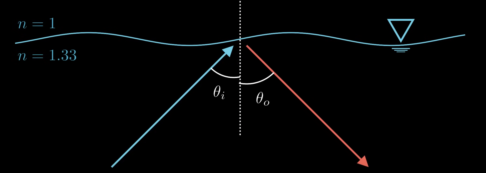
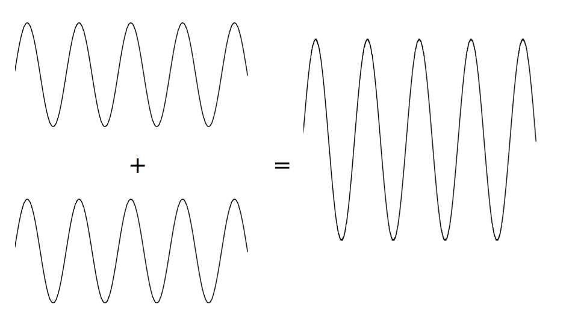
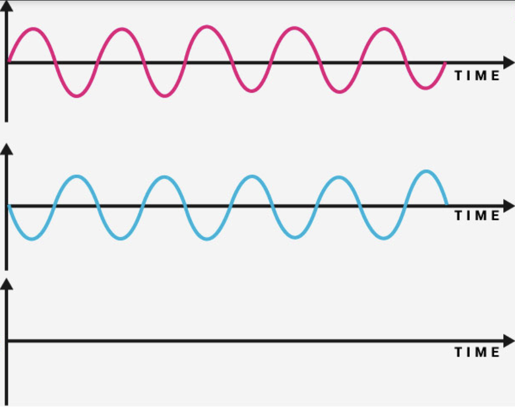
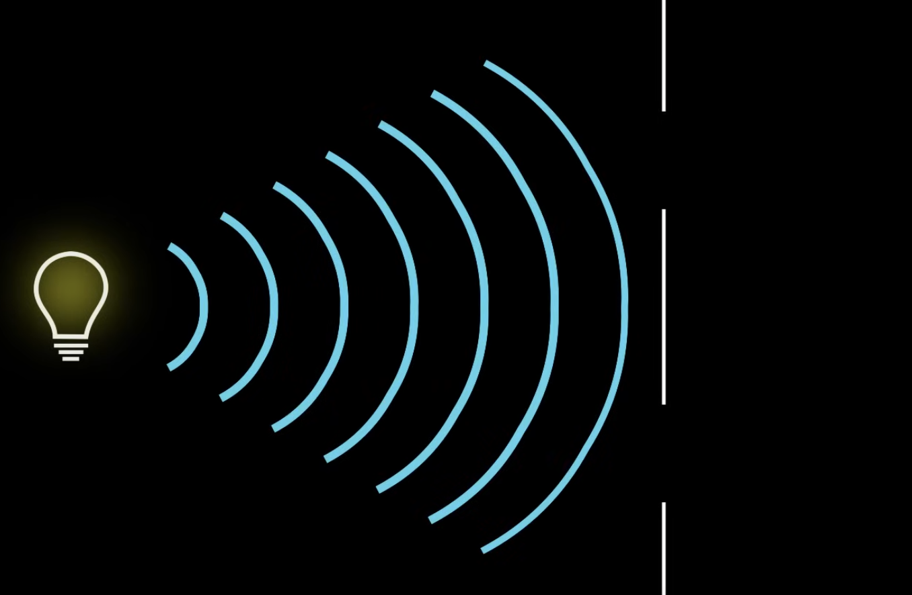
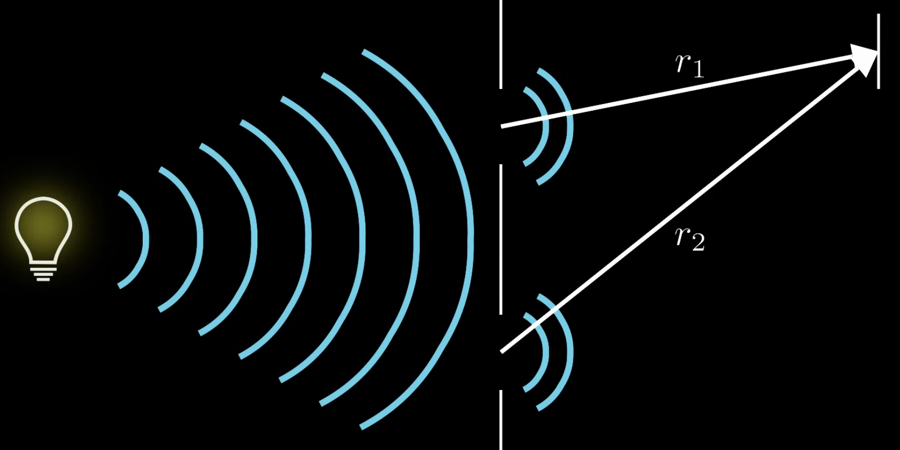
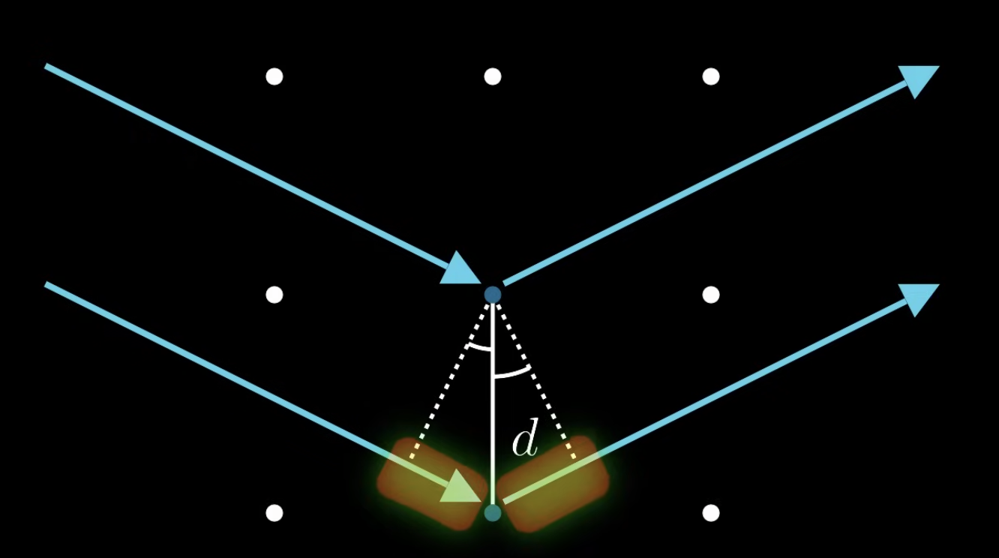

# Geometric

Let's trace out the path of light waves. When a light wave hits an interface between to materials, some of the light will usually be reflected. It reflects in such a way that the angle to the surface normal is the same in both cases. So these two angles here are the same.

Most objects aren't reflective because they aren't this smooth. They have a rough surface when you zoom in far enough, and so the light bounces in all sorts of directions.

If we get a reflective corner of material, then the reflected light is going to come out at the same angle that it came in at, which is pretty helpful if we want to send light waves back and forth.

Some light will refract (go through) the surface. 

Since light is no longer traveling in a vacuum, the two constants $\mu_0$ and $\epsilon_0$ might change in the material, which will change the speed of light. We define a quantity called the index of refraction $n$, which is the ratio of the speed of light in a vacuum to the speed of light in this new material.

$$
n = \frac{c}{v}
$$

When light enters a new medium, it bends according to *Snell's law*. The original index of refraction, times the sine of the incoming angle, is equal to the second index of refraction, times the sine of the outgoing angle.

$$
n_1 \sin(\theta_i) = n_2 \sin(\theta_o)
$$

In a real material, some of the light is going to reflect, and some is going to refract. And we can figure out the angles with the 2 laws above. But here's a problem: the larger the incoming angle, the larger the outgoing angle. If we make our incoming angle large enough, the outgoing angle will actually be larger than $90\degree$. So instead of refracting, all of the light gets reflected.

We can calculate the angle this is going to happen at with Snell's law. Let's take water for example. Water's index of refraction is around $1.333$, and air's index of refraction is $1$.

What angle would we need for an underwater light ray to start to have total internal reflection?

$$
1.33 \sin(\theta_i) = 1 \sin(\theta_o)
$$

According to Snell's law, we know the outgoing angle will be $90\degree$ or larger. For the smallest angle we'll just use $90\degree$:

$$
\begin{align}
1.33 \sin(\theta_i) = 1 \sin(90\degree)
\theta_i = \arcsin(\frac{1}{1.333}) \approx 48.6\degree
\end{align}
$$

If we went the other way, we do the same steps and get basically the same equation except the fraction is flipped.

$$
\theta_i = \arcsin(\frac{1.333}{1})
$$

This can't happen, there's no angle that will give us total reflection from air to water. In general, total internal reflection only works when you're going from a material of higher index to lower index of refraction.

$$
n_1 > n_2
$$

# Physical

In some cases, we'll still need to worry about the wave properties of light when tracing out the path. A useful property is *interference*.

When two waves meet at the same location, they add together. If they're in phase, then the resultant wave is larger. This is *constructive interference*. 

If the waves are out of phase, the resultant wave will be smaller. This is called *destructive interference*.

This actually shows up in the double slit experiment. We have a source area emitting light through two slits.

Since they're coming from the same source, we're assuming that they start out in phase. The difference between the lengths of the two paths will tell us if they're in phase or not.

If the path difference is an integer multiple of the wavelength, then they'll add constructively because the peaks and valleys will still match. But if it's a half multiple of the wavelength, then they'll add destructively.

$$
\begin{align}
\Delta r = r_1 - r_2
\\
\text{Constructive: } \Delta r = m \lambda
\\
\text{Destructive: } \Delta r = (m + \frac{1}{2}) \lambda
\end{align}
$$

What we see on a detector is certain bright spots where the waves add constructively because of the path length differences.

Interference is also applied to *X-ray Diffraction*. If we have some kind of material that has a lattice structure and shine some light waves onto the lattice, we'll assume that the light waves reflect off it. The difference in the path lengths is equal to the length of the two highlighted segments, or the distance between the atoms times the sine of angle one plus the distance times the sine of angle two.

$$
\Delta r = d \sin(\theta_1) + d \sin(\theta_2)
$$

If we know the wavelength of the light and we send the light in at some specific angles, we can determine how far apart the atoms are on the lattice.