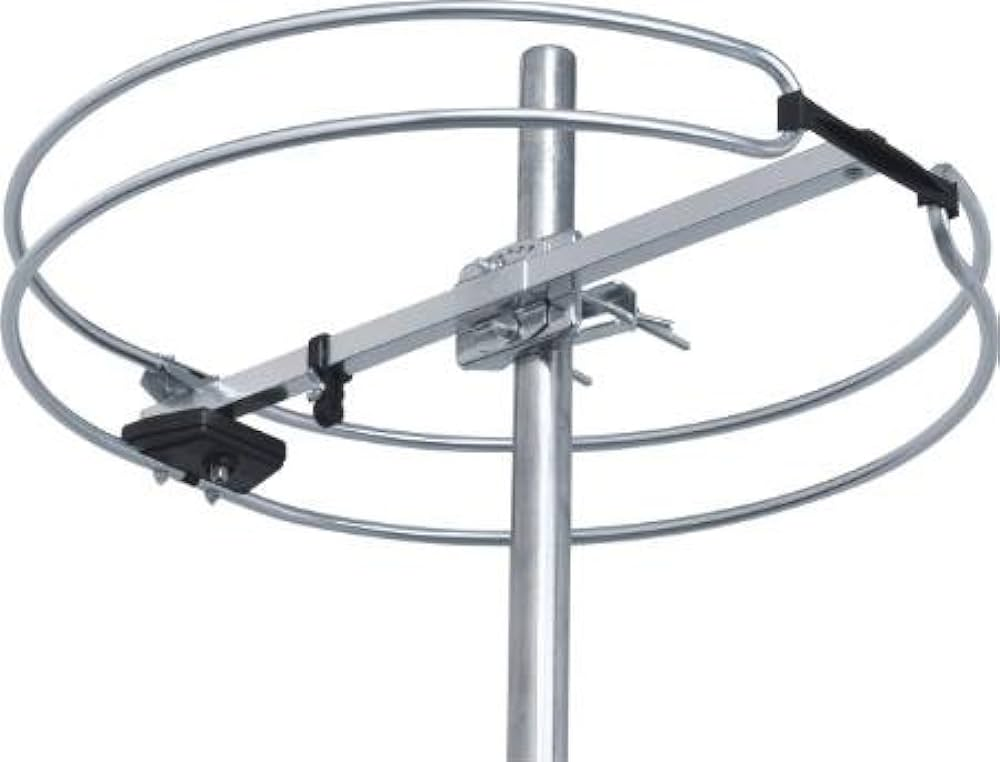

Electric and magnetic fields store energy (actually the reason why sunlight is hot). We can look at the intensity of the wave to see the power per area of that wave. The intensity is asking how much energy per second we get on some square unit of area.

$$
I = \frac{P}{A} = \frac{U}{tA}
$$

For a light wave, it's equal to the magnitude of this vector called the *Poynting vector*:

$$
I = | \vec{S} | = | \frac{\vec{E} \times \vec{B}}{\mu_0} | = \frac{1}{2} c \epsilon_0 E_0^2
$$

Say we have a transmitter at a radio station with a power $P$ and some frequency $f$, that's $d$ distance away and an antenna for receiving with length $l$. What's the max voltage we can get across our antenna? We can start with the intensity:

$$
I = \frac{P}{A}
$$

Assuming it radiates in all direction, the area is the area of a sphere. $d$ will be the radius of the sphere since it's how far the antenna is away from the transmitter.

$$
I = \frac{P}{4\pi d^2}
$$

We can also get the intensity in terms of the electric field:

$$
I = \frac{P}{4\pi d^2} = \frac{1}{2} c \epsilon_0 E_0^2
$$

So we can solve for the maximum electric field $E_0$:

$$
E_0 = \sqrt{\frac{P}{2\pi d^2 c \epsilon_0}}
$$

Now that we know what the maximum electric field is, we an get the voltage from the electric field.

$$
| V | = \int{\vec{E} \cdot d\vec{l}}
$$

We only care about the magnitude in this case, and since we want the maximum possible voltage, we'll assume $\vec{E}$ and $d\vec{l}$ points in the same direction.

$$
| V_{max} | = E_0 l = l \sqrt{\frac{P}{2\pi d^2 c \epsilon_0}}
$$

For circular antennas like this:

We'll call its radius $r$. We're going to get the voltage from the induction of the magnetic field. 

The 2 constants $\mu_0$ and $\epsilon_0$ are directly related to the speed of light. They're built into Maxwell's equations in such a way that the induced electric and magnetic fields directly depend on them. 

For plane waves, the ratio of the maximum electric and magnetic field strength is equal to the speed of light.

$$
\frac{E_0}{B_0} = c
$$

We know that we can write one of these fields as a sine wave, we can now change the constants out front to include the maximum electric field.

$$
B(t) = B_0 \sin(kx - \omega t + \Delta) = \frac{E_0}{c} \sin(kx - \omega t + \Delta)
$$

Since we're looking for the maximum voltage, this integral will just simplify to the magnetic field times the area of the loop ($\pi r ^2$).

$$
\begin{align}
| V | = \frac{d\phi_B}{dt} = \frac{d}{dt} \oint{\vec{B} \cdot d\vec{A}}
\\
| V_{max} | = \frac{d}{dt} [B(t) \pi r^2]_{max}
\end{align}
$$

Now we have to get the time derivative of this, which introduces an $\omega$ into the equation, which is the same thing as $2 \pi$ times the linear frequency $f$.

$$
| V_{max} | = \frac{E_0}{c} \omega \cos(kx - \omega t + \Delta)\pi r^2_{max} = \frac{E_0}{c} 2\pi f \pi r^2
$$

Since we only want the maximum voltage, we'll consider just the amplitude of the sine wave, not the wave itself.