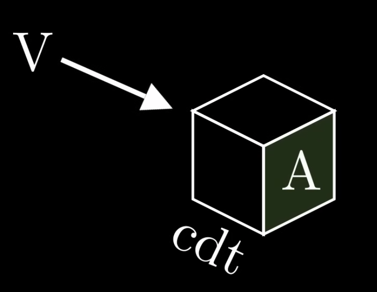

One weird thing about light waves is that they carry momentum. This is the equation for the momentum of an energy wave:

$$
U_{per\_volume} = p_{per\_volume}c
$$

The energy per volume of the wave is equal to the momentum per volume times the speed of light. This is a result from quantum physics.

We know momentum and force can be described as this in classical mechanics:

$$
\begin{align}
p = mv
\\
F = ma
\end{align}
$$

The force is actually a time derivative of momentum for constant mass. 

$$
F = ma = \frac{dp}{dt}
$$

We can rewrite the momentum as the accumulation of force over time:

$$
p = \int{F dt}
$$

Energy is the accumulation of force across some distance. Since we're dealing with changes in momentum, we'll assume that the force is in the same direction as the motion of the object.

$$
| U | = \int{\vec{F} \cdot d\vec{s}} \rightarrow \int{F ds}
$$

We can rewrite a small unit of length as the change in length over change in time times a small unit of length, and the differential $\frac{ds}{dt}$ is the velocity. The velocity for a wave floating around in free space is constant.

$$
| U | = \int{F \frac{ds}{dt}dt} = \int{F v dt} = v \int{F dt}
$$

So the energy is equal in magnitude to the momentum times velocity ($v = c$ for light waves):

$$
U = vp
$$

We can plug in our energy density $\frac{U}{V}$ (which is twice the energy of one of the fields) and divide both sides by the speed of light $c$. We'll also rewrite the momentum per volume in a differential form:

$$
\begin{align}
U_{per\_volume} = p_{per\_volume}c
\\
\epsilon_0 E_0^2 = p_{per\_volume}c
\\
\frac{\epsilon_0 E_0^2}{c} = p_{per\_volume} = \frac{dp}{dV}
\end{align}
$$

If we have some chunk of volume $dV$, it's the same as area times the length, which is the same as the speed times a small change in time.

$$
V = Acdt
$$

So change in volume over change in time is equal to the cross-sectional area times the speed of light.

$$
\frac{dV}{dt} = Ac
$$

If we have the change in momentum per unit volume $\frac{dp}{dV}$ times the change in volume over change in time $\frac{dV}{dt}$, then we can multiply them together to get the time derivative of momentum, or the force.

$$
\frac{dp}{dV} \cdot \frac{dV}{dt} = \frac{\epsilon_0 E_0^2 Ac}{c} = \frac{dp}{dt} = F
$$

We can divide both side by the area and get the pressure from a light wave:

$$
P = \epsilon_0 E_0^2
$$

This usually isn't a lot of pressure. It has the benefit of being kinda free. This is actually how solar sail works.