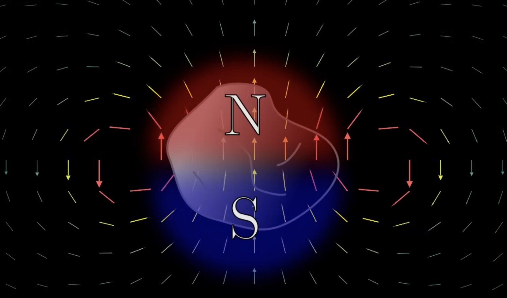
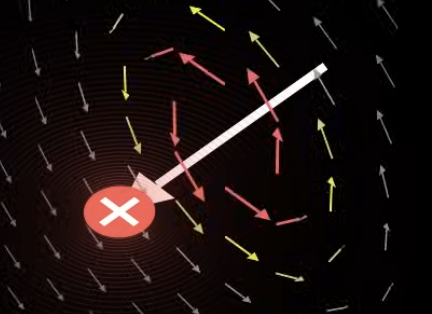
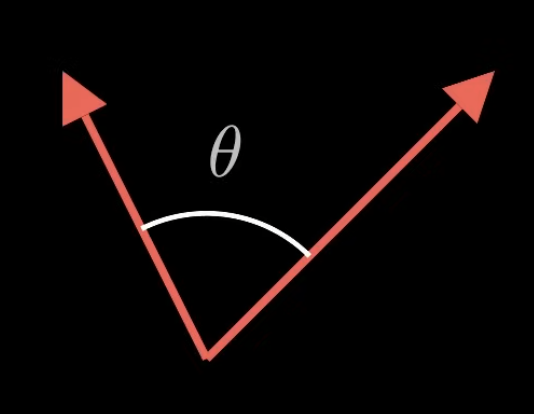
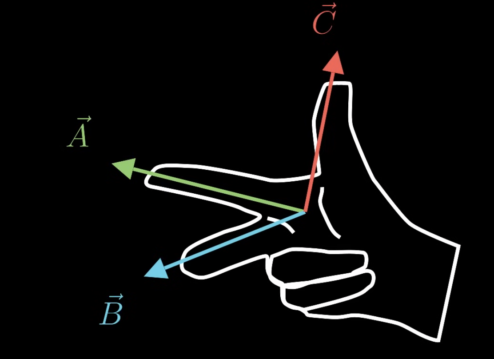
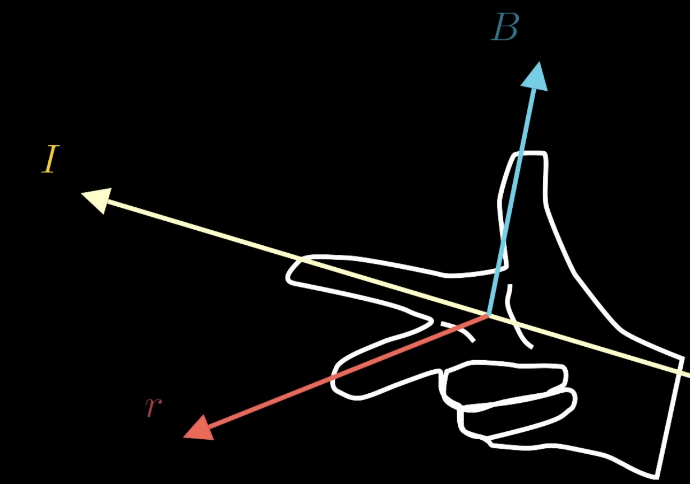
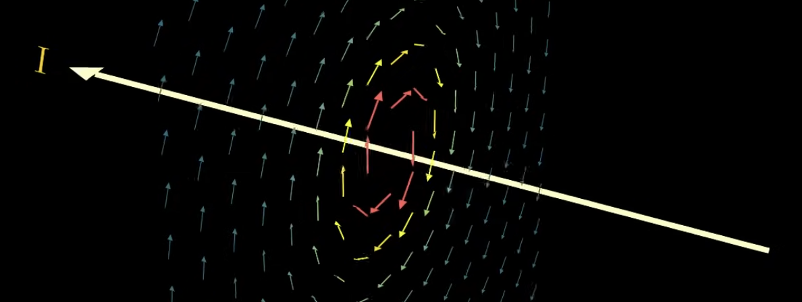
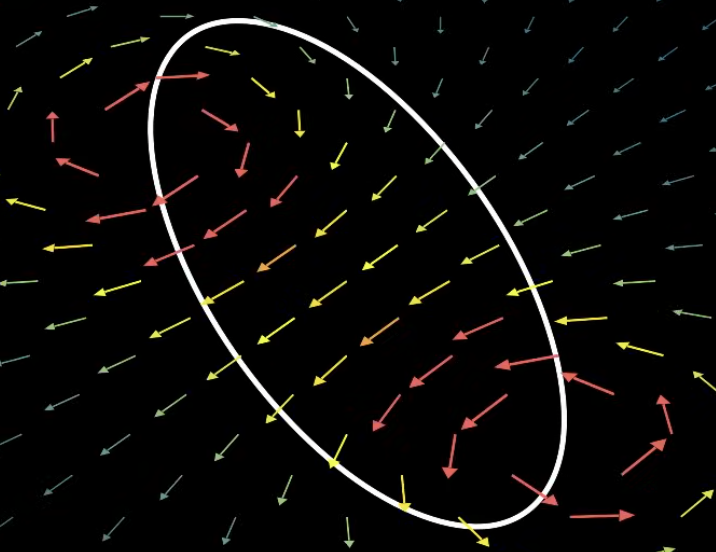
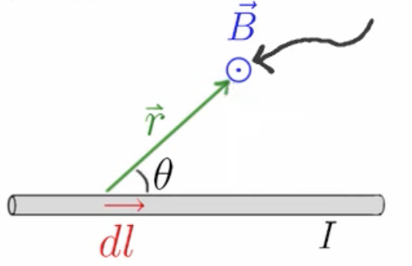

Some metals can be magnetized, meaning they have a North pole and a South pole. In terms of 2 magnetized metals close to each other, opposite poles attract, and similar poles repel. So just like the electric field, we also have the magnetic field.

Moving charges also create magnetic fields. That's pretty much how the Earth's magnetic field works.

 And we can figure out how strong the magnetic field is and what direction it's going to point in with the *Biot-Savart law*.

$$
d\vec{B} = \frac{\mu_0}{4\pi} \frac{I d\vec{l} \times \hat{r}}{r^2}
$$

$d\vec{B}$ is the smallest size of the magnetic field. The $\frac{\mu_0}{4\pi}$ is a constant, we'll ignore it for now. The $\times$ represents the cross product between $d\vec{l}$ and $\hat{r}$. The magnitude is the magnitude of each of the 2 vectors times the sine angle between them. $\hat{r}$ is equal to $\frac{\vec{r}}{r}$.

$$
| d\vec{l} \times \vec{r} | = dlr \sin(\theta)
$$

The direction can be found with the [right hand rule](https://en.wikipedia.org/wiki/Right-hand_rule).

$$
\vec{A} \times \vec{B} = \vec{C}
$$

According to the Biot-Savart law, if you point your index finger in the direction of that the positive charges go, then your thumb will point in the direction of the magnetic field, and your middle finger will point in the direction from the wire to the observation point (to where the magnetic field is being calculated). It's used to determine the direction of the magnetic field, and it usually has a magnitude of 1.

Current conventionally goes in the direction of positive charge, even though it's not accurate to real life. $d\vec{l}$ along the wire will follow the current. The magnetic field is also proportional to the current. More current means stronger magnetic field. The magnetic field is also inversely proportional to $r^2$, meaning the further out you get, the weaker the magnetic field.

> Note that $r$ is pointing in the same direction as $\hat{r}$.

Because of this law, the magnetic field will always curl around the wire like this:

We still use the curled up right hand rule to confirm this. This means if you want to create a fairly consistent magnetic field, we can make a loop of current. with the magnetic field in the middle being very consistent.

We get this magnetic field to running current equation.

$$
\vec{B} = \int{d\vec{B}} = \int{\frac{\mu_0}{4\pi} \frac{I d\vec{l} \times \hat{r}}{r^2}}
$$

We get that adding up the current ($I$) times a small bit of length ($d\vec{l}$) crossed with the radius ($\hat{r}$) divided by the radius squared ($r^2$).

This is a 3D version of the Biot-Savart law. If we apply the right hand rule, we see the index finger pointing in the direction of $dl$. The middle finger shows us the direction to the observation point. The thumb shows us the direction of the magnetic field. So we can see the $\vec{B}$ points in the correct direction. We can also see the $r$ vector and we can derive the $\hat{r}$ vector from $r$ since $\hat{r}$ is just the unit vector of $r$.