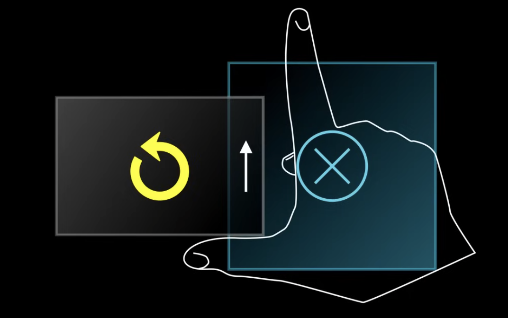

Electricity is generated by moving a piece of magnet being moved around a coil of wire. If we move either the magnet or the coil, we get electricity. This is *Faraday's Law*.

$$
\begin{align}
V = - \frac{d \phi_B}{dt}
\\
V = -\frac{d}{dt} \int{\vec{B} \cdot d\vec{A}}
\\
\int{\vec{E} \cdot d\vec{l}} = -\frac{d}{dt} \int{\vec{B} \cdot d\vec{A}}
\\
\int{(\vec{E} + \vec{v} \times \vec{B}) \cdot d\vec{l}} = -\frac{d}{dt} \int{\vec{B} \cdot d\vec{A}}
\end{align}
$$

The voltage imposed on a loop of wire is equal to the negative of the change in flux over change in time. If we increase the magnetic field, we get a voltage in the opposite direction. The magnetic flux won't be 0 since we're not going through a closed surface. We're looking at the flux through a loop.

> The last equation is not very easy to work with. So we'll use the first equation.

Anytime we change the magnetic flux in the loop, we get voltage. We get this flux integral:

$$
\phi_B = \int{\vec{B} \cdot d\vec{A}}
$$

There are 3 ways we can generate voltage from magnetic flux:
- We can make the magnetic field weaker or stronger.
- We can make the area bigger or smaller.
- We can make the loop in the magnetic field point more or less parallel.

Another thing to note is the direction the voltage takes will oppose the change in flux. If we have an increasing flux from south to north, the voltage will point from north to south, creating an opposing magnetic field. This is called *Lenz's Law*.

We can use the right hand rule to figure out which direction the current will point in. First, determine the direction the magnetic flux is changing in. For example, if we have a strong magnetic field upwards but it weakens, then the change vector is downwards. Now, using the curled right hand rule, point it in the opposite direction of the change vector. Your thumb will be in the direction of the voltage, your curled fingers will be in the direction of the generated current.

A consequence of this is called *Eddy current*. Say we have a magnetic field pointing into the screen. Moving a metal object through the magnetic field will cause the field through the metal to get stronger, pointing into the screen. An opposing voltage will be created out of the screen counterclockwise. There's also current in that direction. Most of which is pointing upwards as the object enters the magnetic field. Using the right hand rule, we can see there's a force pushing the metal back.

If the metal moves out of the magnetic field, the opposite will happen, it will create a force pointing into the magnetic field, opposing the metal being pulled out of the magnetic field.