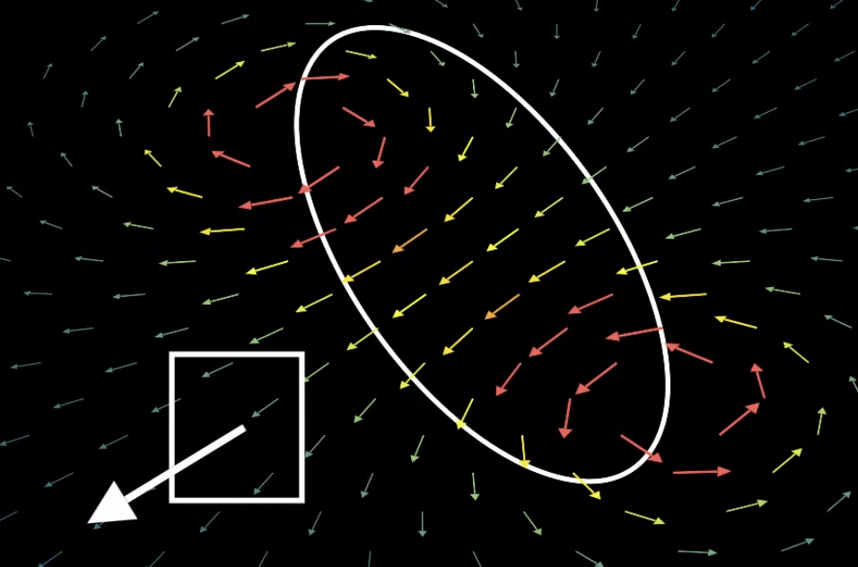
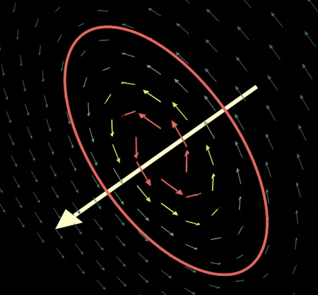

Magnets have a north and a south pole. Cutting one of them in half will just double the amount of poles. So any region of magnetic space will have a magnetic field flowing away from the north pole to the south pole. The exact amount of flow will make it so that the flux will always cancel out.

*Gauss's law for magnetism* states that the magnetic flux for any closed surface is 0.

$$
\oint{\vec{B} \cdot d\vec{A}} = 0
$$

*Circulation* is a very useful property for calculating magnetic field. Instead of looking at how much a magnetic field flows through a surface, so how much it flows parallel to the area vector, we look at how much it flows along a given path. At each point in the path, we assign a length vector $d\vec{l}$ in the direction we're going. We then compare that to the flow of the magnetic field. Knowing the circulation allows us to use *Ampere's law*: The circulation on any closed path around a loop is proportional to the current running through that path.

$$
\oint{\vec{B} \cdot d\vec{l}} = \mu_0 I_{thru}
$$

If we go in a circle of constant radius around the wire, the magnetic field will be constant. So like Gauss's law, we can pull it out and now the integral of $d\vec{l}$ is the same as the length of the wire or the circumference ($2 \pi r$).

$$
\begin{align}
\oint{\vec{B} \cdot d\vec{l}} = \mu_0 I_{thru}
\\
\oint{B \cdot dl} = \mu_0 I_{thru}
\\
B \oint{dl} = \mu_0 I_{thru}
\\
B 2 \pi r = \mu_0 I_{thru}
\\
B = \frac{\mu_0 I_{thru}}{2 \pi r}
\end{align}
$$

The magnetic field only decreases inversely with the radius. The magnetic field will drop off fairly quickly as we move further away.