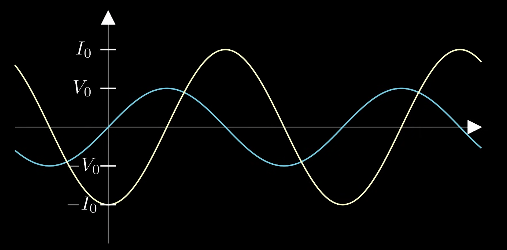
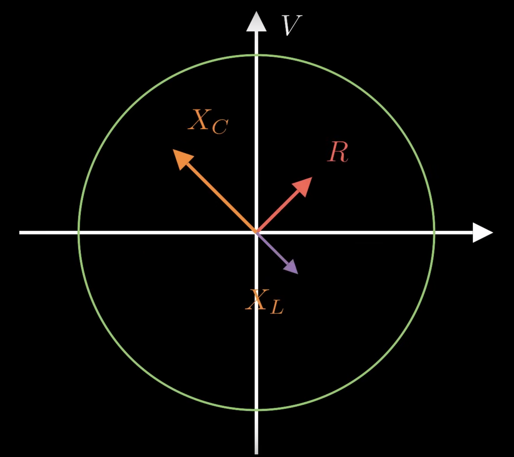
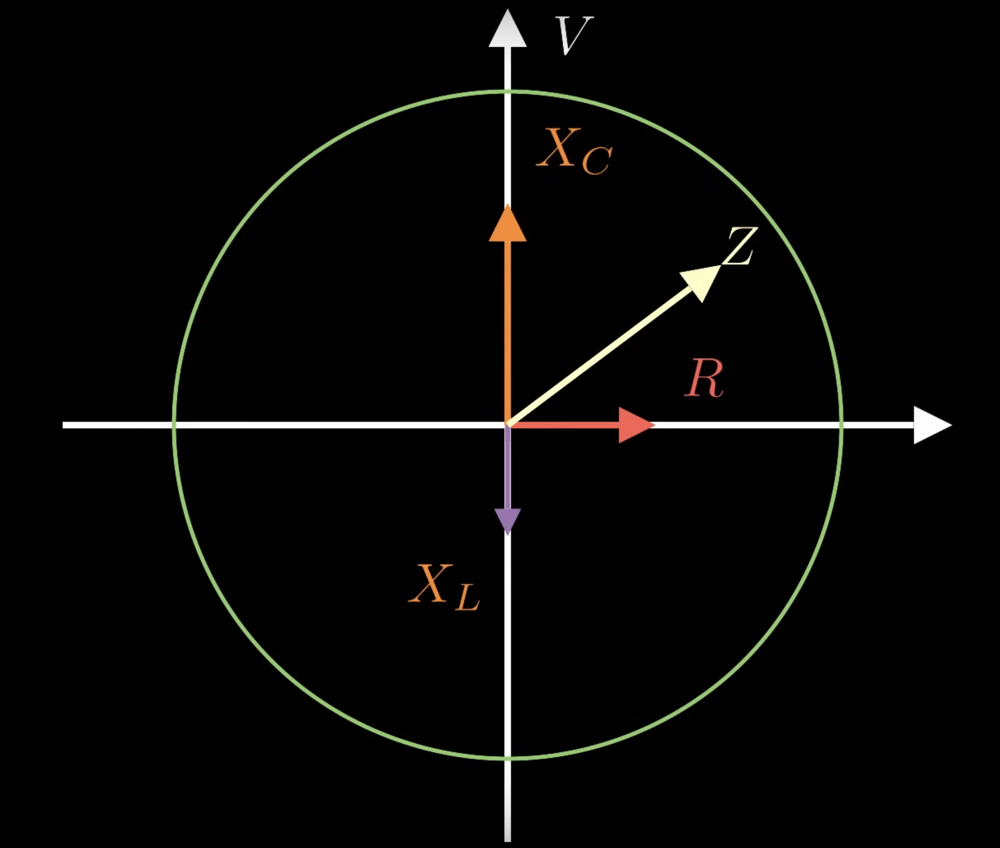
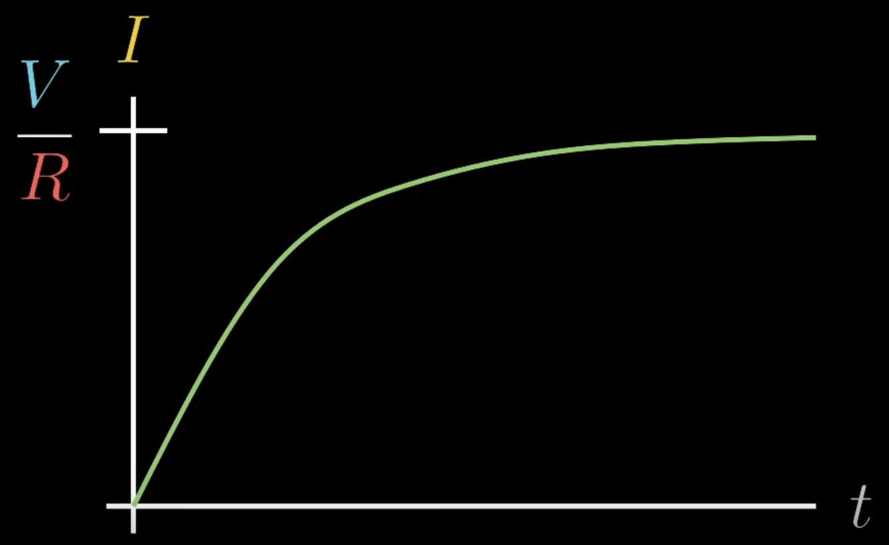

Just like one of the coils of a transformer creates flux through the other coil, the coil can also create flux through itself. Specifically, that flux is proportional to the current that we send through the coil.

$$
\phi_B = LI
$$

The voltage is proportional to the change in current over change in time.

$$
V = - L \frac{dI}{dt}
$$

This is the *inductor*. Since it opposes changes in voltage, it's kinda like a big wheel. If you start rolling the wheel, it takes a while to get it going, but once it's going, it'll keep going even if you try to stop it.

The voltage of the inductor will lag behind the voltage of the rest of the circuit since it opposes changes in voltage. The current stays the same since it's the circuit's current, the inductor doesn't oppose to that.

At the first peak of the voltage wave, enough voltage has been applied to get current running through the inductor. It will keep pushing more and more current until we start pushing the current in the other direction. At that point, the voltage will start pushing to the peak in the other direction, and current starts flowing in the other direction. And the cycle repeats in the opposite direction.

The equivalent to resistance for an AC inductor is its *reactance*, which is equal to the frequency times the inductance. Meaning a better inductor will oppose the voltage better, and if the voltage is oscillating more frequently, the inductor will oppose that change more.

$$
X = \omega L
$$

The vector for the inductor's voltage is 90 degrees behind the voltage source. If we have a resistor, a capacitor, and an inductor in series, we can add them up and get a total impedance like this:

$$
\begin{align}
Z = \sqrt{(X_C - X_L)^2 + R^2}
\\
V_{rms} = I_{rms} Z
\end{align}
$$

We have to subtract the reactance of the inductor from the capacitor since they point in opposite directions. Since the capacitor is capable of resisting the voltage of an AC circuit, we would expect it to have some energy. We can calculate the energy from a Kirchhoff's loop:

$$
V - IR - L \frac{dI}{dt} = 0
$$

Source voltage minus the resistor's voltage minus the inductor's voltage must be equal to 0. All these quantities are voltage so if we multiply this by current, these quantities become power.

$$
VI - I^2R - LI \frac{dI}{dt} = 0
$$

So we can get the energy by adding up the power from the inductor (change in energy over change in time) along some interval of time.

$$
\begin{align}
P = \frac{dU}{dt} = LI \frac{dI}{dt}
\\
du = LI dI
\\
U = \int{dU} = \int_0^L{LI dI}
\\
U_L = \frac{1}{2} LI^2
\end{align}
$$

When you first turn the inductor on with a DC circuit, it'll oppose the voltage source. After sometime, it won't oppose that anymore because the voltage isn't changing.

So in DC situations, you can think of an inductor as starting out like an open circuit and over time acting like a normal wire.