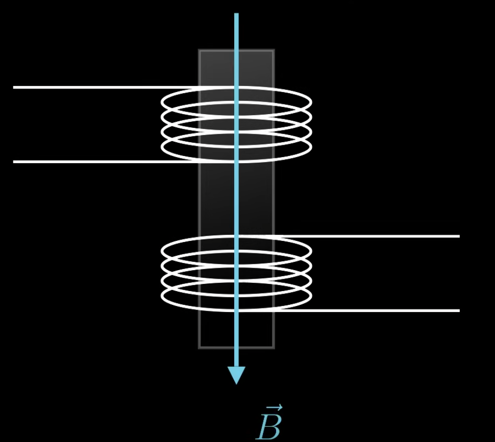
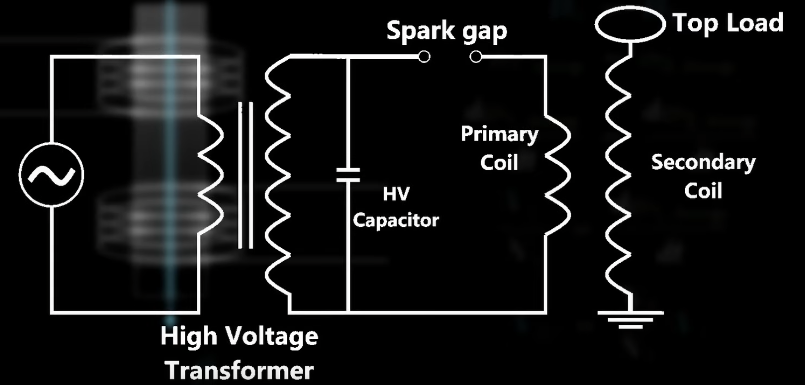

Say we have 2 coils of wires stacked on top of each other.

The top wire has current running through it, which creates a magnetic field right through the second coil. As the magnetic field turns on, the magnetic flux is changing, meaning we get voltage in the second coil. Now the magnetic field in both coils is the same, which means the flux through each single loop would also be the same and the change in flux over change in time would also be the same.

$$
\begin{align}
\vec{B_1} = \vec{B_2}
\\
\phi_{1, loop} = \phi_{2, loop}
\\
\frac{d\phi_{1, loop}}{dt} = \frac{d\phi_{2, loop}}{dt}
\end{align}
$$

The flux for the entire coil is equal to the flux for a single loop times the number of loops.

$$
\begin{align}
| V_1 | = N_1 \frac{d\phi_{1, loop}}{dt}
\\
| V_2 | = N_2 \frac{d\phi_{2, loop}}{dt}
\end{align}
$$

The voltage on the first one is equal to the number of loops in the first one times the change in flux over change in time, and the voltage in the second one is the same.

We can solve for the change in flux over change in time in both cases by dividing it with the number of loops.

$$
\begin{align}
\frac{| V_1 |}{N_1} = \frac{d\phi_{1, loop}}{dt}
\\
\frac{| V_2 |}{N_2} =  \frac{d\phi_{2, loop}}{dt}
\\
\frac{| V_1 |}{N_1} = \frac{| V_2 |}{N_2}
\\
| V_1 | = \frac{N_1}{N_2}| V_2 |
\end{align}
$$

This gives us the voltage of 1 coil is equal to the voltage of another coil multiplied by the ratio between the number of loops of the 2 coils. If we have more turn in the 2nd coil, then we have more output voltage.

A Tesla coil work by combining 2 transformer together, giving us a very large voltage:

Power is still conserved so while the voltage is very high, the current isn't.

$$
P = IV
$$