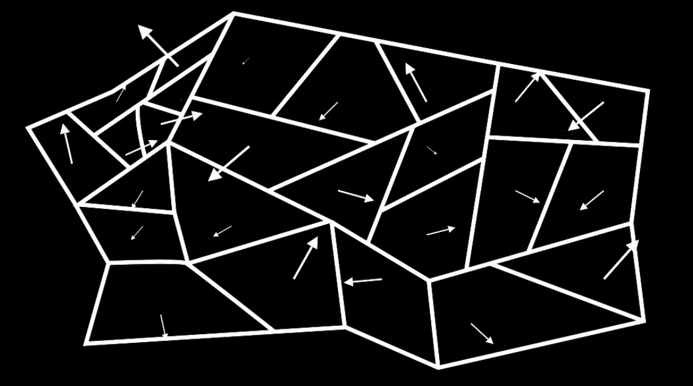
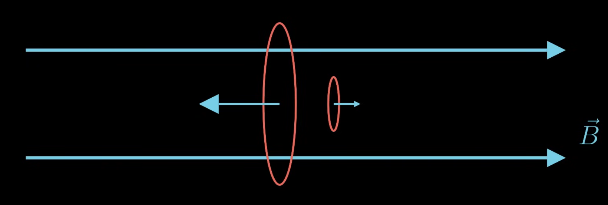

The magnetism that comes from moving charges is called induced magnetism. This isn't the only type of magnetism though.

Magnets are generally referred to as *ferromagnetic*. They have different chunks that have magnetic fields pointing in certain directions, called *domains*. If you add in an external magnetic field, you can get these domains to align, giving you a permanent magnet. These are materials like iron and cobalt.

Materials that have randomly aligned magnetic fields that cancel each other out are called *paramagnetic*. If we add in an external magnetic field, the material will align with that, giving us a slight magnetic field. These are materials like aluminum.

There's also *diamagnetic* materials. This encompasses almost all materials. Think of the electrons moving around the atom as tiny current loops which create tiny magnetic fields. In diamagnetic atoms, the electrons are paired up so that the magnetic field cancels out normally, but when you bring a magnet close to them, you get induction (from Faraday's law), so the current running in the direction opposing the magnetic field gets slightly stronger, and so the material slightly opposes the magnetic field. These are materials like water and most organic materials.

> Fun note: If you can get a strong enough magnetic field, you can make diamagnetic things levitate.